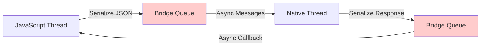
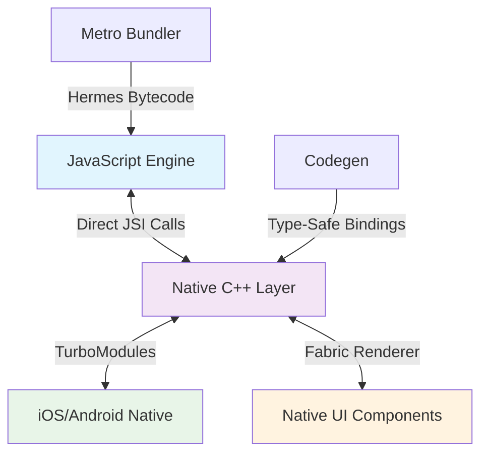

## Pengantar: Jembatan Universal Antara Dunia Web dan Mobile

Bayangkan [[JavaScript]] sebagai seorang wisatawan yang ingin mengunjungi dua negara eksotis: **iOS Land** dan **Android Territory**. Tanpa React Native, wisatawan ini harus belajar bahasa lokal yang berbeda (Swift/Objective-C untuk iOS, Java/Kotlin untuk Android) dan mengikuti aturan budaya yang berbeda pula. React Native hadir sebagai **sistem transportasi universal** yang memungkinkan wisatawan JavaScript berkeliling kedua negara dengan satu "paspor" yang sama.

React Native adalah framework open-source yang dikembangkan [[Facebook]] untuk membangun aplikasi [[Mobile Development|mobile native]] menggunakan [[React]]. Filosofi "Learn Once, Write Anywhere" memungkinkan developer menggunakan satu set skill untuk menghasilkan aplikasi yang benar-benar native di multiple platform. Ini bukan sekadar wrapper atau [[WebView]] - React Native menghasilkan komponen UI native asli yang performanya setara dengan aplikasi yang ditulis dalam [[Native Development|bahasa native]].

**Mengapa React Native Penting?**
- **[[Developer Velocity]]**: Satu codebase untuk multiple platform mengurangi development time hingga 50%
- **[[Hot Reloading]]**: Perubahan kode terlihat dalam hitungan detik tanpa rebuild
- **[[Native Performance]]**: Menggunakan komponen UI native, bukan webview
- **[[Ecosystem Maturity]]**: Didukung oleh [[Facebook]] dan komunitas besar dengan 100k+ stars di [[GitHub]]

## Arsitektur Lama: Sistem Ferry Tradisional

### Bridge-Based Communication - Kapal Ferry yang Lambat

Dalam arsitektur lama React Native, komunikasi antara [[JavaScript]] dan [[Native Code|native code]] terjadi melalui sebuah "[[Bridge Pattern|Bridge]]" - seperti sistem kapal ferry tradisional yang menghubungkan dua pulau.



**Karakteristik Bridge System:**
- **[[Asynchronous Programming|Asynchronous Only]]**: Semua komunikasi bersifat asinkron, seperti jadwal ferry yang kaku
- **[[Serialization]] Overhead**: Data harus "dikemas" menjadi [[JSON]] setiap kali transit
- **[[Threading|Dedicated Thread]]**: Thread khusus untuk marshalling messages, seperti petugas pelabuhan
- **No Direct Access**: [[JavaScript]] tidak bisa langsung "menyentuh" objek [[Native Code|native]]

### Keterbatasan Arsitektur Lama

Sistem ferry ini memiliki bottleneck yang signifikan:
- **[[Latency]]**: Setiap panggilan membutuhkan round-trip [[Serialization|serialization]]
- **[[Memory Management|Memory Overhead]]**: [[JSON]] serialization mengonsumsi memory ekstra
- **[[Threading]] Complexity**: Koordinasi antar thread yang rumit
- **[[Type Safety]]**: Tidak ada jaminan type safety di boundary

## Arsitektur Baru: Sistem Transportasi Modern

### JSI - Jembatan Langsung Tanpa Antrian

[[JavaScript Interface|JavaScript Interface (JSI)]] adalah revolusi dalam komunikasi [[JavaScript]]-[[Native Code|Native]], seperti membangun jembatan langsung atau terowongan bawah laut yang menghubungkan kedua negara tanpa perlu antri ferry.



### TurboModules - Jalur Ekspres untuk Layanan Khusus

TurboModules adalah seperti **jalur ekspres** dalam sistem transportasi modern - jalur khusus untuk layanan premium yang membutuhkan akses cepat dan langsung.

**Keunggulan TurboModules:**
- **[[Synchronous Programming|Synchronous Calls]]**: Panggilan langsung tanpa antri, seperti jalur VIP
- **[[Lazy Loading]]**: Module dimuat hanya saat dibutuhkan, menghemat startup time
- **[[Type Safety]]**: [[Code Generation|Code generation]] memastikan type safety end-to-end
- **[[Zero-Copy]]**: Reference langsung tanpa [[Serialization|serialization]] overhead

### Fabric - Sistem Manajemen Lalu Lintas Canggih

Fabric adalah sistem rendering baru yang menggantikan UI Manager lama, seperti **sistem manajemen lalu lintas AI** yang mengoptimalkan flow kendaraan di seluruh kota.

**Inovasi Fabric:**
- **[[Cross-Platform Development|Cross-Platform]] Consistency**: [[Rendering]] behavior yang konsisten di semua platform
- **[[Concurrent React]]**: Mendukung fitur [[React 18]] seperti [[Suspense]] dan [[Concurrent Features]]
- **[[Performance Optimization|Improved Performance]]**: [[Rendering Pipeline|Rendering pipeline]] yang lebih efisien
- **[[Developer Experience|Better Developer Experience]]**: [[Error Handling|Error handling]] dan [[Debugging|debugging]] yang lebih baik

## Implementasi Praktis: Konfigurasi dan Migration

### Mengaktifkan New Architecture

Untuk mengaktifkan sistem transportasi modern, kita perlu mengkonfigurasi feature flags:

```javascript
// react-native.config.js
module.exports = {
  project: {
    ios: {},
    android: {},
  },
  dependencies: {},
  // Enable New Architecture
  newArchEnabled: true,
};
```

```json
// android/gradle.properties
newArchEnabled=true
hermesEnabled=true
```

```ruby
# ios/Podfile
use_react_native!(
  :path => config[:reactNativePath],
  :hermes_enabled => true,
  :fabric_enabled => true,
  :flipper_configuration => FlipperConfiguration.enabled,
  :app_path => "#{Pod::Config.instance.installation_root}/.."
)
```

### Membuat TurboModule Custom

```typescript
// NativeSampleModule.ts - Spec Definition
import type {TurboModule} from 'react-native';
import {TurboModuleRegistry} from 'react-native';

export interface Spec extends TurboModule {
  multiply(a: number, b: number): Promise<number>;
  getString(input: string): string;
}

export default TurboModuleRegistry.getEnforcing<Spec>('SampleModule');
```

```cpp
// SampleModule.cpp - Native Implementation
#include "SampleModule.h"

namespace facebook::react {

SampleModule::SampleModule(std::shared_ptr<CallInvoker> jsInvoker)
    : NativeSampleModuleCxxSpec(std::move(jsInvoker)) {}

jsi::Value SampleModule::multiply(jsi::Runtime& rt, double a, double b) {
    return jsi::Value(a * b);
}

std::string SampleModule::getString(jsi::Runtime& rt, const std::string& input) {
    return "Processed: " + input;
}

} // namespace facebook::react
```

## Trade-offs dan Best Practices: Memilih Rute yang Tepat

### Perbandingan Arsitektur

| Aspek | Old Architecture (Bridge) | New Architecture (JSI) |
|-------|---------------------------|------------------------|
| **Communication** | Asynchronous only | Sync + Async |
| **Performance** | JSON serialization overhead | Direct memory access |
| **Type Safety** | Runtime errors | Compile-time checking |
| **Startup Time** | All modules loaded | Lazy loading |
| **Memory Usage** | Higher (serialization) | Lower (zero-copy) |
| **Debugging** | Bridge bottlenecks | Direct stack traces |
| **Ecosystem** | Mature, stable | Growing, cutting-edge |

### Kapan Menggunakan New Architecture?

**Gunakan New Architecture jika:**
- **Performance Critical**: Aplikasi dengan intensive native interactions
- **Type Safety Priority**: Tim yang mengutamakan compile-time safety
- **Modern React Features**: Membutuhkan Concurrent React, Suspense
- **Long-term Project**: Investasi untuk masa depan yang sustainable

**Pertahankan Old Architecture jika:**
- **Legacy Dependencies**: Banyak third-party modules yang belum support
- **Stability Priority**: Aplikasi production yang tidak boleh risk
- **Team Expertise**: Tim belum familiar dengan New Architecture
- **Short-term Project**: Timeline ketat tanpa waktu untuk learning curve

### Best Practices untuk Migration

```javascript
// Gradual Migration Strategy
const useNewArchitecture = __DEV__ ? true : false;

// Feature Flag Implementation
if (Platform.OS === 'ios') {
  // iOS-specific New Architecture setup
} else {
  // Android-specific New Architecture setup
}

// Fallback untuk Old Architecture
const NativeModule = TurboModuleRegistry.get('MyModule') || 
                     NativeModules.MyModule;
```

### Performance Optimization Techniques

**Hot Paths vs Cold Paths:**
- **Hot Paths**: Gunakan TurboModules untuk operasi yang sering dipanggil
- **Cold Paths**: Bridge masih acceptable untuk operasi jarang

**Memory Management:**
```javascript
// Efficient TurboModule usage
const result = useMemo(() => {
  return NativeModule.expensiveOperation(data);
}, [data]);

// Avoid frequent bridge calls
const batchedOperations = useCallback((operations) => {
  return NativeModule.batchProcess(operations);
}, []);
```

## Studi Kasus: Facebook dan Instagram

Facebook dan Instagram menggunakan React Native untuk berbagai fitur:
- **Facebook**: Marketplace, Events, Dating features
- **Instagram**: Stories creation tools, Shopping features
- **Performance Impact**: 50% reduction in development time, 30% smaller bundle size

**Lessons Learned:**
- New Architecture memberikan 40% improvement dalam scroll performance
- TurboModules mengurangi startup time hingga 25%
- Fabric renderer meningkatkan consistency UI di berbagai device

## Refleksi: Masa Depan Transportasi Cross-Platform

React Native telah berevolusi dari sistem ferry sederhana menjadi jaringan transportasi modern yang sophisticated. New Architecture dengan JSI, TurboModules, dan Fabric bukan hanya peningkatan incremental - ini adalah paradigm shift menuju **native-first development** dengan **web-like developer experience**.

Seperti sistem transportasi kota yang terus berkembang dari kereta kuda ke moblistrik otonom, React Native terus berinovasi menuju masa depan di mana boundary antara web dan mobile development semakin tipis. Developer dapat fokus pada **business logic** dan **user experience**, sementara framework menangani kompleksitas **platform-specific optimizations**.

Investasi dalam memahami New Architecture adalah investasi untuk masa depan - seperti belajar mengendarai mobil listrik ketika dunia bergerak menuju sustainable transportation. The future is native, the experience is universal.

---

*Catatan ini menggambarkan evolusi React Native dari Bridge-based architecture menuju JSI-powered modern system, dengan analogi sistem transportasi yang memudahkan pemahaman konsep teknis yang kompleks.*