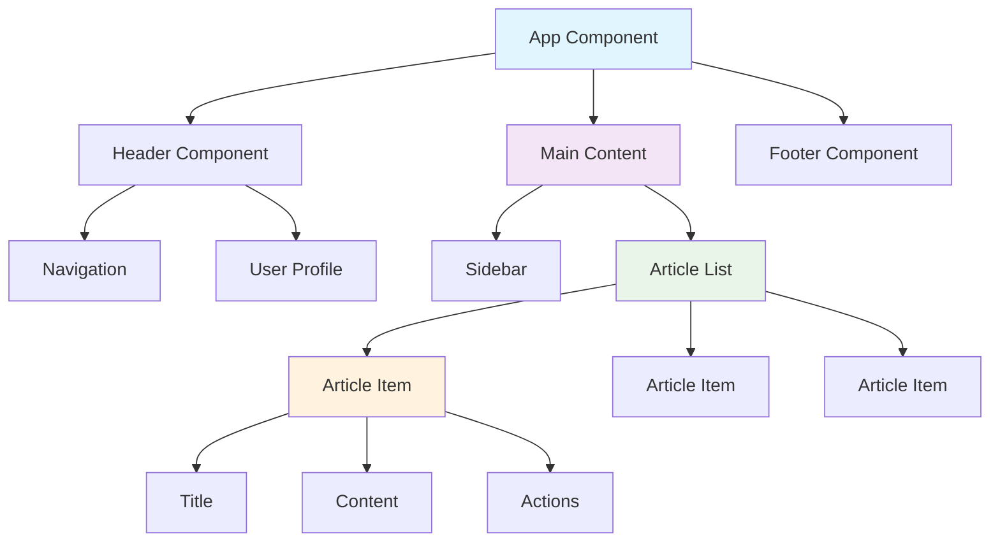
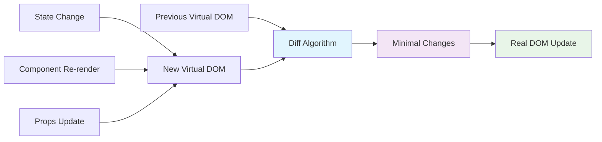

## Pengantar: Perpustakaan Komponen Digital yang Hidup

Bayangkan React sebagai **perpustakaan komponen digital yang hidup** - sebuah sistem modular di mana setiap "buku" (component) dapat dibaca secara independen, namun juga dapat dikombinasikan untuk menceritakan kisah yang lebih besar dan kompleks. Seperti perpustakaan modern dengan sistem katalog yang canggih, React memungkinkan developer untuk mengorganisir, mencari, dan menggunakan kembali komponen UI dengan efisien.

React adalah [[JavaScript]] library yang dikembangkan [[Facebook]] untuk membangun user interfaces yang interaktif dan dinamis. Dengan filosofi "declarative programming", React memungkinkan developer mendeskripsikan **apa** yang ingin ditampilkan, bukan **bagaimana** cara menampilkannya, seperti memberikan instruksi kepada pustakawan ahli yang tahu persis cara mengatur dan menampilkan informasi.

Modern React dengan [[React 18]] memperkenalkan [[Concurrent Features]], [[Suspense]], dan advanced [[Performance Optimization]] techniques yang mengubah cara kita membangun user interfaces.

**Mengapa React Revolusioner?**
- **Component-Based Architecture**: UI dipecah menjadi komponen reusable seperti modul perpustakaan
- **Declarative Paradigm**: Describe the UI state, React handles the DOM manipulation
- **Virtual DOM**: Efficient rendering dengan diff algorithm yang cerdas
- **Rich Ecosystem**: Jutaan package dan tools yang mendukung development

## Arsitektur Komponen: Sistem Katalog Modular

### Component Hierarchy - Struktur Perpustakaan Berlapis

React components seperti **sistem katalog perpustakaan** dengan hierarki yang jelas dari kategori umum hingga item spesifik.



**Karakteristik Component Architecture:**
```jsx
// Parent Component - Katalog Utama
function Library() {
  const [books, setBooks] = useState([]);
  const [selectedCategory, setSelectedCategory] = useState('all');
  
  return (
    <div className="library">
      <Header onCategoryChange={setSelectedCategory} />
      <BookShelf 
        books={books} 
        category={selectedCategory}
        onBookSelect={handleBookSelect}
      />
      <Footer />
    </div>
  );
}

// Child Component - Rak Buku Spesifik
function BookShelf({ books, category, onBookSelect }) {
  const filteredBooks = books.filter(book => 
    category === 'all' || book.category === category
  );
  
  return (
    <div className="bookshelf">
      {filteredBooks.map(book => (
        <BookCard 
          key={book.id}
          book={book}
          onClick={() => onBookSelect(book)}
        />
      ))}
    </div>
  );
}

// Leaf Component - Kartu Buku Individual
function BookCard({ book, onClick }) {
  return (
    <div className="book-card" onClick={onClick}>
      
      <h3>{book.title}</h3>
      <p>{book.author}</p>
      <span className="category">{book.category}</span>
    </div>
  );
}
```

### Props Flow - Sistem Komunikasi Antar Rak

Props dalam React seperti **sistem komunikasi antar rak** di perpustakaan - informasi mengalir dari rak induk ke rak anak dengan cara yang terstruktur.

```jsx
// Props sebagai "Kartu Katalog" yang diteruskan
function UserDashboard({ user }) {
  return (
    <div className="dashboard">
      <UserProfile 
        name={user.name}
        avatar={user.avatar}
        membershipLevel={user.membership}
      />
      <BookRecommendations 
        userId={user.id}
        preferences={user.preferences}
        readingHistory={user.history}
      />
      <ReadingProgress 
        currentBooks={user.currentlyReading}
        completedBooks={user.completed}
      />
    </div>
  );
}

// Component menerima props seperti menerima instruksi katalog
function UserProfile({ name, avatar, membershipLevel }) {
  const membershipBadge = {
    basic: '📚',
    premium: '⭐',
    vip: '👑'
  };
  
  return (
    <div className="user-profile">
      
      <h2>{name} {membershipBadge[membershipLevel]}</h2>
      <p>Membership: {membershipLevel}</p>
    </div>
  );
}
```

## State Management: Sistem Inventori Dinamis

### Local State - Inventori Rak Individual

Local state seperti **inventori yang dikelola setiap rak secara independen** - setiap component mengelola data yang relevan dengan fungsinya.

```jsx
// useState Hook - Sistem Inventori Otomatis
function SearchableBookList() {
  const [books, setBooks] = useState([]);
  const [searchTerm, setSearchTerm] = useState('');
  const [isLoading, setIsLoading] = useState(false);
  const [selectedBook, setSelectedBook] = useState(null);
  
  // Effect Hook - Sistem Pembaruan Otomatis
  useEffect(() => {
    async function fetchBooks() {
      setIsLoading(true);
      try {
        const response = await fetch('/api/books');
        const booksData = await response.json();
        setBooks(booksData);
      } catch (error) {
        console.error('Failed to fetch books:', error);
      } finally {
        setIsLoading(false);
      }
    }
    
    fetchBooks();
  }, []); // Empty dependency - run once on mount
  
  // Computed values - Katalog yang difilter
  const filteredBooks = useMemo(() => {
    return books.filter(book =>
      book.title.toLowerCase().includes(searchTerm.toLowerCase()) ||
      book.author.toLowerCase().includes(searchTerm.toLowerCase())
    );
  }, [books, searchTerm]);
  
  // Event handlers - Sistem Interaksi
  const handleSearch = useCallback((term) => {
    setSearchTerm(term);
  }, []);
  
  const handleBookSelect = useCallback((book) => {
    setSelectedBook(book);
  }, []);
  
  if (isLoading) {
    return <LoadingSpinner message="Loading library catalog..." />;
  }
  
  return (
    <div className="searchable-book-list">
      <SearchBar 
        value={searchTerm}
        onChange={handleSearch}
        placeholder="Search books or authors..."
      />
      
      <BookGrid 
        books={filteredBooks}
        onBookSelect={handleBookSelect}
      />
      
      {selectedBook && (
        <BookDetailModal 
          book={selectedBook}
          onClose={() => setSelectedBook(null)}
        />
      )}
    </div>
  );
}
```

### Context API - Sistem Informasi Terpusat

Context API seperti **sistem informasi terpusat perpustakaan** yang dapat diakses dari mana saja tanpa perlu meneruskan informasi secara manual.

```jsx
// Library Context - Sistem Informasi Terpusat
const LibraryContext = createContext();

function LibraryProvider({ children }) {
  const [user, setUser] = useState(null);
  const [theme, setTheme] = useState('light');
  const [notifications, setNotifications] = useState([]);
  
  const value = {
    user,
    theme,
    notifications,
    login: (userData) => setUser(userData),
    logout: () => setUser(null),
    toggleTheme: () => setTheme(prev => prev === 'light' ? 'dark' : 'light'),
    addNotification: (notification) => {
      setNotifications(prev => [...prev, notification]);
    },
    removeNotification: (id) => {
      setNotifications(prev => prev.filter(n => n.id !== id));
    }
  };
  
  return (
    <LibraryContext.Provider value={value}>
      {children}
    </LibraryContext.Provider>
  );
}

// Custom Hook untuk akses mudah
function useLibrary() {
  const context = useContext(LibraryContext);
  if (!context) {
    throw new Error('useLibrary must be used within LibraryProvider');
  }
  return context;
}

// Usage dalam component
function UserMenu() {
  const { user, logout, theme, toggleTheme } = useLibrary();
  
  if (!user) {
    return <LoginButton />;
  }
  
  return (
    <div className={`user-menu ${theme}`}>
      <span>Welcome, {user.name}!</span>
      <button onClick={toggleTheme}>
        {theme === 'light' ? '🌙' : '☀️'}
      </button>
      <button onClick={logout}>Logout</button>
    </div>
  );
}
```

## Virtual DOM: Sistem Katalog Cerdas

### Reconciliation Algorithm - Pustakawan AI yang Efisien

Virtual DOM seperti **pustakawan AI** yang dapat mendeteksi perubahan minimal dan mengupdate katalog dengan cara yang paling efisien.



**Reconciliation Process:**
```jsx
// React's Virtual DOM Optimization
function BookList({ books, searchTerm }) {
  // React creates virtual representation
  return (
    <div className="book-list">
      {books
        .filter(book => book.title.includes(searchTerm))
        .map(book => (
          <BookItem 
            key={book.id} // Key helps React identify changes
            book={book}
          />
        ))
      }
    </div>
  );
}

// When searchTerm changes:
// 1. React creates new Virtual DOM tree
// 2. Compares with previous Virtual DOM
// 3. Identifies only changed BookItem components
// 4. Updates only those specific DOM nodes
// 5. Preserves unchanged components for performance
```

### Keys dan Performance - Sistem Identifikasi Unik

Keys dalam React seperti **barcode unik** pada setiap item perpustakaan yang membantu sistem tracking perubahan dengan akurat.

```jsx
// ❌ Bad: Index sebagai key (tidak stabil)
function BadBookList({ books }) {
  return (
    <div>
      {books.map((book, index) => (
        <BookItem key={index} book={book} />
      ))}
    </div>
  );
}

// ✅ Good: Unique ID sebagai key (stabil)
function GoodBookList({ books }) {
  return (
    <div>
      {books.map(book => (
        <BookItem key={book.id} book={book} />
      ))}
    </div>
  );
}

// ✅ Better: Composite key untuk complex scenarios
function AdvancedBookList({ books, category }) {
  return (
    <div>
      {books.map(book => (
        <BookItem 
          key={`${category}-${book.id}`} 
          book={book}
          category={category}
        />
      ))}
    </div>
  );
}
```

## Hooks: Sistem Utilitas Perpustakaan

### Built-in Hooks - Peralatan Standar Pustakawan

React Hooks seperti **peralatan standar** yang disediakan perpustakaan untuk mengelola berbagai aspek operasional.

```jsx
// useState - Sistem Inventori
function BookCounter() {
  const [count, setCount] = useState(0);
  
  return (
    <div>
      <p>Books read: {count}</p>
      <button onClick={() => setCount(count + 1)}>
        Mark as Read
      </button>
    </div>
  );
}

// useEffect - Sistem Pemeliharaan Otomatis
function BookTracker({ bookId }) {
  const [book, setBook] = useState(null);
  const [readingTime, setReadingTime] = useState(0);
  
  // Fetch book data when bookId changes
  useEffect(() => {
    async function fetchBook() {
      const response = await fetch(`/api/books/${bookId}`);
      const bookData = await response.json();
      setBook(bookData);
    }
    
    if (bookId) {
      fetchBook();
    }
  }, [bookId]);
  
  // Track reading time
  useEffect(() => {
    const timer = setInterval(() => {
      setReadingTime(prev => prev + 1);
    }, 1000);
    
    // Cleanup function - tutup timer saat component unmount
    return () => clearInterval(timer);
  }, []);
  
  return (
    <div>
      {book && (
        <>
          <h2>{book.title}</h2>
          <p>Reading time: {readingTime} seconds</p>
        </>
      )}
    </div>
  );
}

// useCallback - Optimasi Fungsi
function BookSearch({ onSearch }) {
  const [query, setQuery] = useState('');
  
  // Memoize search function untuk prevent unnecessary re-renders
  const handleSearch = useCallback((searchTerm) => {
    onSearch(searchTerm);
  }, [onSearch]);
  
  const debouncedSearch = useCallback(
    debounce(handleSearch, 300),
    [handleSearch]
  );
  
  useEffect(() => {
    debouncedSearch(query);
  }, [query, debouncedSearch]);
  
  return (
    <input
      type="text"
      value={query}
      onChange={(e) => setQuery(e.target.value)}
      placeholder="Search books..."
    />
  );
}
```

### Custom Hooks - Peralatan Khusus Buatan Sendiri

Custom hooks seperti **peralatan khusus** yang dibuat pustakawan untuk menangani tugas-tugas spesifik yang sering berulang.

```jsx
// Custom Hook untuk API calls
function useApi(url) {
  const [data, setData] = useState(null);
  const [loading, setLoading] = useState(true);
  const [error, setError] = useState(null);
  
  useEffect(() => {
    async function fetchData() {
      try {
        setLoading(true);
        setError(null);
        
        const response = await fetch(url);
        if (!response.ok) {
          throw new Error(`HTTP error! status: ${response.status}`);
        }
        
        const result = await response.json();
        setData(result);
      } catch (err) {
        setError(err.message);
      } finally {
        setLoading(false);
      }
    }
    
    if (url) {
      fetchData();
    }
  }, [url]);
  
  return { data, loading, error };
}

// Custom Hook untuk local storage
function useLocalStorage(key, initialValue) {
  const [storedValue, setStoredValue] = useState(() => {
    try {
      const item = window.localStorage.getItem(key);
      return item ? JSON.parse(item) : initialValue;
    } catch (error) {
      console.error(`Error reading localStorage key "${key}":`, error);
      return initialValue;
    }
  });
  
  const setValue = useCallback((value) => {
    try {
      setStoredValue(value);
      window.localStorage.setItem(key, JSON.stringify(value));
    } catch (error) {
      console.error(`Error setting localStorage key "${key}":`, error);
    }
  }, [key]);
  
  return [storedValue, setValue];
}

// Usage custom hooks
function BookmarkManager() {
  const { data: books, loading, error } = useApi('/api/books');
  const [bookmarks, setBookmarks] = useLocalStorage('bookmarks', []);
  
  const toggleBookmark = useCallback((bookId) => {
    setBookmarks(prev => 
      prev.includes(bookId)
        ? prev.filter(id => id !== bookId)
        : [...prev, bookId]
    );
  }, [setBookmarks]);
  
  if (loading) return <div>Loading books...</div>;
  if (error) return <div>Error: {error}</div>;
  
  return (
    <div>
      {books?.map(book => (
        <BookCard
          key={book.id}
          book={book}
          isBookmarked={bookmarks.includes(book.id)}
          onToggleBookmark={() => toggleBookmark(book.id)}
        />
      ))}
    </div>
  );
}
```

## Performance Optimization: Efisiensi Perpustakaan

### Memoization - Sistem Cache Cerdas

React memoization seperti **sistem cache perpustakaan** yang menyimpan hasil pencarian populer untuk akses yang lebih cepat.

```jsx
// React.memo - Component memoization
const BookCard = React.memo(function BookCard({ book, onSelect }) {
  console.log(`Rendering BookCard for ${book.title}`);
  
  return (
    <div className="book-card" onClick={() => onSelect(book)}>
      
      <h3>{book.title}</h3>
      <p>{book.author}</p>
    </div>
  );
}, (prevProps, nextProps) => {
  // Custom comparison function
  return prevProps.book.id === nextProps.book.id &&
         prevProps.book.title === nextProps.book.title;
});

// useMemo - Value memoization
function BookStatistics({ books }) {
  const statistics = useMemo(() => {
    console.log('Calculating statistics...');
    
    return {
      totalBooks: books.length,
      totalPages: books.reduce((sum, book) => sum + book.pages, 0),
      averageRating: books.reduce((sum, book) => sum + book.rating, 0) / books.length,
      genreDistribution: books.reduce((acc, book) => {
        acc[book.genre] = (acc[book.genre] || 0) + 1;
        return acc;
      }, {})
    };
  }, [books]); // Only recalculate when books array changes
  
  return (
    <div className="statistics">
      <h3>Library Statistics</h3>
      <p>Total Books: {statistics.totalBooks}</p>
      <p>Total Pages: {statistics.totalPages}</p>
      <p>Average Rating: {statistics.averageRating.toFixed(1)}</p>
      
      <h4>Genre Distribution:</h4>
      {Object.entries(statistics.genreDistribution).map(([genre, count]) => (
        <p key={genre}>{genre}: {count}</p>
      ))}
    </div>
  );
}
```

### Code Splitting - Sistem Modular Loading

Code splitting seperti **sistem loading modular** di perpustakaan - hanya muat bagian yang dibutuhkan saat itu.

```jsx
// Lazy loading components
const BookDetails = lazy(() => import('./BookDetails'));
const AuthorProfile = lazy(() => import('./AuthorProfile'));
const BookReviews = lazy(() => import('./BookReviews'));

function LibraryApp() {
  const [currentView, setCurrentView] = useState('catalog');
  
  return (
    <div className="library-app">
      <Navigation onViewChange={setCurrentView} />
      
      <Suspense fallback={<LoadingSpinner />}>
        {currentView === 'catalog' && <BookCatalog />}
        {currentView === 'details' && <BookDetails />}
        {currentView === 'author' && <AuthorProfile />}
        {currentView === 'reviews' && <BookReviews />}
      </Suspense>
    </div>
  );
}

// Route-based code splitting
const AppRouter = () => (
  <Router>
    <Routes>
      <Route path="/" element={<Home />} />
      <Route 
        path="/books" 
        element={
          <Suspense fallback={<div>Loading...</div>}>
            <BookCatalog />
          </Suspense>
        } 
      />
      <Route 
        path="/authors" 
        element={
          <Suspense fallback={<div>Loading...</div>}>
            <AuthorDirectory />
          </Suspense>
        } 
      />
    </Routes>
  </Router>
);
```

## Trade-offs dan Best Practices: Mengelola Perpustakaan dengan Bijak

### Perbandingan dengan Framework Lain

| Aspek | React | Vue | Angular | Svelte |
|-------|-------|---------|-------------|------------|
| **Learning Curve** | Medium | Easy | Steep | Easy |
| **Bundle Size** | Medium | Small | Large | Smallest |
| **Performance** | Good | Good | Good | Excellent |
| **Ecosystem** | Huge | Large | Large | Growing |
| **Type Safety** | Optional (TS) | Optional (TS) | Built-in | Optional (TS) |
| **State Management** | External libs | Built-in | Built-in | Built-in |

### React Best Practices

```jsx
// 1. Component Composition over Inheritance
function Modal({ children, isOpen, onClose }) {
  if (!isOpen) return null;
  
  return (
    <div className="modal-overlay" onClick={onClose}>
      <div className="modal-content" onClick={e => e.stopPropagation()}>
        {children}
      </div>
    </div>
  );
}

// Usage - Flexible composition
<Modal isOpen={showBookDetails} onClose={() => setShowBookDetails(false)}>
  <BookDetails book={selectedBook} />
  <BookActions book={selectedBook} />
</Modal>

// 2. Prop Drilling Solution dengan Context
const BookContext = createContext();

function BookProvider({ children }) {
  const [selectedBook, setSelectedBook] = useState(null);
  const [bookmarks, setBookmarks] = useState([]);
  
  return (
    <BookContext.Provider value={{
      selectedBook,
      setSelectedBook,
      bookmarks,
      setBookmarks
    }}>
      {children}
    </BookContext.Provider>
  );
}

// 3. Error Boundaries untuk Graceful Failures
class BookErrorBoundary extends Component {
  constructor(props) {
    super(props);
    this.state = { hasError: false, error: null };
  }
  
  static getDerivedStateFromError(error) {
    return { hasError: true, error };
  }
  
  componentDidCatch(error, errorInfo) {
    console.error('Book component error:', error, errorInfo);
  }
  
  render() {
    if (this.state.hasError) {
      return (
        <div className="error-fallback">
          <h2>Oops! Something went wrong with the book display.</h2>
          <button onClick={() => this.setState({ hasError: false })}>
            Try Again
          </button>
        </div>
      );
    }
    
    return this.props.children;
  }
}
```

## Studi Kasus: Perpustakaan Digital Sukses

**Netflix**: React untuk streaming interface dengan performance optimization
**Facebook**: React untuk social media platform dengan real-time updates
**Airbnb**: React untuk booking platform dengan complex state management
**WhatsApp Web**: React untuk messaging interface dengan efficient rendering

**Lessons Learned:**
- Component reusability crucial untuk large-scale applications
- State management strategy harus dipilih sesuai complexity aplikasi
- Performance optimization perlu attention khusus untuk user experience
- Testing strategy penting untuk maintain code quality

## Refleksi: Masa Depan Perpustakaan Komponen

React telah berevolusi dari "simple UI library" menjadi "comprehensive ecosystem" untuk building modern applications. Seperti perpustakaan yang berkembang dari koleksi buku fisik menjadi digital library dengan AI assistance, React terus berinovasi dengan fitur-fitur seperti [[Concurrent React]], [[Server Components]], dan [[Suspense]].

Masa depan React terletak pada **developer experience** dan **performance optimization** - automatic code splitting, intelligent prefetching, dan seamless server-client integration. Dengan [[React 18]] dan beyond, developer dapat fokus pada business logic sementara React menangani kompleksitas rendering dan state management.

Investasi dalam menguasai React adalah investasi dalam modern web development - seperti belajar mengorganisir perpustakaan modern, menguasai React membuka kemampuan untuk membangun user interfaces yang scalable, maintainable, dan delightful untuk millions of users.

---

*Catatan ini menggambarkan React sebagai perpustakaan komponen digital yang hidup, dengan analogi sistem perpustakaan yang memudahkan pemahaman tentang component architecture, state management, dan best practices dalam building modern user interfaces.*