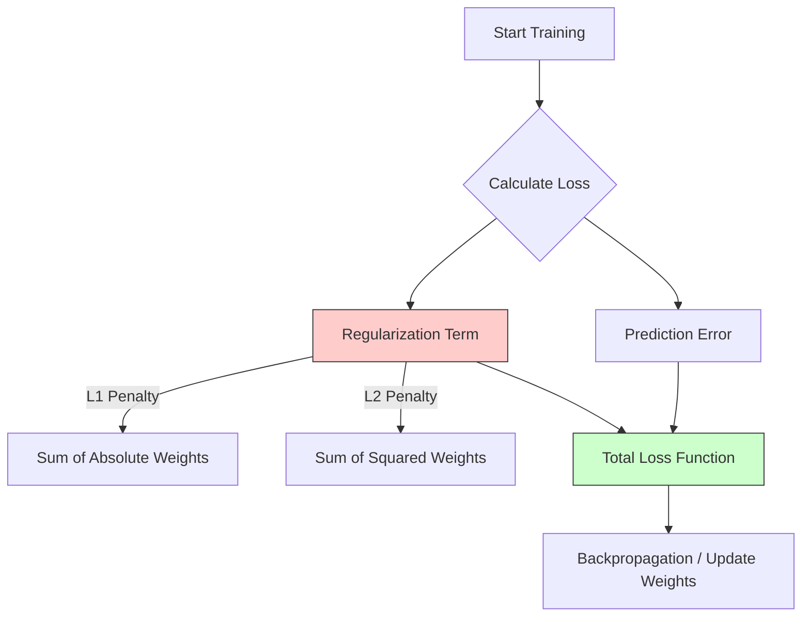

## Pengantar: Membayar Harga Fleksibilitas

Jika [[Overfitting]] adalah seorang penjahit yang terlalu obsesif hingga mengukur setiap kerutan baju, maka **Regularization** adalah manajer ketat yang memberinya batasan anggaran.

Tanpa regularization, sebuah model [[Machine Learning]] memiliki "kebebasan mutlak" untuk memutar-mutar parameter (bobot) sesuka hatinya demi mencapai *training error* nol. Regularization memperkenalkan konsep **"Pajak Kerumitan"** (Complexity Tax).

Model tidak lagi hanya diminta untuk "meminimalkan kesalahan", tetapi "meminimalkan kesalahan **DITAMBAH** pajak atas kerumitan yang digunakan".

$$ \text{Total Cost} = \text{Error} + (\lambda \times \text{Complexity}) $$

Di mana $$\lambda$$ adalah tarif pajaknya. Semakin tinggi tarifnya, semakin model takut untuk menjadi kompleks.

## Dua Jenis Pajak: L1 vs L2

Dalam dunia algoritma, ada dua cara utama untuk menarik pajak ini, yang dikenal sebagai L1 (Lasso) dan L2 (Ridge). Bayangkan Anda sedang mengepak koper untuk perjalanan mendaki gunung.

### 1. L1 Regularization (Lasso) - "Pajak Per Barang"
Aturan: *"Anda harus membayar Rp 1 juta untuk setiap barang yang Anda masukkan ke tas, tidak peduli seberapa kecil barangnya."*

*   **Efek**: Anda akan membuang barang-barang yang tidak **benar-benar krusial**. Sikat gigi cadangan? Buang. Topi kedua? Buang.
*   **Hasil Matematis**: Koefisien fitur yang kurang penting akan ditekan hingga **tepat nol**.
*   **Kegunaan**: **Feature Selection**. Ini membuat model menjadi "jarang" (*sparse*), sangat berguna jika Anda memiliki ribuan fitur tapi menduga hanya sedikit yang relevan.

### 2. L2 Regularization (Ridge) - "Pajak Berat Barang"
Aturan: *"Anda harus membayar pajak sebesar 10% dari total berat barang bawaan Anda."*

*   **Efek**: Anda tidak membuang barang, tapi Anda mencari versi yang lebih ringan dari *semuanya*. Anda membawa sikat gigi *travel size*, handuk tipis, dan botol kecil.
*   **Hasil Matematis**: Koefisien fitur ditekan mendekati nol, tapi **tidak pernah benar-benar nol**.
*   **Kegunaan**: Menangani **Multicollinearity** (fitur yang mirip). Model akan membagi beban "penting" ke semua fitur yang mirip tersebut, bukan memilih satu dan membuang lainnya.

| Fitur | L1 (Lasso) | L2 (Ridge) |
| :--- | :--- | :--- |
| **Analogi** | Pajak per *item*. | Pajak persentase nilai/berat. |
| **Efek pada Bobot** | Menjadi 0 (Zeroing out). | Menjadi sangat kecil (Shrinking). |
| **Solusi** | Sparse (Jarang). | Dense (Padat tapi kecil). |
| **Kapan Dipakai?** | Ingin membuang fitur sampah. | Ingin menjaga semua info tapi mencegah dominasi. |

## Teknik Lain: Dropout (Kamp Pelatihan Survival)

Khusus untuk [[Neural Networks]], ada teknik regularization brutal bernama **Dropout**.

Bayangkan sebuah tim sepak bola di mana setiap sesi latihan, pelatih secara acak menunjuk 30% pemain untuk **duduk di bangku cadangan**.
*   Pemain yang ada di lapangan tidak bisa lagi mengandalkan "bintang tim" (fitur dominan) karena bisa jadi si bintang sedang dicadangkan.
*   Setiap pemain dipaksa untuk belajar mandiri dan bekerja sama dengan siapa saja.

Ini mencegah jaringan saraf menjadi terlalu bergantung pada satu *neuron* tertentu. Hasilnya adalah jaringan yang lebih tangguh (robust) dan demokratis dalam pengambilan keputusan.

> **Diagram**: Modifikasi fungsi tujuan. Model tidak lagi hanya mengejar "Prediksi Benar" (C), tapi juga harus menyeimbangkannya dengan "Biaya Kerumitan" (D).

## Refleksi: Pisau Ockham

Regularization adalah manifestasi matematis dari prinsip filosofis kuno: **Ockham's Razor** (Pisau Ockham).

> *"Entia non sunt multiplicanda praeter necessitatem."*
> (Entitas tidak boleh digandakan melebihi kebutuhan).

Jika ada dua model yang memiliki akurasi yang sama, Regularization memaksa kita memilih model yang lebih sederhana. Karena dalam kesederhanaan, seringkali terdapat kebenaran yang lebih tahan uji (generalizable) daripada dalam kerumitan yang dibuat-buat.

Regularization mengajarkan kita untuk tidak "rakus" terhadap data latih, dan selalu menyisakan ruang keraguan untuk ketidakpastian dunia nyata.

---
**Lihat juga**:
*   [[Overfitting]] - Masalah utama yang diselesaikan oleh konsep ini.
*   [[Bias Variance Tradeoff]] - Menyeimbangkan bias (kesederhanaan) dan variance (kompleksitas).
*   [[Optimization]] - Bagaimana Gradient Descent bekerja dengan fungsi loss baru ini.
*   [[Feature Engineering]] - Proses memilih fitur sebelum regularization melakukannya untuk Anda.
