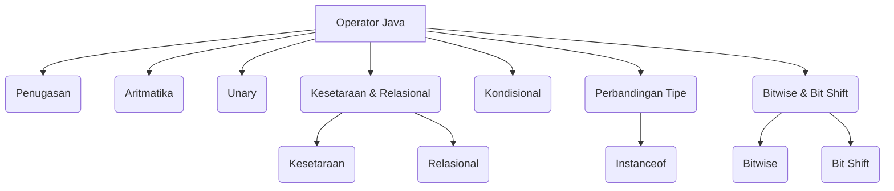

## Pengantar: Papan Tulis Operator

Bayangkan sebuah [[Papan Tulis|papan tulis]] besar di kelas pemrograman, di mana setiap [[Operator|operator]] Java adalah sebuah simbol atau rumus yang tertulis jelas. Setiap simbol memiliki fungsi unik, seperti halnya setiap rumus matematika memiliki tujuan spesifik. Memahami operator-operator ini adalah kunci untuk membaca dan menulis "persamaan" kode yang benar, memungkinkan kita untuk memanipulasi [[Variabel|variabel]] dan mengarahkan alur logika program. Papan tulis ini adalah panduan visual kita untuk memahami bahasa Java, di mana setiap goresan kapur (operator) membentuk instruksi yang dapat dieksekusi oleh komputer.

## Operator Penugasan: Menulis Nilai

Operator penugasan adalah simbol pertama yang sering kita tulis di papan tulis. Fungsinya adalah untuk memberikan nilai kepada sebuah variabel.

### Penugasan Sederhana
- `=` : Operator penugasan sederhana. Ini seperti menuliskan hasil perhitungan ke dalam sebuah kotak.

## Operator Aritmatika: Perhitungan Dasar

Operator aritmatika adalah rumus-rumus dasar yang kita gunakan untuk melakukan perhitungan matematis.

- `+` : Operator penjumlahan (juga digunakan untuk penggabungan String).
- `-` : Operator pengurangan.
- `*` : Operator perkalian.
- `/` : Operator pembagian.
- `%` : Operator sisa pembagian (modulus).

## Operator Unary: Mengubah Tanda atau Nilai

Operator unary adalah simbol yang bekerja pada satu nilai tunggal, mengubah tanda atau nilainya.

- `+` : Operator plus unary; menunjukkan nilai positif (angka sudah positif tanpa ini).
- `-` : Operator minus unary; menegasikan sebuah ekspresi.
- `++` : Operator increment; menambah nilai sebesar 1.
- `--` : Operator decrement; mengurangi nilai sebesar 1.
- `!` : Operator komplemen logis; membalik nilai [[Tipe Data Boolean|boolean]].

## Operator Kesetaraan dan Relasional: Membandingkan Angka

Operator ini seperti tanda perbandingan dalam matematika, digunakan untuk membandingkan dua nilai dan menghasilkan nilai boolean (`true` atau `false`).

### Kesetaraan
- `==` : Sama dengan.
- `!=` : Tidak sama dengan.

### Relasional
- `>` : Lebih besar dari.
- `>=` : Lebih besar dari atau sama dengan.
- `<` : Lebih kecil dari.
- `<=` : Lebih kecil dari atau sama dengan.

## Operator Kondisional: Membuat Keputusan

Operator kondisional adalah simbol yang membantu kita membuat keputusan dalam program, seperti cabang dalam sebuah diagram alir.

- `&&` : Conditional-AND. Mengembalikan `true` jika kedua kondisi benar.
- `||` : Conditional-OR. Mengembalikan `true` jika salah satu kondisi benar.
- `?:` : Ternary (singkatan untuk pernyataan `if-then-else`).

## Operator Perbandingan Tipe: Memeriksa Identitas

Operator ini digunakan untuk memeriksa jenis atau identitas suatu objek.

- `instanceof` : Membandingkan sebuah objek dengan tipe yang ditentukan. Berguna dalam [[Polimorfisme|polimorfisme]].

## Operator Bitwise dan Bit Shift: Manipulasi Tingkat Rendah

Operator ini bekerja langsung pada representasi biner dari angka, memungkinkan manipulasi data pada tingkat [[Pemrograman Tingkat Rendah|bit]].

### Bitwise
- `~` : Komplemen bitwise unary.
- `&` : Bitwise AND.
- `^` : Bitwise exclusive OR.
- `|` : Bitwise inclusive OR.

### Bit Shift
- `<<` : Geser kiri bertanda.
- `>>` : Geser kanan bertanda.
- `>>>` : Geser kanan tak bertanda.

## Diagram: Peta Operator di Papan Tulis

Berikut adalah diagram yang memvisualisasikan kategori utama operator Java, seperti peta yang digambar di papan tulis untuk memudahkan pemahaman.

Diagram di atas berfungsi sebagai peta visual dari berbagai kategori operator Java. Setiap kotak mewakili jenis operator, dan panah menunjukkan bagaimana mereka dikelompokkan di bawah kategori utama "Operator Java". Ini membantu kita melihat gambaran besar dan memahami struktur hierarkis dari alat-alat yang tersedia untuk memanipulasi data dalam program kita.

## Refleksi: Membaca Papan Tulis Kode

Setelah mengisi papan tulis dengan berbagai simbol dan rumus operator, kita dapat melihat bahwa setiap operator adalah alat penting dalam kotak perkakas seorang programmer. Seperti seorang siswa yang memahami setiap rumus di papan tulis, seorang programmer yang menguasai operator dapat menulis kode yang efisien dan logis. Dari penugasan sederhana hingga manipulasi bit yang kompleks, setiap operator adalah bagian dari bahasa universal yang memungkinkan kita untuk berkomunikasi dengan mesin. Dengan pemahaman yang kuat tentang "Papan Tulis Operator" ini, kita siap untuk menyelesaikan masalah yang lebih kompleks dan membangun solusi yang lebih canggih dalam perjalanan [[Belajar Pemrograman|pemrograman]] kita.
