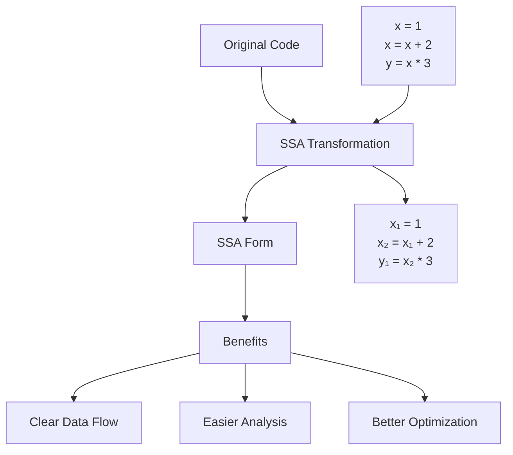
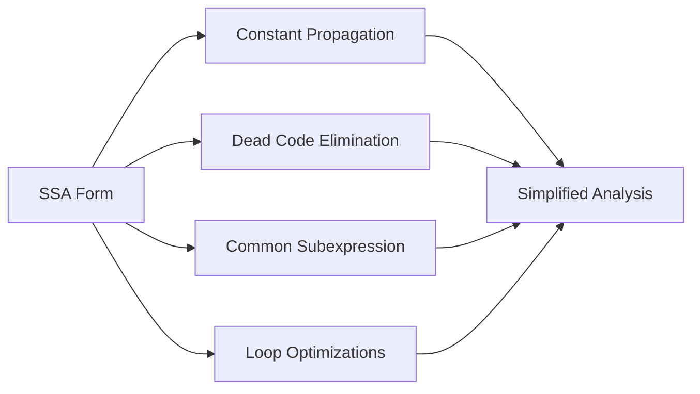

## Pengantar: Renovasi Struktur Kode

Static Single Assignment (SSA) Generation adalah **arsitek yang merancang ulang kode** untuk efisiensi maksimal. Seperti arsitek yang merenovasi bangunan lama menjadi lebih fungsional, SSA mengubah struktur kode menjadi bentuk yang lebih mudah dioptimasi dan dianalisis.

## Konsep Fundamental: Prinsip Single Assignment

### Filosofi "Satu Variabel, Satu Kelahiran"
SSA form memastikan setiap variabel hanya **"dilahirkan" sekali** dalam program. Ini seperti sistem inventori yang memberikan ID unik untuk setiap item, memudahkan pelacakan dan manajemen sepanjang lifecycle program.



## Transformasi Process: Dari Chaos ke Order

### Variable Renaming - Sistem Penamaan Unik
- **Setiap assignment** mendapat variabel baru dengan subscript
- Eliminasi ambiguitas dalam data flow analysis
- Clear dependency chains untuk optimization passes
- Foundation untuk advanced compiler techniques

| Before SSA | After SSA | Benefit |
|------------|-----------|---------|
| `x = a + b`<br/>`x = x * 2` | `x₁ = a + b`<br/>`x₂ = x₁ * 2` | Clear data dependencies |
| `if (c) x = 1`<br/>`else x = 2`<br/>`y = x + 3` | `if (c) x₁ = 1`<br/>`else x₂ = 2`<br/>`x₃ = φ(x₁, x₂)`<br/>`y₁ = x₃ + 3` | Explicit control flow merge |

## Phi Functions: Konduktor Merge Points

### Control Flow Convergence
Phi functions (φ) adalah **konduktor yang mengatur pertemuan jalur** dalam control flow. Seperti traffic controller di persimpangan, phi functions menentukan nilai mana yang harus digunakan ketika multiple paths bertemu.

```mermaid
graph TD
    A[Entry] --> B{Condition}
    B -->|True| C[x₁ = 10]
    B -->|False| D[x₂ = 20]
    C --> E[x₃ = φ(x₁, x₂)]
    D --> E
    E --> F[Use x₃]
```

### Phi Placement Algorithm
- **Dominance frontiers** menentukan lokasi phi functions
- Iterative algorithm untuk minimal phi placement
- Pruning unnecessary phi functions untuk efficiency
- Integration dengan liveness analysis

## SSA dalam Modern Compilers

### LLVM IR - Industrial Standard
LLVM menggunakan SSA sebagai **bahasa universal** untuk optimization:
- Type-safe SSA values dengan explicit typing
- Infinite virtual registers untuk simplified code generation
- Rich instruction set untuk various operations
- Platform-independent intermediate representation

### MLIR Integration
- **Multi-Level IR** dengan SSA at each level
- Dialect-specific SSA operations
- Hierarchical optimization opportunities
- Composable transformation passes

## Optimization Opportunities

### Data Flow Analysis Enhancement


### Advanced Techniques
- **Value numbering** untuk redundancy elimination
- Sparse conditional constant propagation
- Aggressive dead code elimination
- Loop-invariant code motion

## Implementation Challenges

### Memory Overhead
- **Increased variable count** dari renaming process
- Phi function proliferation di complex control flow
- Register pressure dalam code generation phase
- Memory usage optimization strategies

### Construction Complexity
| Phase | Challenge | Solution |
|-------|-----------|----------|
| Dominance | Computing dominance tree | Efficient algorithms (Lengauer-Tarjan) |
| Phi Placement | Minimal phi insertion | Dominance frontier computation |
| Renaming | Variable versioning | Stack-based renaming algorithm |
| Pruning | Removing dead phis | Liveness analysis integration |

## Deconstruction: Back to Normal Form

### SSA Destruction Process
Setelah optimization, SSA harus **dikembalikan ke bentuk normal** untuk code generation:
- Phi elimination melalui copy insertion
- Register allocation considerations
- Critical edge splitting untuk correctness
- Coalescing opportunities untuk efficiency

### Register Allocation Integration
- **Interference graph construction** dari SSA form
- Copy coalescing untuk reducing moves
- Spill code insertion strategies
- Architecture-specific considerations

## Applications Beyond Compilers

### Static Analysis Tools
- **Program verification** dengan precise data flow
- Security analysis untuk vulnerability detection
- Code quality metrics dan complexity analysis
- Refactoring tools dengan safe transformations

### Just-In-Time Compilation
- **Dynamic optimization** dengan runtime information
- Adaptive compilation strategies
- Speculative optimization dengan deoptimization
- Profile-guided optimization integration

## Best Practices untuk SSA Design

### Construction Guidelines
- **Minimal phi placement** untuk reduced overhead
- Efficient dominance computation algorithms
- Incremental SSA maintenance untuk dynamic updates
- Memory-conscious implementation strategies

### Optimization Integration
- **Pass ordering** untuk maximum benefit
- Sparse analysis techniques untuk scalability
- Interprocedural SSA untuk whole-program optimization
- Debugging support untuk development tools

---

*Catatan ini mengeksplorasi SSA Generation sebagai fundamental technique dalam modern compiler design, berdasarkan implementasi dalam LLVM dan best practices dalam industry.*