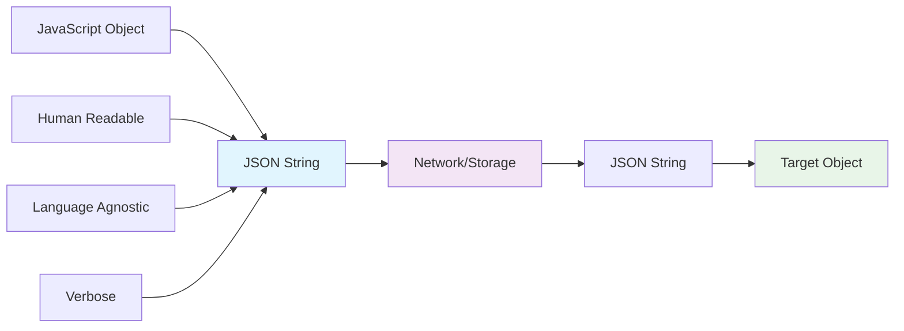

## Pengantar: Sistem Pengepakan untuk Perjalanan Lintas Dimensi

Bayangkan Serialization sebagai **sistem pengepakan canggih untuk perjalanan lintas dimensi** - seperti teknologi di film sci-fi yang dapat mengubah objek 3D menjadi data digital, mengirimkannya melalui portal, dan merekonstruksinya kembali dengan sempurna di dimensi lain. Setiap detail, struktur, dan relationship harus dipertahankan selama proses transformasi bolak-balik.

Serialization adalah proses mengkonversi data structures atau objects menjadi format yang dapat disimpan atau ditransmisikan, kemudian direkonstruksi kembali (deserialization) di tempat atau waktu yang berbeda. Ini adalah fondasi komunikasi antar sistem, persistent storage, dan distributed computing. Dalam modern web development, serialization berkaitan erat dengan [[Performance Optimization]], [[JSON]] processing, dan [[Zero-Copy]] operations untuk efficient data transfer.

**Mengapa Serialization Fundamental?**
- **Cross-System Communication**: Memungkinkan data exchange antar platform berbeda
- **Data Persistence**: Menyimpan complex objects ke database atau file system  
- **Network Transmission**: Mengirim structured data melalui network protocols
- **Caching dan Performance**: Menyimpan computed results untuk reuse

## Format Serialization: Bahasa Universal Lintas Dimensi

### JSON - Bahasa Diplomatik Sederhana

[[JSON]] seperti **bahasa diplomatik universal** yang mudah dipahami manusia dan mesin, meskipun tidak selalu paling efisien.



**JSON Serialization Examples:**
```javascript
// Complex object serialization
const userProfile = {
  id: 12345,
  name: "John Doe",
  email: "john@example.com",
  preferences: {
    theme: "dark",
    notifications: true,
    language: "en"
  },
  friends: [
    { id: 67890, name: "Jane Smith" },
    { id: 11111, name: "Bob Wilson" }
  ],
  lastLogin: new Date("2025-12-15T10:30:00Z"),
  metadata: {
    createdAt: "2023-01-15",
    version: "2.1.0"
  }
};

// Serialization dengan custom replacer
const jsonString = JSON.stringify(userProfile, (key, value) => {
  // Handle Date objects
  if (value instanceof Date) {
    return { __type: 'Date', value: value.toISOString() };
  }
  
  // Handle undefined values
  if (value === undefined) {
    return { __type: 'undefined' };
  }
  
  return value;
}, 2); // Pretty print dengan 2 spaces

// Deserialization dengan custom reviver
const reconstructed = JSON.parse(jsonString, (key, value) => {
  // Reconstruct Date objects
  if (value && value.__type === 'Date') {
    return new Date(value.value);
  }
  
  // Reconstruct undefined values
  if (value && value.__type === 'undefined') {
    return undefined;
  }
  
  return value;
});

console.log(reconstructed.lastLogin instanceof Date); // true
```

### Binary Formats - Pengepakan Efisien untuk Kargo Berat

Binary formats seperti **sistem pengepakan cargo** yang mengoptimalkan space dan speed untuk data berat.

```javascript
// Protocol Buffers (protobuf) example
// user.proto
/*
syntax = "proto3";

message User {
  int32 id = 1;
  string name = 2;
  string email = 3;
  repeated Friend friends = 4;
  google.protobuf.Timestamp last_login = 5;
}

message Friend {
  int32 id = 1;
  string name = 2;
}
*/

// Generated JavaScript code usage
const user = new User();
user.setId(12345);
user.setName("John Doe");
user.setEmail("john@example.com");

const friend1 = new Friend();
friend1.setId(67890);
friend1.setName("Jane Smith");
user.addFriends(friend1);

// Serialize to binary
const binaryData = user.serializeBinary();
console.log(`Binary size: ${binaryData.length} bytes`);

// Deserialize from binary
const reconstructedUser = User.deserializeBinary(binaryData);
console.log(reconstructedUser.getName()); // "John Doe"

// MessagePack - JSON-like but binary
const msgpack = require('msgpack5')();

const data = {
  name: "John Doe",
  age: 30,
  skills: ["JavaScript", "Python", "Go"],
  metadata: {
    timestamp: Date.now(),
    version: 1.2
  }
};

// Serialize
const packed = msgpack.encode(data);
console.log(`MessagePack size: ${packed.length} bytes`);
console.log(`JSON size: ${JSON.stringify(data).length} bytes`);

// Deserialize
const unpacked = msgpack.decode(packed);
console.log(unpacked); // Original object restored
```

### Schema Evolution - Sistem Upgrade Kompatibel

Schema evolution seperti **sistem upgrade spacecraft** yang harus tetap kompatibel dengan versi lama sambil mendukung fitur baru.

```typescript
// Versioned serialization system
interface SerializationMetadata {
  version: string;
  timestamp: number;
  format: 'json' | 'binary' | 'msgpack';
}

class VersionedSerializer<T> {
  private migrations: Map<string, (data: any) => any> = new Map();
  
  constructor(private currentVersion: string) {}
  
  // Register migration function
  addMigration(fromVersion: string, toVersion: string, migrateFn: (data: any) => any) {
    this.migrations.set(`${fromVersion}->${toVersion}`, migrateFn);
  }
  
  serialize(data: T): string {
    const envelope = {
      metadata: {
        version: this.currentVersion,
        timestamp: Date.now(),
        format: 'json' as const
      },
      data
    };
    
    return JSON.stringify(envelope);
  }
  
  deserialize(serialized: string): T {
    const envelope = JSON.parse(serialized);
    let data = envelope.data;
    
    // Apply migrations if needed
    if (envelope.metadata.version !== this.currentVersion) {
      data = this.migrate(data, envelope.metadata.version, this.currentVersion);
    }
    
    return data;
  }
  
  private migrate(data: any, fromVersion: string, toVersion: string): any {
    // Simple linear migration path
    const migrationKey = `${fromVersion}->${toVersion}`;
    const migrateFn = this.migrations.get(migrationKey);
    
    if (migrateFn) {
      return migrateFn(data);
    }
    
    // Multi-step migration (simplified)
    if (fromVersion === '1.0' && toVersion === '2.0') {
      const v1_1 = this.migrate(data, '1.0', '1.1');
      return this.migrate(v1_1, '1.1', '2.0');
    }
    
    throw new Error(`No migration path from ${fromVersion} to ${toVersion}`);
  }
}

// Usage example
interface UserV1 {
  name: string;
  email: string;
}

interface UserV2 {
  firstName: string;
  lastName: string;
  email: string;
  preferences: {
    theme: string;
  };
}

const userSerializer = new VersionedSerializer<UserV2>('2.0');

// Migration from v1.0 to v1.1 (split name)
userSerializer.addMigration('1.0', '1.1', (data: UserV1) => {
  const [firstName, ...lastNameParts] = data.name.split(' ');
  return {
    firstName,
    lastName: lastNameParts.join(' '),
    email: data.email
  };
});

// Migration from v1.1 to v2.0 (add preferences)
userSerializer.addMigration('1.1', '2.0', (data: any) => ({
  ...data,
  preferences: {
    theme: 'light' // default value
  }
}));
```

## Performance Optimization: Efisiensi Pengepakan

### Streaming Serialization - Pengepakan Sambil Jalan

Streaming serialization seperti **assembly line** yang memproses data secara continuous tanpa menunggu seluruh dataset selesai.

```javascript
// Streaming JSON serialization
class StreamingJSONSerializer {
  constructor(writeStream) {
    this.stream = writeStream;
    this.isFirstItem = true;
  }
  
  startArray() {
    this.stream.write('[');
    this.isFirstItem = true;
  }
  
  writeItem(item) {
    if (!this.isFirstItem) {
      this.stream.write(',');
    }
    this.stream.write(JSON.stringify(item));
    this.isFirstItem = false;
  }
  
  endArray() {
    this.stream.write(']');
  }
  
  startObject() {
    this.stream.write('{');
    this.isFirstProperty = true;
  }
  
  writeProperty(key, value) {
    if (!this.isFirstProperty) {
      this.stream.write(',');
    }
    this.stream.write(`"${key}":${JSON.stringify(value)}`);
    this.isFirstProperty = false;
  }
  
  endObject() {
    this.stream.write('}');
  }
}

// Usage untuk large datasets
async function serializeLargeDataset(dataSource, outputStream) {
  const serializer = new StreamingJSONSerializer(outputStream);
  
  serializer.startArray();
  
  for await (const batch of dataSource.getBatches(1000)) {
    for (const item of batch) {
      // Process dan serialize item by item
      const processedItem = await processItem(item);
      serializer.writeItem(processedItem);
    }
    
    // Yield control untuk prevent blocking
    await new Promise(resolve => setImmediate(resolve));
  }
  
  serializer.endArray();
}

// Streaming deserialization
class StreamingJSONDeserializer {
  constructor(readStream) {
    this.stream = readStream;
    this.buffer = '';
    this.depth = 0;
    this.inString = false;
    this.escapeNext = false;
  }
  
  async *parseObjects() {
    for await (const chunk of this.stream) {
      this.buffer += chunk;
      
      let startIndex = 0;
      for (let i = 0; i < this.buffer.length; i++) {
        const char = this.buffer[i];
        
        if (this.escapeNext) {
          this.escapeNext = false;
          continue;
        }
        
        if (char === '\\') {
          this.escapeNext = true;
          continue;
        }
        
        if (char === '"' && !this.escapeNext) {
          this.inString = !this.inString;
          continue;
        }
        
        if (this.inString) continue;
        
        if (char === '{') {
          this.depth++;
        } else if (char === '}') {
          this.depth--;
          
          if (this.depth === 0) {
            // Complete object found
            const objectStr = this.buffer.slice(startIndex, i + 1);
            try {
              const obj = JSON.parse(objectStr);
              yield obj;
            } catch (e) {
              console.error('Parse error:', e);
            }
            
            startIndex = i + 1;
          }
        }
      }
      
      // Keep remaining buffer
      this.buffer = this.buffer.slice(startIndex);
    }
  }
}
```

### Compression Integration - Pengepakan Berlapis

```javascript
// Compression dengan serialization
const zlib = require('zlib');
const { promisify } = require('util');

class CompressedSerializer {
  constructor(compressionLevel = 6) {
    this.compressionLevel = compressionLevel;
    this.gzip = promisify(zlib.gzip);
    this.gunzip = promisify(zlib.gunzip);
  }
  
  async serialize(data) {
    // Step 1: Serialize to JSON
    const jsonString = JSON.stringify(data);
    const jsonBuffer = Buffer.from(jsonString, 'utf8');
    
    // Step 2: Compress
    const compressed = await this.gzip(jsonBuffer, {
      level: this.compressionLevel
    });
    
    // Step 3: Add metadata header
    const metadata = {
      originalSize: jsonBuffer.length,
      compressedSize: compressed.length,
      algorithm: 'gzip',
      encoding: 'utf8'
    };
    
    const metadataBuffer = Buffer.from(JSON.stringify(metadata));
    const metadataLength = Buffer.alloc(4);
    metadataLength.writeUInt32BE(metadataBuffer.length);
    
    // Final format: [metadata_length][metadata][compressed_data]
    return Buffer.concat([metadataLength, metadataBuffer, compressed]);
  }
  
  async deserialize(buffer) {
    // Step 1: Read metadata
    const metadataLength = buffer.readUInt32BE(0);
    const metadataBuffer = buffer.slice(4, 4 + metadataLength);
    const metadata = JSON.parse(metadataBuffer.toString('utf8'));
    
    // Step 2: Extract compressed data
    const compressedData = buffer.slice(4 + metadataLength);
    
    // Step 3: Decompress
    const decompressed = await this.gunzip(compressedData);
    
    // Step 4: Parse JSON
    const jsonString = decompressed.toString(metadata.encoding);
    return JSON.parse(jsonString);
  }
  
  getCompressionRatio(originalSize, compressedSize) {
    return ((originalSize - compressedSize) / originalSize * 100).toFixed(2);
  }
}

// Usage
const serializer = new CompressedSerializer();

const largeData = {
  users: Array.from({ length: 10000 }, (_, i) => ({
    id: i,
    name: `User ${i}`,
    email: `user${i}@example.com`,
    preferences: {
      theme: i % 2 === 0 ? 'light' : 'dark',
      notifications: true
    }
  }))
};

async function demonstrateCompression() {
  const serialized = await serializer.serialize(largeData);
  const deserialized = await serializer.deserialize(serialized);
  
  const originalSize = JSON.stringify(largeData).length;
  const compressedSize = serialized.length;
  
  console.log(`Original size: ${originalSize} bytes`);
  console.log(`Compressed size: ${compressedSize} bytes`);
  console.log(`Compression ratio: ${serializer.getCompressionRatio(originalSize, compressedSize)}%`);
  console.log(`Data integrity: ${JSON.stringify(largeData) === JSON.stringify(deserialized)}`);
}
```

## Security Considerations: Keamanan Pengepakan

### Safe Deserialization - Pemeriksaan Keamanan Portal

```typescript
// Secure deserialization dengan validation
import Joi from 'joi';

class SecureDeserializer {
  private schemas: Map<string, Joi.Schema> = new Map();
  private maxDepth = 10;
  private maxSize = 1024 * 1024; // 1MB
  
  registerSchema(type: string, schema: Joi.Schema) {
    this.schemas.set(type, schema);
  }
  
  deserialize<T>(data: string, expectedType: string): T {
    // Size check
    if (data.length > this.maxSize) {
      throw new Error(`Data too large: ${data.length} bytes`);
    }
    
    // Parse dengan error handling
    let parsed: any;
    try {
      parsed = JSON.parse(data);
    } catch (error) {
      throw new Error(`Invalid JSON: ${error.message}`);
    }
    
    // Depth check
    if (this.getObjectDepth(parsed) > this.maxDepth) {
      throw new Error(`Object too deep: exceeds ${this.maxDepth} levels`);
    }
    
    // Schema validation
    const schema = this.schemas.get(expectedType);
    if (schema) {
      const { error, value } = schema.validate(parsed);
      if (error) {
        throw new Error(`Validation failed: ${error.message}`);
      }
      return value as T;
    }
    
    // Sanitization untuk unknown types
    return this.sanitizeObject(parsed) as T;
  }
  
  private getObjectDepth(obj: any, currentDepth = 0): number {
    if (currentDepth > this.maxDepth) return currentDepth;
    
    if (typeof obj !== 'object' || obj === null) {
      return currentDepth;
    }
    
    let maxChildDepth = currentDepth;
    for (const key in obj) {
      if (obj.hasOwnProperty(key)) {
        const childDepth = this.getObjectDepth(obj[key], currentDepth + 1);
        maxChildDepth = Math.max(maxChildDepth, childDepth);
      }
    }
    
    return maxChildDepth;
  }
  
  private sanitizeObject(obj: any): any {
    if (typeof obj !== 'object' || obj === null) {
      return obj;
    }
    
    if (Array.isArray(obj)) {
      return obj.map(item => this.sanitizeObject(item));
    }
    
    const sanitized: any = {};
    for (const key in obj) {
      if (obj.hasOwnProperty(key)) {
        // Skip dangerous properties
        if (key.startsWith('__') || key === 'constructor' || key === 'prototype') {
          continue;
        }
        
        sanitized[key] = this.sanitizeObject(obj[key]);
      }
    }
    
    return sanitized;
  }
}

// Schema definitions
const userSchema = Joi.object({
  id: Joi.number().integer().positive().required(),
  name: Joi.string().min(1).max(100).required(),
  email: Joi.string().email().required(),
  preferences: Joi.object({
    theme: Joi.string().valid('light', 'dark').default('light'),
    notifications: Joi.boolean().default(true)
  }).default({})
});

// Usage
const deserializer = new SecureDeserializer();
deserializer.registerSchema('User', userSchema);

try {
  const user = deserializer.deserialize<User>(userJson, 'User');
  console.log('Safely deserialized user:', user);
} catch (error) {
  console.error('Deserialization failed:', error.message);
}
```

## Trade-offs dan Best Practices: Memilih Sistem Pengepakan

### Format Comparison

| Format | Size | Speed | Human Readable | Schema Evolution | Language Support |
|--------|------|-------|----------------|------------------|------------------|
| **JSON** | Large | Medium | Yes | Limited | Universal |
| **MessagePack** | Small | Fast | No | Limited | Good |
| **Protocol Buffers** | Smallest | Fastest | No | Excellent | Excellent |
| **Avro** | Small | Fast | No | Excellent | Good |
| **XML** | Largest | Slow | Yes | Good | Universal |

### Best Practices

```javascript
// 1. Choose appropriate format berdasarkan use case
class SerializationStrategy {
  static getOptimalFormat(requirements) {
    if (requirements.humanReadable && requirements.debugging) {
      return 'json';
    }
    
    if (requirements.performance && requirements.size) {
      return 'protobuf';
    }
    
    if (requirements.schemaEvolution) {
      return 'avro';
    }
    
    if (requirements.simplicity && requirements.webCompatible) {
      return 'json';
    }
    
    return 'messagepack'; // Good default
  }
}

// 2. Implement proper error handling
class RobustSerializer {
  serialize(data, options = {}) {
    try {
      const { format = 'json', validate = true } = options;
      
      if (validate) {
        this.validateData(data);
      }
      
      switch (format) {
        case 'json':
          return this.serializeJSON(data);
        case 'binary':
          return this.serializeBinary(data);
        default:
          throw new Error(`Unsupported format: ${format}`);
      }
    } catch (error) {
      throw new Error(`Serialization failed: ${error.message}`);
    }
  }
  
  deserialize(serializedData, options = {}) {
    try {
      const { format = 'json', validate = true } = options;
      
      const data = this.parseData(serializedData, format);
      
      if (validate) {
        this.validateData(data);
      }
      
      return data;
    } catch (error) {
      throw new Error(`Deserialization failed: ${error.message}`);
    }
  }
}

// 3. Performance monitoring
class PerformanceAwareSerializer {
  constructor() {
    this.metrics = {
      serializationTime: [],
      deserializationTime: [],
      sizeRatio: []
    };
  }
  
  serialize(data) {
    const start = performance.now();
    const result = JSON.stringify(data);
    const end = performance.now();
    
    this.metrics.serializationTime.push(end - start);
    this.metrics.sizeRatio.push(result.length / JSON.stringify(data).length);
    
    return result;
  }
  
  getPerformanceReport() {
    return {
      avgSerializationTime: this.average(this.metrics.serializationTime),
      avgDeserializationTime: this.average(this.metrics.deserializationTime),
      avgSizeRatio: this.average(this.metrics.sizeRatio)
    };
  }
  
  private average(arr) {
    return arr.reduce((a, b) => a + b, 0) / arr.length;
  }
}
```

## Studi Kasus: Sistem Pengepakan Sukses

**Google Protocol Buffers**: 3-10x smaller, 20-100x faster than XML
**Apache Avro**: Schema evolution tanpa breaking changes di LinkedIn
**MessagePack**: 2x faster serialization di Redis
**JSON**: Universal compatibility di REST APIs worldwide

**Lessons Learned:**
- Format choice depends heavily pada specific requirements dan constraints
- Schema evolution planning crucial untuk long-term maintainability  
- Performance monitoring essential untuk optimization decisions
- Security considerations tidak boleh diabaikan dalam production systems

## Refleksi: Masa Depan Pengepakan Data

Serialization telah berevolusi dari simple data conversion menjadi sophisticated communication protocol yang mendukung modern distributed systems. Seperti sistem pengepakan yang berkembang dari manual packing menjadi automated logistics, serialization terus berinovasi menuju **intelligent data transformation**.

Masa depan serialization terletak pada **adaptive optimization** - AI-powered format selection, automatic compression tuning, dan schema evolution prediction. Dengan [[Machine Learning]] dan advanced analytics, serialization systems akan semakin pintar dalam memilih optimal strategies berdasarkan data patterns dan usage contexts.

Investasi dalam memahami serialization adalah investasi dalam system architecture - seperti memiliki sistem logistik yang excellent, serialization yang optimal memungkinkan systems untuk communicate efficiently, scale gracefully, dan evolve sustainably dalam distributed computing landscape.

---

*Catatan ini menggambarkan Serialization sebagai sistem pengepakan universal untuk perjalanan lintas dimensi, dengan analogi sci-fi yang memudahkan pemahaman tentang data transformation, format selection, dan best practices dalam modern system communication.*