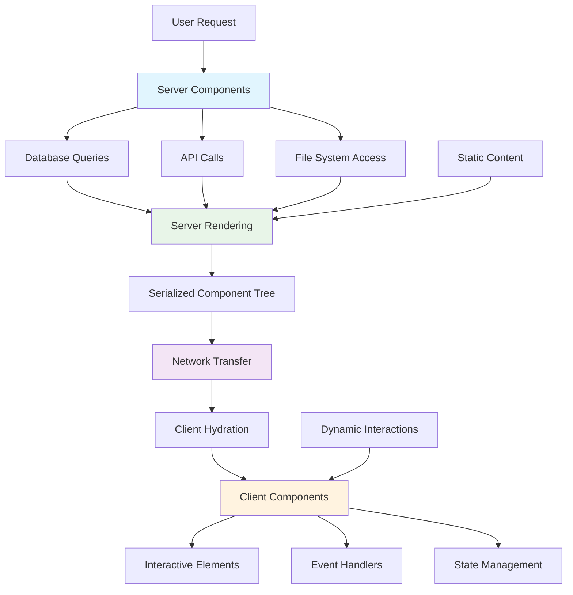

## Pengantar: Orkestra yang Bermain di Dua Panggung Sekaligus

Bayangkan Server Components sebagai **orkestra revolusioner** yang dapat bermain di dua panggung sekaligus - sebagian musisi bermain di server (backstage) menghasilkan rich, complex melodies, sementara sebagian lain bermain di client (front stage) memberikan interactive experience kepada audience. Kedua bagian orkestra ini bekerja dalam harmoni perfect, dengan server orchestra menyediakan foundation yang kuat dan client orchestra memberikan responsiveness yang immediate.

Server Components adalah paradigm baru dalam [[React]] yang memungkinkan components untuk render di server, mengirimkan hanya hasil rendering ke client tanpa [[JavaScript]] bundle overhead. Ini menciptakan hybrid architecture di mana server-side dan client-side rendering bekerja seamlessly together, mengoptimalkan both [[Performance Optimization]] dan [[Developer Experience]].

**Mengapa Server Components Revolutionary?**
- **Zero Bundle Impact**: Server components tidak menambah [[JavaScript]] bundle size
- **Direct Data Access**: Akses langsung ke databases dan APIs tanpa additional network requests
- **Automatic Code Splitting**: Natural code splitting antara server dan client code
- **Enhanced Security**: Sensitive operations tetap di server, tidak exposed ke client
- **Improved Performance**: Faster initial page loads dengan reduced client-side processing

## Core Architecture: Hybrid Rendering System

### Server vs Client Component Boundary

Server Components menciptakan **clear boundary** antara server-side dan client-side execution:



Diagram ini menunjukkan bagaimana Server Components handle data fetching dan rendering di server, kemudian mengirim hasil ke client di mana Client Components mengambil alih untuk interactivity.

### Basic Server Component Implementation

```javascript
// ServerComponent.server.js - Runs on server only
import { db } from './database';
import ClientComponent from './ClientComponent.client';

// Server Component - no useState, useEffect, or event handlers
async function ProductList({ category }) {
    // Direct database access - tidak perlu API endpoint
    const products = await db.products.findMany({
        where: { category },
        include: { reviews: true, inventory: true }
    });
    
    // Heavy computation di server
    const enrichedProducts = products.map(product => ({
        ...product,
        averageRating: calculateAverageRating(product.reviews),
        isInStock: product.inventory.quantity > 0,
        priceWithTax: calculatePriceWithTax(product.price, product.category)
    }));
    
    return (
        <div className="product-list">
            <h2>Products in {category}</h2>
            {enrichedProducts.map(product => (
                <div key={product.id} className="product-card">
                    <h3>{product.name}</h3>
                    <p>Price: ${product.priceWithTax}</p>
                    <p>Rating: {product.averageRating}/5</p>
                    
                    {/* Client Component untuk interactivity */}
                    <ClientComponent 
                        productId={product.id}
                        initialStock={product.isInStock}
                    />
                </div>
            ))}
        </div>
    );
}

// Helper functions - berjalan di server
function calculateAverageRating(reviews) {
    if (reviews.length === 0) return 0;
    const sum = reviews.reduce((acc, review) => acc + review.rating, 0);
    return Math.round((sum / reviews.length) * 10) / 10;
}

function calculatePriceWithTax(price, category) {
    const taxRates = {
        electronics: 0.08,
        clothing: 0.06,
        books: 0.0
    };
    const taxRate = taxRates[category] || 0.05;
    return Math.round((price * (1 + taxRate)) * 100) / 100;
}

export default ProductList;
```

### Client Component Integration

```javascript
// ClientComponent.client.js - Runs on client
'use client'; // Directive untuk Client Component

import { useState, useTransition } from 'react';

function AddToCartButton({ productId, initialStock }) {
    const [isInCart, setIsInCart] = useState(false);
    const [isPending, startTransition] = useTransition();
    const [stock, setStock] = useState(initialStock);
    
    const handleAddToCart = () => {
        startTransition(async () => {
            try {
                // Client-side API call
                const response = await fetch('/api/cart', {
                    method: 'POST',
                    headers: { 'Content-Type': 'application/json' },
                    body: JSON.stringify({ productId, quantity: 1 })
                });
                
                if (response.ok) {
                    setIsInCart(true);
                    // Update stock optimistically
                    setStock(prev => prev - 1);
                }
            } catch (error) {
                console.error('Failed to add to cart:', error);
            }
        });
    };
    
    return (
        <div className="cart-controls">
            <button 
                onClick={handleAddToCart}
                disabled={!stock || isPending}
                className={`add-to-cart ${isInCart ? 'added' : ''}`}
            >
                {isPending ? 'Adding...' : isInCart ? 'Added to Cart' : 'Add to Cart'}
            </button>
            
            {stock <= 5 && stock > 0 && (
                <p className="low-stock">Only {stock} left in stock!</p>
            )}
            
            {stock === 0 && (
                <p className="out-of-stock">Out of stock</p>
            )}
        </div>
    );
}

export default AddToCartButton;
```

## Advanced Patterns dan Data Flow

### Streaming Server Components

Server Components dapat di-stream untuk **progressive rendering**:

```javascript
// StreamingLayout.server.js
import { Suspense } from 'react';
import Header from './Header.server';
import Sidebar from './Sidebar.server';
import MainContent from './MainContent.server';
import Footer from './Footer.server';

function StreamingLayout({ children }) {
    return (
        <html>
            <body>
                {/* Header renders immediately */}
                <Header />
                
                <div className="main-layout">
                    {/* Sidebar dapat di-stream secara terpisah */}
                    <Suspense fallback={<SidebarSkeleton />}>
                        <Sidebar />
                    </Suspense>
                    
                    {/* Main content dengan nested suspense */}
                    <main>
                        <Suspense fallback={<ContentSkeleton />}>
                            <MainContent>
                                {children}
                            </MainContent>
                        </Suspense>
                    </main>
                </div>
                
                {/* Footer renders last */}
                <Footer />
            </body>
        </html>
    );
}

// MainContent.server.js - dengan nested data fetching
async function MainContent({ children }) {
    // Multiple parallel data fetches
    const [userProfile, notifications, recentActivity] = await Promise.all([
        fetchUserProfile(),
        fetchNotifications(),
        fetchRecentActivity()
    ]);
    
    return (
        <div className="main-content">
            <div className="user-info">
                <UserProfile data={userProfile} />
                
                <Suspense fallback={<NotificationsSkeleton />}>
                    <NotificationsList data={notifications} />
                </Suspense>
            </div>
            
            <div className="content-area">
                {children}
                
                <Suspense fallback={<ActivitySkeleton />}>
                    <RecentActivity data={recentActivity} />
                </Suspense>
            </div>
        </div>
    );
}
```

### Data Fetching Patterns

```javascript
// DataFetchingPatterns.server.js
import { cache } from 'react';

// Cache function untuk deduplication
const getUser = cache(async (userId) => {
    console.log('Fetching user:', userId); // Only logs once per request
    return await db.user.findUnique({ where: { id: userId } });
});

const getUserPosts = cache(async (userId) => {
    return await db.post.findMany({ 
        where: { authorId: userId },
        orderBy: { createdAt: 'desc' }
    });
});

// Server Component dengan optimized data fetching
async function UserDashboard({ userId }) {
    // Parallel data fetching
    const [user, posts, analytics] = await Promise.all([
        getUser(userId),
        getUserPosts(userId),
        getAnalytics(userId)
    ]);
    
    return (
        <div className="dashboard">
            <UserHeader user={user} />
            
            <div className="dashboard-grid">
                <div className="posts-section">
                    <h2>Recent Posts</h2>
                    <PostsList posts={posts} />
                </div>
                
                <div className="analytics-section">
                    <h2>Analytics</h2>
                    <AnalyticsChart data={analytics} />
                </div>
            </div>
        </div>
    );
}

// Nested Server Component dengan shared data
async function PostsList({ posts }) {
    return (
        <div className="posts-list">
            {posts.map(post => (
                <PostCard key={post.id} post={post} />
            ))}
        </div>
    );
}

async function PostCard({ post }) {
    // Reuse cached user data
    const author = await getUser(post.authorId);
    
    return (
        <article className="post-card">
            <h3>{post.title}</h3>
            <p>By {author.name}</p>
            <p>{post.excerpt}</p>
            
            {/* Client Component untuk interactions */}
            <PostInteractions postId={post.id} />
        </article>
    );
}
```

## Integration dengan Modern React Features

### Server Components + Concurrent Features

Server Components bekerja seamlessly dengan [[Concurrent Features]]:

```javascript
// ConcurrentServerApp.js
import { Suspense } from 'react';
import { unstable_cache as cache } from 'react';

// Server Component dengan caching
const CachedProductData = cache(
    async (productId) => {
        const product = await fetchProduct(productId);
        return product;
    },
    ['product'], // Cache key
    { revalidate: 3600 } // Revalidate every hour
);

function ProductPage({ productId }) {
    return (
        <div className="product-page">
            <Suspense fallback={<ProductSkeleton />}>
                <ProductDetails productId={productId} />
            </Suspense>
            
            <Suspense fallback={<ReviewsSkeleton />}>
                <ProductReviews productId={productId} />
            </Suspense>
            
            <Suspense fallback={<RecommendationsSkeleton />}>
                <RelatedProducts productId={productId} />
            </Suspense>
        </div>
    );
}

// Server Components dengan progressive enhancement
async function ProductDetails({ productId }) {
    const product = await CachedProductData(productId);
    
    return (
        <div className="product-details">
            <h1>{product.name}</h1>
            
            <p>{product.description}</p>
            
            {/* Client Component untuk cart functionality */}
            <AddToCartForm 
                productId={productId}
                price={product.price}
                availability={product.inStock}
            />
        </div>
    );
}
```

### Server Actions Integration

```javascript
// ServerActions.js - Server-side form handling
'use server';

import { revalidatePath } from 'next/cache';
import { redirect } from 'next/navigation';

export async function createPost(formData) {
    const title = formData.get('title');
    const content = formData.get('content');
    const authorId = formData.get('authorId');
    
    // Validation
    if (!title || !content) {
        return { error: 'Title and content are required' };
    }
    
    try {
        // Database operation
        const post = await db.post.create({
            data: {
                title,
                content,
                authorId: parseInt(authorId)
            }
        });
        
        // Revalidate affected pages
        revalidatePath('/posts');
        revalidatePath(`/users/${authorId}`);
        
        // Redirect to new post
        redirect(`/posts/${post.id}`);
    } catch (error) {
        return { error: 'Failed to create post' };
    }
}

// PostForm.client.js - Client Component menggunakan Server Action
'use client';

import { useFormState } from 'react-dom';
import { createPost } from './ServerActions';

function PostForm({ userId }) {
    const [state, formAction] = useFormState(createPost, null);
    
    return (
        <form action={formAction} className="post-form">
            <input type="hidden" name="authorId" value={userId} />
            
            <div className="form-group">
                <label htmlFor="title">Title</label>
                <input 
                    type="text" 
                    id="title" 
                    name="title" 
                    required 
                />
            </div>
            
            <div className="form-group">
                <label htmlFor="content">Content</label>
                <textarea 
                    id="content" 
                    name="content" 
                    rows={10} 
                    required 
                />
            </div>
            
            <button type="submit">Create Post</button>
            
            {state?.error && (
                <p className="error">{state.error}</p>
            )}
        </form>
    );
}
```

## Performance Optimization Strategies

### Bundle Size Analysis

Server Components dramatically reduce client bundle size:

```javascript
// Bundle analysis comparison
// Traditional React App
const TraditionalApp = {
    components: [
        'ProductList.js',      // 15KB
        'ProductCard.js',      // 8KB
        'DatabaseClient.js',   // 25KB
        'APIHelpers.js',       // 12KB
        'DataProcessing.js'    // 18KB
    ],
    totalSize: '78KB',
    networkRequests: 5, // Separate API calls
    initialRender: 'Client-side only'
};

// Server Components App
const ServerComponentsApp = {
    serverComponents: [
        'ProductList.server.js',    // 0KB client bundle
        'ProductCard.server.js',    // 0KB client bundle
        'DatabaseQueries.server.js' // 0KB client bundle
    ],
    clientComponents: [
        'AddToCart.client.js',      // 5KB
        'InteractiveElements.js'    // 3KB
    ],
    totalClientSize: '8KB',
    networkRequests: 1, // Single server render
    initialRender: 'Server + Client hybrid'
};
```

### Caching Strategies

```javascript
// Advanced caching dengan Server Components
import { unstable_cache as cache, revalidateTag } from 'next/cache';

// Multi-level caching strategy
const getCachedData = cache(
    async (key, params) => {
        // L1: Application cache
        const appCacheKey = `app:${key}:${JSON.stringify(params)}`;
        let data = await appCache.get(appCacheKey);
        
        if (!data) {
            // L2: Database query
            data = await database.query(key, params);
            
            // Cache dengan different TTLs
            const ttl = getTTLForDataType(key);
            await appCache.set(appCacheKey, data, ttl);
        }
        
        return data;
    },
    ['data-cache'],
    {
        revalidate: 3600, // 1 hour
        tags: ['products', 'users'] // Cache tags untuk selective invalidation
    }
);

// Smart cache invalidation
export async function invalidateProductCache(productId) {
    // Invalidate specific product
    revalidateTag(`product:${productId}`);
    
    // Invalidate related caches
    revalidateTag('product-list');
    revalidateTag('recommendations');
}
```

## Security dan Best Practices

### Secure Data Handling

```javascript
// SecureServerComponent.server.js
import { headers } from 'next/headers';
import { verifyJWT } from './auth';

async function SecureUserDashboard() {
    // Server-side authentication
    const headersList = headers();
    const authorization = headersList.get('authorization');
    
    if (!authorization) {
        return <LoginPrompt />;
    }
    
    try {
        const user = await verifyJWT(authorization);
        
        // Sensitive data operations di server
        const [
            personalData,
            financialInfo,
            privateMessages
        ] = await Promise.all([
            getPersonalData(user.id),
            getFinancialInfo(user.id), // Never sent to client
            getPrivateMessages(user.id)
        ]);
        
        // Only send necessary data ke client
        return (
            <div className="secure-dashboard">
                <UserProfile data={personalData} />
                
                {/* Financial summary tanpa sensitive details */}
                <FinancialSummary 
                    balance={financialInfo.balance}
                    // Don't send account numbers, SSN, etc.
                />
                
                <MessagesList messages={privateMessages} />
            </div>
        );
    } catch (error) {
        return <AuthError />;
    }
}

// Environment-specific configurations
const getSecureConfig = () => {
    if (process.env.NODE_ENV === 'production') {
        return {
            database: process.env.PROD_DATABASE_URL,
            apiKeys: {
                payment: process.env.PROD_PAYMENT_KEY,
                analytics: process.env.PROD_ANALYTICS_KEY
            }
        };
    }
    
    return {
        database: process.env.DEV_DATABASE_URL,
        apiKeys: {
            payment: process.env.DEV_PAYMENT_KEY,
            analytics: process.env.DEV_ANALYTICS_KEY
        }
    };
};
```

## Migration Strategies

### Gradual Adoption Path

```javascript
// Phase 1: Identify Server Component candidates
const migrationCandidates = {
    highPriority: [
        'ProductList',      // Heavy data fetching
        'UserProfile',      // Static content
        'BlogPost',         // SEO critical
        'Navigation'        // Rarely changes
    ],
    mediumPriority: [
        'SearchResults',    // Some interactivity
        'CommentsList',     // Mixed static/dynamic
        'CategoryFilter'    // Partial interactivity
    ],
    lowPriority: [
        'ShoppingCart',     // Highly interactive
        'ChatWidget',       // Real-time updates
        'GameInterface'     // Complex state
    ]
};

// Phase 2: Hybrid implementation
function HybridProductPage({ productId }) {
    return (
        <div>
            {/* Server Component - static content */}
            <ProductDetails productId={productId} />
            
            {/* Client Component - interactive features */}
            <ProductInteractions productId={productId} />
            
            {/* Server Component - related products */}
            <RelatedProducts productId={productId} />
        </div>
    );
}

// Phase 3: Full Server Components adoption
function FullServerComponentsApp() {
    return (
        <ServerLayout>
            <ServerNavigation />
            <ServerContent>
                <ClientInteractiveElements />
            </ServerContent>
            <ServerFooter />
        </ServerLayout>
    );
}
```

## Trade-offs dan Decision Matrix

### When to Use Server Components

| Scenario | Server Component | Client Component | Hybrid |
|----------|------------------|------------------|--------|
| **Static Content** | ⭐ Best | ❌ Overkill | ✅ Good |
| **Data-Heavy Pages** | ⭐ Best | ❌ Poor | ✅ Good |
| **SEO Critical** | ⭐ Best | ❌ Poor | ✅ Good |
| **Real-time Updates** | ❌ Limited | ⭐ Best | ✅ Good |
| **Complex Interactions** | ❌ Not possible | ⭐ Best | ✅ Good |
| **Form Handling** | ✅ Good (Server Actions) | ✅ Good | ⭐ Best |

### Performance Comparison

```javascript
// Performance metrics comparison
const performanceMetrics = {
    traditionalSPA: {
        initialBundle: '250KB',
        timeToInteractive: '3.2s',
        firstContentfulPaint: '2.1s',
        cumulativeLayoutShift: 0.15
    },
    serverComponents: {
        initialBundle: '45KB',
        timeToInteractive: '1.8s',
        firstContentfulPaint: '0.9s',
        cumulativeLayoutShift: 0.05
    },
    improvement: {
        bundleReduction: '82%',
        ttiImprovement: '44%',
        fcpImprovement: '57%',
        clsImprovement: '67%'
    }
};
```

## Refleksi: Orkestra Masa Depan Web Development

Server Components telah merevolusi cara kita membangun [[React]] applications, menciptakan **perfect harmony** antara server-side efficiency dan client-side interactivity. Seperti orkestra modern yang menggunakan teknologi canggih untuk mengkoordinasikan performance yang complex, Server Components memungkinkan developers untuk membangun applications yang optimal dalam both performance dan [[Developer Experience]].

Integration dengan [[Concurrent Features]], [[Suspense]], dan modern [[Performance Optimization]] techniques menciptakan ecosystem yang powerful untuk building next-generation web applications. Dengan automatic code splitting, zero bundle impact untuk server code, dan seamless data fetching, Server Components menyediakan foundation yang solid untuk scalable, maintainable applications.

Masa depan web development adalah tentang **intelligent distribution** antara server dan client processing. Server Components memberikan paradigm yang memungkinkan developers untuk make optimal decisions tentang where code should run, resulting dalam applications yang fast, secure, dan user-friendly. Investasi dalam Server Components adalah investasi dalam future of web architecture yang truly efficient dan developer-centric.