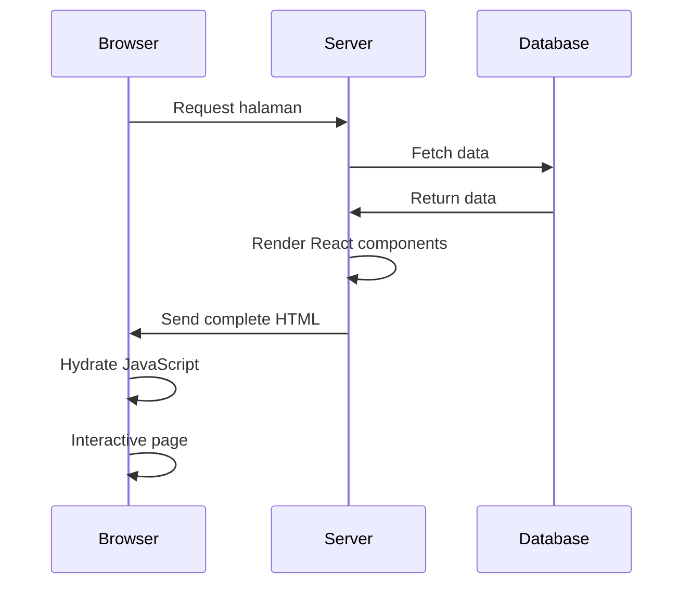

# Server Side Rendering (SSR)

Server Side Rendering (SSR) adalah teknik rendering dimana HTML halaman web di-generate di server sebelum dikirim ke browser client, berbeda dengan Client Side Rendering yang me-render di browser.

## Apa itu SSR?

SSR adalah proses dimana server mengeksekusi JavaScript code, me-render React components menjadi HTML string, dan mengirimkan HTML yang sudah lengkap ke browser.

### Alur Kerja SSR



## SSR vs CSR vs SSG

| Aspek | SSR | CSR | SSG |
|-------|-----|-----|-----|
| **Rendering** | Server | Client | Build time |
| **First Paint** | Cepat | Lambat | Sangat cepat |
| **SEO** | Excellent | Poor | Excellent |
| **Server Load** | Tinggi | Rendah | Rendah |
| **Interactivity** | Delayed | Immediate | Delayed |
| **Dynamic Content** | Yes | Yes | Limited |

## Keuntungan SSR

### 1. SEO Optimization
```html
<!-- HTML yang diterima search engine crawler -->
<html>
<head>
  <title>Product Page - Amazing Product</title>
  <meta name="description" content="This is an amazing product...">
</head>
<body>
  <h1>Amazing Product</h1>
  <p>Product description here...</p>
  <!-- Content sudah ada, bukan loading spinner -->
</body>
</html>
```

### 2. Faster First Contentful Paint
- User melihat content immediately
- Tidak perlu menunggu JavaScript download
- Better perceived performance

### 3. Better Social Media Sharing
```html
<!-- Open Graph tags untuk social sharing -->
<meta property="og:title" content="Amazing Product">
<meta property="og:description" content="Product description">
<meta property="og:image" content="/product-image.jpg">
```

## Kerugian SSR

### 1. Server Complexity
- Butuh server yang selalu running
- Higher server costs
- Complex caching strategies

### 2. Slower Time to Interactive (TTI)
- HTML muncul cepat tapi belum interactive
- Harus menunggu JavaScript hydration
- Potential "uncanny valley" effect

### 3. Server Load
- Setiap request butuh server processing
- Scaling challenges untuk traffic tinggi
- Memory usage per request

## Implementasi SSR di Next.js

### 1. getServerSideProps
```typescript
// pages/product/[id].tsx
export async function getServerSideProps(context) {
  const { id } = context.params
  
  // Fetch data di server
  const product = await fetch(`https://api.example.com/products/${id}`)
    .then(res => res.json())
  
  // Return props ke component
  return {
    props: {
      product
    }
  }
}

export default function ProductPage({ product }) {
  return (
    <div>
      <h1>{product.name}</h1>
      <p>{product.description}</p>
      <p>Price: ${product.price}</p>
    </div>
  )
}
```

### 2. App Router SSR
```typescript
// app/product/[id]/page.tsx
async function getProduct(id: string) {
  const res = await fetch(`https://api.example.com/products/${id}`, {
    cache: 'no-store' // Disable caching for SSR
  })
  return res.json()
}

export default async function ProductPage({ params }) {
  const product = await getProduct(params.id)
  
  return (
    <div>
      <h1>{product.name}</h1>
      <p>{product.description}</p>
    </div>
  )
}
```

## SSR Performance Optimization

### 1. Caching Strategies
```typescript
// Cache di berbagai level
export async function getServerSideProps(context) {
  // Set cache headers
  context.res.setHeader(
    'Cache-Control',
    'public, s-maxage=10, stale-while-revalidate=59'
  )
  
  const data = await getCachedData(context.params.id)
  
  return {
    props: { data }
  }
}
```

### 2. Streaming SSR
```typescript
// React 18 Streaming
import { Suspense } from 'react'

export default function Page() {
  return (
    <div>
      <h1>Page Title</h1>
      <Suspense fallback={<ProductSkeleton />}>
        <ProductList />
      </Suspense>
    </div>
  )
}
```

### 3. Partial Hydration
```typescript
// Hydrate hanya komponen yang butuh interactivity
'use client'
import { useState } from 'react'

export default function InteractiveButton() {
  const [count, setCount] = useState(0)
  
  return (
    <button onClick={() => setCount(count + 1)}>
      Clicked {count} times
    </button>
  )
}
```

## SSR Best Practices

### 1. Data Fetching
```typescript
// ✅ Good - Parallel data fetching
export async function getServerSideProps() {
  const [user, posts, comments] = await Promise.all([
    fetchUser(),
    fetchPosts(),
    fetchComments()
  ])
  
  return {
    props: { user, posts, comments }
  }
}

// ❌ Bad - Sequential data fetching
export async function getServerSideProps() {
  const user = await fetchUser()
  const posts = await fetchPosts()
  const comments = await fetchComments()
  
  return {
    props: { user, posts, comments }
  }
}
```

### 2. Error Handling
```typescript
export async function getServerSideProps(context) {
  try {
    const data = await fetchData(context.params.id)
    
    return {
      props: { data }
    }
  } catch (error) {
    // Handle errors gracefully
    if (error.status === 404) {
      return {
        notFound: true
      }
    }
    
    return {
      props: {
        error: 'Failed to load data'
      }
    }
  }
}
```

### 3. Security Considerations
```typescript
export async function getServerSideProps(context) {
  // Validate user authentication
  const session = await getSession(context.req)
  
  if (!session) {
    return {
      redirect: {
        destination: '/login',
        permanent: false
      }
    }
  }
  
  // Only fetch data user has access to
  const data = await fetchUserData(session.userId)
  
  return {
    props: { data }
  }
}
```

## Kapan Menggunakan SSR

### ✅ Gunakan SSR Ketika:
- SEO sangat penting
- Content berubah frequently
- Personalized content per user
- Real-time data requirements
- Social media sharing critical

### ❌ Hindari SSR Ketika:
- Aplikasi internal/dashboard
- Content mostly static
- High traffic dengan budget terbatas
- Complex client-side interactions
- Real-time collaborative apps

## SSR Alternatives

### 1. [[Static Site Generation]] (SSG)
```typescript
// Generate static pages at build time
export async function getStaticProps() {
  const posts = await fetchPosts()
  
  return {
    props: { posts },
    revalidate: 3600 // ISR - revalidate every hour
  }
}
```

### 2. Client Side Rendering (CSR)
```typescript
// Render di client dengan loading state
export default function ProductPage() {
  const [product, setProduct] = useState(null)
  const [loading, setLoading] = useState(true)
  
  useEffect(() => {
    fetchProduct().then(data => {
      setProduct(data)
      setLoading(false)
    })
  }, [])
  
  if (loading) return <div>Loading...</div>
  
  return <ProductDetails product={product} />
}
```

### 3. Incremental Static Regeneration (ISR)
```typescript
// Best of both worlds - static + dynamic
export async function getStaticProps() {
  const data = await fetchData()
  
  return {
    props: { data },
    revalidate: 60 // Regenerate every 60 seconds
  }
}
```

## Monitoring SSR Performance

### 1. Key Metrics
- **Time to First Byte (TTFB)** - Server response time
- **First Contentful Paint (FCP)** - When content appears
- **Time to Interactive (TTI)** - When page becomes interactive
- **Cumulative Layout Shift (CLS)** - Visual stability

### 2. Monitoring Tools
```typescript
// Web Vitals monitoring
import { getCLS, getFID, getFCP, getLCP, getTTFB } from 'web-vitals'

getCLS(console.log)
getFID(console.log)
getFCP(console.log)
getLCP(console.log)
getTTFB(console.log)
```

## Kesimpulan

SSR adalah teknik powerful untuk meningkatkan SEO dan perceived performance, tapi datang dengan trade-offs dalam complexity dan server costs. 

**Pilih SSR ketika**:
- SEO adalah prioritas utama
- Content dynamic dan personalized
- Budget server memadai
- Team memiliki expertise server-side

**Pertimbangkan alternatif ketika**:
- Content mostly static → [[Static Site Generation]]
- Budget terbatas → CSR dengan good loading states
- Performance critical → ISR untuk balance

---

**Related Notes:**
- [[NextJS]] - Framework dengan SSR support
- [[Static Site Generation]] - Alternative rendering strategy
- [[Web Performance]] - Optimasi performa web
- [[SEO Optimization]] - Search engine optimization

**External Links:**
- [[Next.js SSR Guide::https://nextjs.org/docs/basic-features/pages]]
- [[React SSR::https://react.dev/reference/react-dom/server]]
- [[Web Vitals::https://web.dev/vitals/]]