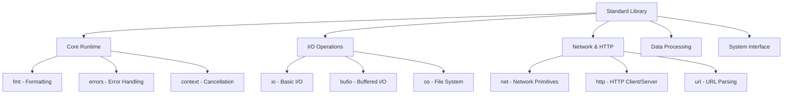
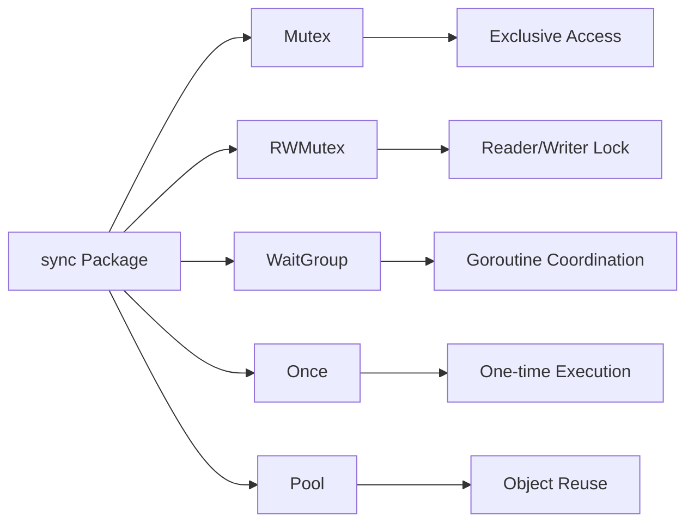

## Pengantar: Toolkit Komprehensif

Standard Library Go adalah **perpustakaan alat universal** yang menyediakan semua tools essential untuk development modern. Seperti workshop lengkap yang memiliki semua peralatan dari yang basic hingga advanced, standard library memberikan foundation solid untuk membangun aplikasi apapun.

## Arsitektur Modular: Sistem Rak Terorganisir

### Core Packages - Rak Alat Dasar

## HTTP Server dan Client: Sistem Komunikasi Robust

### HTTP Server - Pelayan Digital Handal
- **Concurrent connection handling** menggunakan [[Goroutine Scheduler]]
- Built-in support untuk HTTPS, HTTP/2, dan WebSocket
- Middleware pattern untuk extensibility
- Integration dengan [[Context Package]] untuk request lifecycle management

### HTTP Client - Kurir Digital Profesional  
- **Connection pooling** otomatis untuk performance
- Timeout dan retry mechanisms yang sophisticated
- Cookie jar dan redirect handling
- Custom transport untuk advanced networking needs

| Feature | HTTP Server | HTTP Client |
|---------|-------------|-------------|
| Concurrency | Goroutine per request | Connection pooling |
| Performance | High throughput | Efficient reuse |
| Flexibility | Middleware support | Custom transports |

## File System Operations: Manajer Arsip Digital

### os Package - Interface Sistem Operasi
- **Cross-platform file operations** dengan consistent API
- Process management dan environment variables
- Signal handling untuk graceful shutdown
- Integration dengan underlying OS capabilities

### filepath Package - Navigator Path Cerdas
- **Path manipulation** yang aman dan portable
- Glob pattern matching untuk file discovery
- Clean dan Join operations untuk path construction
- OS-specific separator handling

## Data Processing: Laboratorium Transformasi

### JSON Package - Translator Universal
- **Marshal/Unmarshal** dengan reflection-based mapping
- Struct tags untuk custom field mapping
- Streaming API untuk large datasets
- Custom marshaling untuk complex types

### Encoding Packages - Spesialis Format
- **Base64, Hex, CSV** dan format lainnya
- Consistent interface across different encodings
- Streaming support untuk memory efficiency
- Error handling yang robust

## Concurrency Primitives: Toolkit Sinkronisasi

### sync Package - Koordinator Goroutines

### Channels - Pipa Komunikasi
- **Type-safe communication** antar goroutines
- Buffered dan unbuffered channels
- Select statement untuk multiplexing
- Integration dengan [[Goroutine Scheduler]] untuk efficient blocking

## Testing Framework: Laboratorium Quality Assurance

### testing Package - Infrastruktur Testing
- **Unit testing** dengan simple API
- Benchmark framework untuk performance testing
- Example tests untuk documentation
- Integration dengan [[Testing Infrastructure]]

### Subtests dan Parallel Execution
- **Hierarchical test organization** dengan t.Run()
- Parallel test execution dengan t.Parallel()
- Test cleanup dengan t.Cleanup()
- Rich assertion dan reporting capabilities

## Reflection dan Meta-Programming

### reflect Package - Mirror Magic
- **Runtime type inspection** dan manipulation
- Dynamic method invocation
- Struct field access dan modification
- Foundation untuk serialization libraries

## Performance Optimizations

### Memory Management Integration
- **Object pooling** dengan sync.Pool
- Efficient string operations dengan strings.Builder
- Zero-copy operations where possible
- Integration dengan [[Memory Management]] system

### I/O Optimizations
- **Buffered I/O** untuk reducing system calls
- Vectorized operations untuk bulk processing
- Memory mapping untuk large files
- Async I/O patterns dengan goroutines

## Best Practices dan Patterns

### Error Handling Philosophy
- **Explicit error returns** tanpa exceptions
- Error wrapping dengan fmt.Errorf dan errors.Wrap
- Sentinel errors untuk specific conditions
- Custom error types untuk rich context

### Resource Management
- **Defer statements** untuk cleanup
- Context-based cancellation
- Graceful shutdown patterns
- Resource pooling strategies

---

*Catatan ini mengeksplorasi Standard Library Go sebagai foundation untuk development aplikasi modern dengan focus pada performance, reliability, dan developer experience.*