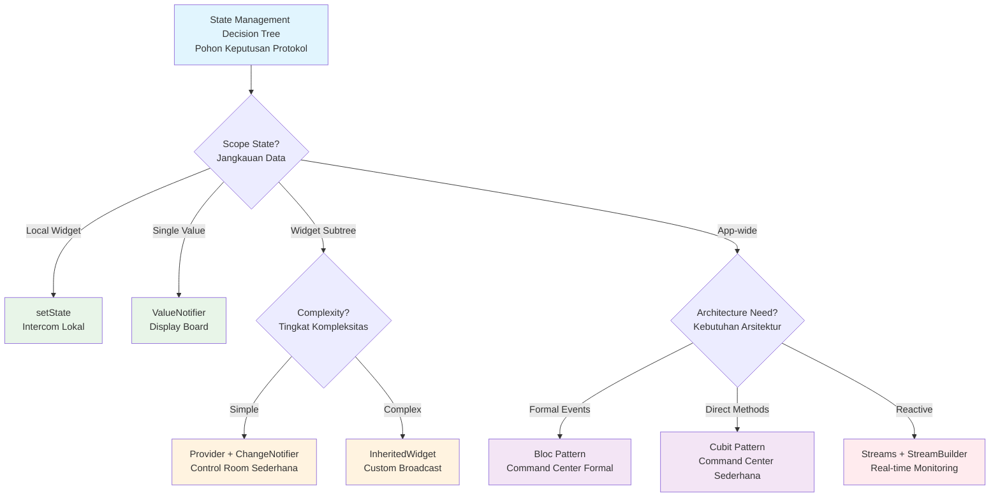

## Pengantar: Orkestra Komunikasi dalam Pabrik Modern

Bayangkan sebuah pabrik modern dengan ribuan stasiun kerja yang harus berkoordinasi secara real-time untuk menghasilkan produk berkualitas. Setiap stasiun memiliki status dan data yang berubah dinamis - dari inventory material, progress produksi, hingga quality control metrics. Untuk memastikan operasi yang smooth, pabrik ini menggunakan berbagai protokol komunikasi: intercom lokal untuk koordinasi antar stasiun tetangga, sistem broadcast terpusat untuk pengumuman pabrik, control room dengan operator untuk manajemen kompleks, dan command center dengan protokol formal untuk operasi critical. Inilah State Management dalam [[Flutter]] - sistem koordinasi data dan status aplikasi yang menentukan bagaimana informasi mengalir dan dikelola dalam widget tree.

State Management adalah salah satu aspek paling fundamental dalam pengembangan aplikasi [[Flutter]]. Seperti sistem komunikasi pabrik yang menentukan efisiensi operasional, pemilihan state management pattern yang tepat menentukan scalability, maintainability, dan performance aplikasi. Dari simple local state dengan setState hingga complex architectural patterns seperti Bloc, setiap approach memiliki karakteristik dan use cases yang spesifik. Pemahaman mendalam tentang berbagai patterns ini crucial untuk membangun aplikasi yang robust dan efficient.

Mengapa State Management penting? Dalam aplikasi mobile yang interactive, state berubah constantly - user input, network responses, navigation changes, dan background processes. Tanpa sistem manajemen yang proper, aplikasi bisa mengalami inconsistent UI, performance issues, dan bugs yang sulit di-debug. Mastery state management patterns memungkinkan developer memilih approach yang optimal untuk setiap scenario, dari simple form validation hingga complex real-time collaborative applications. Seperti engineer pabrik yang memahami kapan menggunakan protokol komunikasi yang tepat, [[Flutter]] developer harus menguasai berbagai state management patterns untuk membangun aplikasi yang truly professional.

## Local State Management: Intercom Stasiun Kerja

Local state management adalah protokol komunikasi paling sederhana dalam pabrik aplikasi, seperti intercom yang digunakan untuk koordinasi langsung antar stasiun kerja yang berdekatan. Pattern ini ideal untuk state yang hanya relevan dalam scope terbatas dan tidak perlu dibagikan ke bagian lain aplikasi.

### setState: Komunikasi Internal Stasiun

setState adalah mekanisme paling basic untuk mengelola state dalam StatefulWidget, seperti intercom internal dalam satu stasiun kerja yang memungkinkan koordinasi antar operator di area yang sama:

```dart
class LocalCounterWidget extends StatefulWidget {
  @override
  _LocalCounterWidgetState createState() => _LocalCounterWidgetState();
}

class _LocalCounterWidgetState extends State<LocalCounterWidget> {
  int _counter = 0;
  bool _isLoading = false;
  String _status = 'Ready';
  
  void _incrementCounter() async {
    setState(() {
      _isLoading = true;
      _status = 'Processing...';
    });
    
    // Simulate async operation
    await Future.delayed(Duration(milliseconds: 500));
    
    setState(() {
      _counter++;
      _isLoading = false;
      _status = 'Completed';
    });
    
    // Reset status after delay
    Future.delayed(Duration(seconds: 2), () {
      if (mounted) {
        setState(() {
          _status = 'Ready';
        });
      }
    });
  }
  
  @override
  Widget build(BuildContext context) {
    return Card(
      child: Padding(
        padding: EdgeInsets.all(16.0),
        child: Column(
          children: [
            Text('Counter: $_counter', 
                 style: Theme.of(context).textTheme.headline6),
            SizedBox(height: 8),
            Text('Status: $_status'),
            SizedBox(height: 16),
            ElevatedButton(
              onPressed: _isLoading ? null : _incrementCounter,
              child: _isLoading 
                ? CircularProgressIndicator(strokeWidth: 2)
                : Text('Increment'),
            ),
          ],
        ),
      ),
    );
  }
}
```

setState cocok untuk:
- **Form input validation**: Status field individual
- **UI toggles**: Expand/collapse, show/hide elements  
- **Loading states**: Button loading, progress indicators
- **Temporary animations**: Hover effects, micro-interactions

### ValueNotifier: Sistem Notifikasi Sederhana

ValueNotifier adalah sistem notifikasi sederhana untuk single value yang berubah, seperti display board di stasiun kerja yang menampilkan satu metric penting:

```dart
class ValueNotifierExample extends StatefulWidget {
  @override
  _ValueNotifierExampleState createState() => _ValueNotifierExampleState();
}

class _ValueNotifierExampleState extends State<ValueNotifierExample> {
  final ValueNotifier<int> _counterNotifier = ValueNotifier<int>(0);
  final ValueNotifier<String> _messageNotifier = ValueNotifier<String>('Hello');
  
  @override
  void dispose() {
    _counterNotifier.dispose();
    _messageNotifier.dispose();
    super.dispose();
  }
  
  @override
  Widget build(BuildContext context) {
    return Column(
      children: [
        // Counter display with ValueListenableBuilder
        ValueListenableBuilder<int>(
          valueListenable: _counterNotifier,
          builder: (context, value, child) {
            return Text('Counter: $value',
                       style: Theme.of(context).textTheme.headline6);
          },
        ),
        
        // Message display
        ValueListenableBuilder<String>(
          valueListenable: _messageNotifier,
          builder: (context, value, child) {
            return Text('Message: $value');
          },
        ),
        
        SizedBox(height: 16),
        
        Row(
          mainAxisAlignment: MainAxisAlignment.spaceEvenly,
          children: [
            ElevatedButton(
              onPressed: () => _counterNotifier.value++,
              child: Text('Increment'),
            ),
            ElevatedButton(
              onPressed: () {
                _messageNotifier.value = 
                  _messageNotifier.value == 'Hello' ? 'World' : 'Hello';
              },
              child: Text('Toggle Message'),
            ),
          ],
        ),
      ],
    );
  }
}
```

ValueNotifier memberikan keuntungan:
- **Minimal boilerplate**: Tidak perlu StatefulWidget
- **Efficient rebuilds**: Hanya widget yang listen yang rebuild
- **Simple API**: Direct value access dan assignment
- **Memory efficient**: Lightweight untuk single values

## Hierarchical State: Sistem Broadcast Terpusat

Hierarchical state management adalah sistem broadcast yang memungkinkan distribusi informasi dari level atas ke bawah dalam widget tree, seperti sistem PA (Public Address) pabrik yang menyebarkan informasi dari control center ke seluruh stasiun kerja.

### InheritedWidget: Foundation Broadcast System

InheritedWidget adalah foundation mechanism untuk efficient state propagation dalam widget tree, seperti infrastruktur broadcast yang memungkinkan selective listening:

```dart
// Define the data model
class AppThemeData {
  final Color primaryColor;
  final double fontSize;
  final bool isDarkMode;
  
  const AppThemeData({
    required this.primaryColor,
    required this.fontSize,
    required this.isDarkMode,
  });
  
  AppThemeData copyWith({
    Color? primaryColor,
    double? fontSize,
    bool? isDarkMode,
  }) {
    return AppThemeData(
      primaryColor: primaryColor ?? this.primaryColor,
      fontSize: fontSize ?? this.fontSize,
      isDarkMode: isDarkMode ?? this.isDarkMode,
    );
  }
}

// InheritedWidget implementation
class AppThemeInherited extends InheritedWidget {
  final AppThemeData themeData;
  final Function(AppThemeData) updateTheme;
  
  const AppThemeInherited({
    Key? key,
    required this.themeData,
    required this.updateTheme,
    required Widget child,
  }) : super(key: key, child: child);
  
  static AppThemeInherited? of(BuildContext context) {
    return context.dependOnInheritedWidgetOfExactType<AppThemeInherited>();
  }
  
  @override
  bool updateShouldNotify(AppThemeInherited oldWidget) {
    return themeData != oldWidget.themeData;
  }
}

// Provider widget that manages state
class AppThemeProvider extends StatefulWidget {
  final Widget child;
  
  const AppThemeProvider({Key? key, required this.child}) : super(key: key);
  
  @override
  _AppThemeProviderState createState() => _AppThemeProviderState();
}

class _AppThemeProviderState extends State<AppThemeProvider> {
  AppThemeData _themeData = AppThemeData(
    primaryColor: Colors.blue,
    fontSize: 16.0,
    isDarkMode: false,
  );
  
  void _updateTheme(AppThemeData newTheme) {
    setState(() {
      _themeData = newTheme;
    });
  }
  
  @override
  Widget build(BuildContext context) {
    return AppThemeInherited(
      themeData: _themeData,
      updateTheme: _updateTheme,
      child: widget.child,
    );
  }
}

// Consumer widget
class ThemeConsumerWidget extends StatelessWidget {
  @override
  Widget build(BuildContext context) {
    final themeProvider = AppThemeInherited.of(context);
    final theme = themeProvider?.themeData;
    
    if (theme == null) return Text('No theme available');
    
    return Container(
      color: theme.isDarkMode ? Colors.black : Colors.white,
      child: Column(
        children: [
          Text(
            'Current Theme',
            style: TextStyle(
              color: theme.primaryColor,
              fontSize: theme.fontSize,
            ),
          ),
          ElevatedButton(
            onPressed: () {
              themeProvider?.updateTheme(
                theme.copyWith(isDarkMode: !theme.isDarkMode),
              );
            },
            child: Text('Toggle Dark Mode'),
          ),
        ],
      ),
    );
  }
}
```

### Provider Pattern: Control Room dengan Operator

Provider adalah wrapper yang menyederhanakan InheritedWidget usage, seperti control room dengan operator yang mengelola komunikasi kompleks dengan interface yang user-friendly:

```dart
// Model with ChangeNotifier
class ShoppingCart extends ChangeNotifier {
  final List<CartItem> _items = [];
  
  List<CartItem> get items => List.unmodifiable(_items);
  
  int get itemCount => _items.length;
  
  double get totalPrice => _items.fold(0.0, (sum, item) => sum + item.price);
  
  void addItem(CartItem item) {
    final existingIndex = _items.indexWhere((i) => i.id == item.id);
    
    if (existingIndex >= 0) {
      _items[existingIndex] = _items[existingIndex].copyWith(
        quantity: _items[existingIndex].quantity + 1,
      );
    } else {
      _items.add(item);
    }
    
    notifyListeners();
  }
  
  void removeItem(String itemId) {
    _items.removeWhere((item) => item.id == itemId);
    notifyListeners();
  }
  
  void updateQuantity(String itemId, int quantity) {
    final index = _items.indexWhere((item) => item.id == itemId);
    if (index >= 0) {
      if (quantity <= 0) {
        _items.removeAt(index);
      } else {
        _items[index] = _items[index].copyWith(quantity: quantity);
      }
      notifyListeners();
    }
  }
  
  void clear() {
    _items.clear();
    notifyListeners();
  }
}

class CartItem {
  final String id;
  final String name;
  final double price;
  final int quantity;
  
  const CartItem({
    required this.id,
    required this.name,
    required this.price,
    this.quantity = 1,
  });
  
  CartItem copyWith({
    String? id,
    String? name,
    double? price,
    int? quantity,
  }) {
    return CartItem(
      id: id ?? this.id,
      name: name ?? this.name,
      price: price ?? this.price,
      quantity: quantity ?? this.quantity,
    );
  }
}

// App setup with MultiProvider
class ShoppingApp extends StatelessWidget {
  @override
  Widget build(BuildContext context) {
    return MultiProvider(
      providers: [
        ChangeNotifierProvider(create: (_) => ShoppingCart()),
        // Add more providers as needed
      ],
      child: MaterialApp(
        home: ShoppingHomePage(),
      ),
    );
  }
}

// Consumer widgets
class CartSummary extends StatelessWidget {
  @override
  Widget build(BuildContext context) {
    return Consumer<ShoppingCart>(
      builder: (context, cart, child) {
        return Card(
          child: Padding(
            padding: EdgeInsets.all(16.0),
            child: Column(
              crossAxisAlignment: CrossAxisAlignment.start,
              children: [
                Text('Cart Summary', 
                     style: Theme.of(context).textTheme.headline6),
                SizedBox(height: 8),
                Text('Items: ${cart.itemCount}'),
                Text('Total: \$${cart.totalPrice.toStringAsFixed(2)}'),
                SizedBox(height: 16),
                ElevatedButton(
                  onPressed: cart.itemCount > 0 ? () {
                    // Process checkout
                    cart.clear();
                    ScaffoldMessenger.of(context).showSnackBar(
                      SnackBar(content: Text('Order placed!')),
                    );
                  } : null,
                  child: Text('Checkout'),
                ),
              ],
            ),
          ),
        );
      },
    );
  }
}

class ProductList extends StatelessWidget {
  final List<CartItem> products = [
    CartItem(id: '1', name: 'Laptop', price: 999.99),
    CartItem(id: '2', name: 'Mouse', price: 29.99),
    CartItem(id: '3', name: 'Keyboard', price: 79.99),
  ];
  
  @override
  Widget build(BuildContext context) {
    return ListView.builder(
      itemCount: products.length,
      itemBuilder: (context, index) {
        final product = products[index];
        return ListTile(
          title: Text(product.name),
          subtitle: Text('\$${product.price.toStringAsFixed(2)}'),
          trailing: IconButton(
            icon: Icon(Icons.add_shopping_cart),
            onPressed: () {
              context.read<ShoppingCart>().addItem(product);
            },
          ),
        );
      },
    );
  }
}
```

## Architectural Patterns: Command Center dengan Protokol Formal

Architectural patterns adalah command center dengan protokol formal untuk mengelola state complex applications, seperti mission control yang menggunakan prosedur standar untuk operasi critical dan koordinasi multi-team.

### Bloc Pattern: Event-Driven Command Center

Bloc (Business Logic Component) adalah architectural pattern yang memisahkan business logic dari UI dengan event-driven approach, seperti command center yang memproses commands formal dan menghasilkan status updates:

```dart
// Events - Commands yang dikirim ke Bloc
abstract class CounterEvent {}

class CounterIncrementPressed extends CounterEvent {}
class CounterDecrementPressed extends CounterEvent {}
class CounterResetPressed extends CounterEvent {}

// States - Status yang diemit oleh Bloc
abstract class CounterState {
  final int value;
  const CounterState(this.value);
}

class CounterInitial extends CounterState {
  const CounterInitial() : super(0);
}

class CounterUpdated extends CounterState {
  const CounterUpdated(int value) : super(value);
}

class CounterLoading extends CounterState {
  const CounterLoading(int value) : super(value);
}

// Bloc - Command processor
class CounterBloc extends Bloc<CounterEvent, CounterState> {
  CounterBloc() : super(CounterInitial()) {
    on<CounterIncrementPressed>(_onIncrement);
    on<CounterDecrementPressed>(_onDecrement);
    on<CounterResetPressed>(_onReset);
  }
  
  void _onIncrement(CounterIncrementPressed event, Emitter<CounterState> emit) async {
    emit(CounterLoading(state.value));
    
    // Simulate async operation
    await Future.delayed(Duration(milliseconds: 300));
    
    emit(CounterUpdated(state.value + 1));
  }
  
  void _onDecrement(CounterDecrementPressed event, Emitter<CounterState> emit) async {
    if (state.value > 0) {
      emit(CounterLoading(state.value));
      await Future.delayed(Duration(milliseconds: 300));
      emit(CounterUpdated(state.value - 1));
    }
  }
  
  void _onReset(CounterResetPressed event, Emitter<CounterState> emit) {
    emit(CounterInitial());
  }
  
  @override
  void onTransition(Transition<CounterEvent, CounterState> transition) {
    super.onTransition(transition);
    print('Transition: ${transition.event} -> ${transition.nextState}');
  }
}

// UI Integration with BlocBuilder
class CounterPage extends StatelessWidget {
  @override
  Widget build(BuildContext context) {
    return BlocProvider(
      create: (_) => CounterBloc(),
      child: CounterView(),
    );
  }
}

class CounterView extends StatelessWidget {
  @override
  Widget build(BuildContext context) {
    return Scaffold(
      appBar: AppBar(title: Text('Bloc Counter')),
      body: Center(
        child: Column(
          mainAxisAlignment: MainAxisAlignment.center,
          children: [
            BlocBuilder<CounterBloc, CounterState>(
              builder: (context, state) {
                return Column(
                  children: [
                    Text(
                      'Counter: ${state.value}',
                      style: Theme.of(context).textTheme.headline4,
                    ),
                    if (state is CounterLoading)
                      Padding(
                        padding: EdgeInsets.only(top: 8),
                        child: CircularProgressIndicator(),
                      ),
                  ],
                );
              },
            ),
            SizedBox(height: 32),
            Row(
              mainAxisAlignment: MainAxisAlignment.spaceEvenly,
              children: [
                FloatingActionButton(
                  onPressed: () => context.read<CounterBloc>()
                    .add(CounterDecrementPressed()),
                  child: Icon(Icons.remove),
                  heroTag: 'decrement',
                ),
                FloatingActionButton(
                  onPressed: () => context.read<CounterBloc>()
                    .add(CounterResetPressed()),
                  child: Icon(Icons.refresh),
                  heroTag: 'reset',
                ),
                FloatingActionButton(
                  onPressed: () => context.read<CounterBloc>()
                    .add(CounterIncrementPressed()),
                  child: Icon(Icons.add),
                  heroTag: 'increment',
                ),
              ],
            ),
          ],
        ),
      ),
    );
  }
}
```

### Cubit Pattern: Simplified Command Center

Cubit adalah simplified version dari Bloc yang tidak menggunakan events, seperti command center yang menerima direct method calls tanpa formal event protocol:

```dart
// Cubit - Direct method calls
class SettingsCubit extends Cubit<SettingsState> {
  SettingsCubit() : super(SettingsState.initial());
  
  void toggleDarkMode() {
    emit(state.copyWith(isDarkMode: !state.isDarkMode));
  }
  
  void updateFontSize(double fontSize) {
    emit(state.copyWith(fontSize: fontSize));
  }
  
  void updateLanguage(String language) {
    emit(state.copyWith(language: language));
  }
  
  void toggleNotifications() {
    emit(state.copyWith(notificationsEnabled: !state.notificationsEnabled));
  }
  
  Future<void> saveSettings() async {
    emit(state.copyWith(isLoading: true));
    
    try {
      // Simulate API call
      await Future.delayed(Duration(seconds: 1));
      
      // Save to local storage
      await _saveToStorage(state);
      
      emit(state.copyWith(isLoading: false, lastSaved: DateTime.now()));
    } catch (error) {
      emit(state.copyWith(isLoading: false, error: error.toString()));
    }
  }
  
  Future<void> _saveToStorage(SettingsState settings) async {
    // Implementation for saving settings
  }
}

// State model
class SettingsState {
  final bool isDarkMode;
  final double fontSize;
  final String language;
  final bool notificationsEnabled;
  final bool isLoading;
  final String? error;
  final DateTime? lastSaved;
  
  const SettingsState({
    required this.isDarkMode,
    required this.fontSize,
    required this.language,
    required this.notificationsEnabled,
    this.isLoading = false,
    this.error,
    this.lastSaved,
  });
  
  factory SettingsState.initial() {
    return SettingsState(
      isDarkMode: false,
      fontSize: 16.0,
      language: 'en',
      notificationsEnabled: true,
    );
  }
  
  SettingsState copyWith({
    bool? isDarkMode,
    double? fontSize,
    String? language,
    bool? notificationsEnabled,
    bool? isLoading,
    String? error,
    DateTime? lastSaved,
  }) {
    return SettingsState(
      isDarkMode: isDarkMode ?? this.isDarkMode,
      fontSize: fontSize ?? this.fontSize,
      language: language ?? this.language,
      notificationsEnabled: notificationsEnabled ?? this.notificationsEnabled,
      isLoading: isLoading ?? this.isLoading,
      error: error,
      lastSaved: lastSaved ?? this.lastSaved,
    );
  }
}

// UI with BlocBuilder
class SettingsPage extends StatelessWidget {
  @override
  Widget build(BuildContext context) {
    return BlocProvider(
      create: (_) => SettingsCubit(),
      child: SettingsView(),
    );
  }
}

class SettingsView extends StatelessWidget {
  @override
  Widget build(BuildContext context) {
    return Scaffold(
      appBar: AppBar(title: Text('Settings')),
      body: BlocBuilder<SettingsCubit, SettingsState>(
        builder: (context, state) {
          return ListView(
            padding: EdgeInsets.all(16),
            children: [
              SwitchListTile(
                title: Text('Dark Mode'),
                value: state.isDarkMode,
                onChanged: (_) => context.read<SettingsCubit>().toggleDarkMode(),
              ),
              
              ListTile(
                title: Text('Font Size: ${state.fontSize.toInt()}'),
                subtitle: Slider(
                  value: state.fontSize,
                  min: 12.0,
                  max: 24.0,
                  divisions: 12,
                  onChanged: (value) => 
                    context.read<SettingsCubit>().updateFontSize(value),
                ),
              ),
              
              SwitchListTile(
                title: Text('Notifications'),
                value: state.notificationsEnabled,
                onChanged: (_) => 
                  context.read<SettingsCubit>().toggleNotifications(),
              ),
              
              SizedBox(height: 32),
              
              ElevatedButton(
                onPressed: state.isLoading ? null : () =>
                  context.read<SettingsCubit>().saveSettings(),
                child: state.isLoading
                  ? CircularProgressIndicator()
                  : Text('Save Settings'),
              ),
              
              if (state.error != null)
                Padding(
                  padding: EdgeInsets.only(top: 16),
                  child: Text(
                    'Error: ${state.error}',
                    style: TextStyle(color: Colors.red),
                  ),
                ),
                
              if (state.lastSaved != null)
                Padding(
                  padding: EdgeInsets.only(top: 8),
                  child: Text(
                    'Last saved: ${state.lastSaved}',
                    style: TextStyle(color: Colors.green),
                  ),
                ),
            ],
          );
        },
      ),
    );
  }
}
```

## Selection Criteria: Memilih Protokol yang Tepat

Pemilihan state management pattern yang tepat seperti memilih protokol komunikasi yang sesuai dengan kompleksitas dan scope operasi pabrik. Setiap pattern memiliki sweet spot dan trade-offs yang harus dipahami.



Diagram ini menunjukkan decision tree untuk memilih state management pattern yang tepat, seperti flowchart pemilihan protokol komunikasi dalam pabrik. Setiap cabang mengarah ke solution yang optimal berdasarkan scope dan kompleksitas requirements.

### Pattern Comparison Matrix

| Pattern | Scope | Complexity | Learning Curve | Boilerplate | Performance | Use Cases |
|---------|-------|------------|----------------|-------------|-------------|-----------|
| **setState** | Widget | Low | Minimal | None | Excellent | Form inputs, toggles, local UI state |
| **ValueNotifier** | Widget+ | Low | Low | Minimal | Excellent | Single values, simple notifications |
| **Provider** | App | Medium | Medium | Low | Good | Shopping cart, user preferences, themes |
| **InheritedWidget** | Subtree | Medium | High | High | Excellent | Custom propagation, performance critical |
| **Bloc** | App | High | High | High | Good | Complex business logic, formal architecture |
| **Cubit** | App | Medium | Medium | Medium | Good | Simplified business logic, direct methods |
| **Streams** | App | High | High | Medium | Good | Real-time data, async operations |

### Decision Guidelines: Kriteria Pemilihan

**Pilih setState ketika**:
- State hanya relevan untuk satu widget
- Tidak ada sharing requirements
- Simple UI interactions (buttons, forms)
- Rapid prototyping atau proof of concept

**Pilih ValueNotifier ketika**:
- Single value yang berubah frequently
- Multiple widgets perlu listen ke same value
- Minimal boilerplate desired
- Performance critical untuk simple cases

**Pilih Provider ketika**:
- State perlu dibagikan across multiple screens
- Medium complexity business logic
- Team familiar dengan ChangeNotifier pattern
- Balanced approach antara simplicity dan power

**Pilih Bloc/Cubit ketika**:
- Complex business logic dengan clear separation
- Formal architecture requirements
- Team experience dengan event-driven patterns
- Testability adalah priority tinggi
- Large-scale applications dengan multiple developers

**Pilih Streams ketika**:
- Real-time data dari server atau sensors
- Complex async operations dengan multiple states
- Reactive programming paradigm preferred
- Integration dengan existing stream-based APIs

## Performance dan Trade-offs: Optimasi Sistem Komunikasi

Performance optimization dalam state management seperti fine-tuning sistem komunikasi pabrik untuk efisiensi maksimal. Setiap pattern memiliki characteristics yang berbeda dalam hal memory usage, rebuild frequency, dan computational overhead.

### Rebuild Optimization: Mengurangi Komunikasi Berlebihan

```dart
// ❌ Inefficient - Rebuilds entire widget tree
class BadShoppingCart extends StatefulWidget {
  @override
  _BadShoppingCartState createState() => _BadShoppingCartState();
}

class _BadShoppingCartState extends State<BadShoppingCart> {
  List<CartItem> _items = [];
  
  @override
  Widget build(BuildContext context) {
    return Column(
      children: [
        // Entire list rebuilds when any item changes
        ListView.builder(
          itemCount: _items.length,
          itemBuilder: (context, index) {
            return ListTile(
              title: Text(_items[index].name),
              subtitle: Text('\$${_items[index].price}'),
              trailing: IconButton(
                icon: Icon(Icons.remove),
                onPressed: () {
                  setState(() {
                    _items.removeAt(index);
                  });
                },
              ),
            );
          },
        ),
        // Summary also rebuilds unnecessarily
        Text('Total: \$${_calculateTotal()}'),
      ],
    );
  }
  
  double _calculateTotal() {
    return _items.fold(0.0, (sum, item) => sum + item.price);
  }
}

// ✅ Efficient - Selective rebuilds with Provider
class EfficientShoppingCart extends StatelessWidget {
  @override
  Widget build(BuildContext context) {
    return Column(
      children: [
        // Only rebuilds when items list changes
        Consumer<ShoppingCart>(
          builder: (context, cart, child) {
            return ListView.builder(
              itemCount: cart.items.length,
              itemBuilder: (context, index) {
                return CartItemWidget(
                  key: ValueKey(cart.items[index].id),
                  item: cart.items[index],
                  onRemove: () => cart.removeItem(cart.items[index].id),
                );
              },
            );
          },
        ),
        
        // Only rebuilds when total changes
        Selector<ShoppingCart, double>(
          selector: (context, cart) => cart.totalPrice,
          builder: (context, total, child) {
            return Text('Total: \$${total.toStringAsFixed(2)}');
          },
        ),
      ],
    );
  }
}

// Individual item widget - doesn't rebuild unless its data changes
class CartItemWidget extends StatelessWidget {
  final CartItem item;
  final VoidCallback onRemove;
  
  const CartItemWidget({
    Key? key,
    required this.item,
    required this.onRemove,
  }) : super(key: key);
  
  @override
  Widget build(BuildContext context) {
    return ListTile(
      title: Text(item.name),
      subtitle: Text('\$${item.price.toStringAsFixed(2)}'),
      trailing: IconButton(
        icon: Icon(Icons.remove),
        onPressed: onRemove,
      ),
    );
  }
}
```

### Memory Management: Efficient Resource Usage

```dart
// Proper resource cleanup in different patterns
class ResourceManagedWidget extends StatefulWidget {
  @override
  _ResourceManagedWidgetState createState() => _ResourceManagedWidgetState();
}

class _ResourceManagedWidgetState extends State<ResourceManagedWidget> {
  // ValueNotifier - needs manual disposal
  late ValueNotifier<int> _counterNotifier;
  
  // Stream subscription - needs cancellation
  StreamSubscription<String>? _dataSubscription;
  
  // Bloc - needs closing
  late CounterBloc _counterBloc;
  
  @override
  void initState() {
    super.initState();
    
    _counterNotifier = ValueNotifier<int>(0);
    _counterBloc = CounterBloc();
    
    // Subscribe to external data stream
    _dataSubscription = someDataStream.listen((data) {
      // Handle data updates
    });
  }
  
  @override
  void dispose() {
    // Critical: Clean up all resources
    _counterNotifier.dispose();
    _counterBloc.close();
    _dataSubscription?.cancel();
    
    super.dispose();
  }
  
  @override
  Widget build(BuildContext context) {
    return Column(
      children: [
        ValueListenableBuilder<int>(
          valueListenable: _counterNotifier,
          builder: (context, value, child) {
            return Text('Counter: $value');
          },
        ),
        
        BlocBuilder<CounterBloc, CounterState>(
          bloc: _counterBloc,
          builder: (context, state) {
            return Text('Bloc Counter: ${state.value}');
          },
        ),
      ],
    );
  }
}
```

### Performance Benchmarks: Metrics Comparison

| Metric | setState | ValueNotifier | Provider | Bloc | InheritedWidget |
|--------|----------|---------------|----------|------|-----------------|
| **Memory Overhead** | Minimal | Low | Medium | High | Minimal |
| **Rebuild Efficiency** | Poor | Good | Excellent | Good | Excellent |
| **Setup Cost** | None | Low | Medium | High | High |
| **Runtime Performance** | Excellent | Excellent | Good | Good | Excellent |
| **Scalability** | Poor | Fair | Good | Excellent | Good |
| **Debugging Complexity** | Low | Low | Medium | High | High |

### Best Practices: Protokol Optimasi

**General Optimization Rules**:
1. **Push state down**: Keep state as close to consumers as possible
2. **Use Selector**: For Provider, use Selector untuk fine-grained rebuilds
3. **Const widgets**: Maximize usage of const constructors
4. **Key management**: Use proper keys untuk list items
5. **Resource cleanup**: Always dispose resources dalam dispose()

**Provider-Specific Optimizations**:
```dart
// Use Selector for specific properties
Selector<UserModel, String>(
  selector: (context, user) => user.name,
  builder: (context, name, child) {
    return Text(name); // Only rebuilds when name changes
  },
)

// Use Consumer.builder for complex logic
Consumer<ShoppingCart>(
  builder: (context, cart, child) {
    if (cart.items.isEmpty) {
      return EmptyCartWidget(); // Static widget
    }
    return CartListWidget(items: cart.items);
  },
)
```

**Bloc-Specific Optimizations**:
```dart
// Use BlocSelector for specific state properties
BlocSelector<UserBloc, UserState, String>(
  selector: (state) => state.user.email,
  builder: (context, email) {
    return Text(email); // Only rebuilds when email changes
  },
)

// Use buildWhen for conditional rebuilds
BlocBuilder<CounterBloc, CounterState>(
  buildWhen: (previous, current) {
    // Only rebuild if value actually changed
    return previous.value != current.value;
  },
  builder: (context, state) {
    return Text('${state.value}');
  },
)
```

## Refleksi: Mastery Komunikasi untuk Aplikasi Scalable

State Management Patterns dalam [[Flutter]] adalah fondasi yang menentukan architecture quality dan long-term maintainability aplikasi, seperti sistem komunikasi yang menentukan efisiensi operasional pabrik modern. Pemahaman mendalam tentang berbagai patterns - dari simple setState hingga complex Bloc architecture - memungkinkan developer membangun aplikasi yang tidak hanya functional, tetapi juga scalable, testable, dan maintainable.

Kunci utama dalam mastery state management terletak pada pemahaman trade-offs dan selection criteria yang tepat. Tidak ada "silver bullet" solution yang cocok untuk semua scenarios. setState perfect untuk local UI state, Provider excellent untuk medium complexity apps, dan Bloc ideal untuk large-scale applications dengan complex business logic. Seperti engineer pabrik yang memilih protokol komunikasi berdasarkan situasi, Flutter developer harus menguasai kapan dan bagaimana menggunakan setiap pattern secara optimal.

Performance optimization melalui proper state management bukan hanya tentang kecepatan, tetapi juga tentang user experience yang consistent dan responsive. Teknik-teknik seperti selective rebuilds, proper resource cleanup, dan efficient state propagation memungkinkan aplikasi tetap smooth bahkan dengan data complexity yang tinggi. Investment dalam understanding performance characteristics setiap pattern akan terbayar dengan aplikasi yang reliable dan user-friendly.

Evolution state management patterns dalam Flutter ecosystem terus berlanjut dengan innovations seperti Riverpod, GetX, dan reactive approaches lainnya. Namun, fundamental principles tetap sama: separation of concerns, efficient data flow, dan proper resource management. Mastery patterns yang established memberikan foundation yang solid untuk mengadopsi innovations baru dan membuat architectural decisions yang informed.

Masa depan aplikasi mobile menuntut state management yang semakin sophisticated untuk handle real-time collaboration, offline-first architectures, dan complex user interactions. Developer yang menguasai state management patterns akan mampu membangun aplikasi yang tidak hanya memenuhi current requirements, tetapi juga adaptable untuk future challenges. Seperti sistem komunikasi pabrik yang evolve dengan teknologi baru, state management skills harus terus di-update untuk menghadapi kompleksitas aplikasi modern yang semakin tinggi.

---

*Catatan ini disusun berdasarkan dokumentasi resmi Flutter repository, Provider package, dan Bloc library dengan analisis mendalam menggunakan Sequential Thinking methodology untuk memberikan pemahaman komprehensif tentang state management patterns yang fundamental untuk pengembangan aplikasi Flutter yang scalable dan maintainable.*