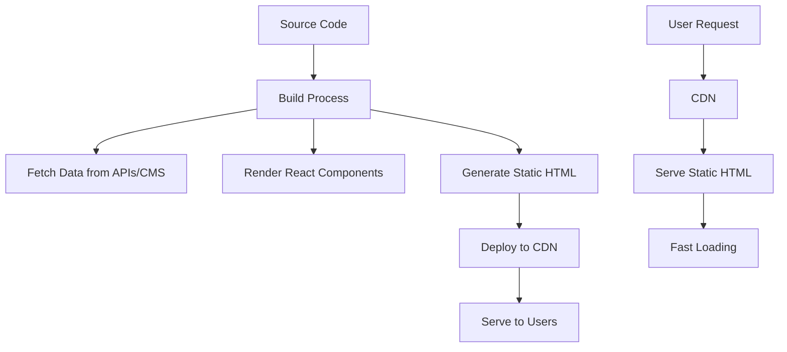

Static Site Generation (SSG) adalah teknik pre-rendering dimana HTML pages di-generate pada build time, bukan pada request time seperti [[SSR|Server Side Rendering]]. Hasil berupa static files yang dapat di-serve dari CDN. SSG adalah salah satu kekuatan utama [[NextJS|Next.js]] untuk mencapai [[Web Performance|performance]] maksimal.

## Apa itu SSG?

SSG mengkonversi dynamic content menjadi static HTML files selama build process. Setiap page di-render sekali saat build, kemudian file HTML yang sama di-serve untuk semua users.

### Alur Kerja SSG



## SSG vs SSR vs CSR

| Aspek | SSG | SSR | CSR |
|-------|-----|-----|-----|
| **Build Time** | Long | Short | Short |
| **Server Load** | None | High | Low |
| **First Paint** | Fastest | Fast | Slow |
| **SEO** | Excellent | Excellent | Poor |
| **Dynamic Content** | Limited | Full | Full |
| **Scalability** | Infinite | Limited | High |
| **Cost** | Lowest | Highest | Medium |

## Keuntungan SSG

### 1. Performance Luar Biasa
```html
<!-- Static HTML langsung dari CDN -->
<!DOCTYPE html>
<html>
<head>
  <title>Blog Post - Amazing Article</title>
  <link rel="stylesheet" href="/styles.css">
</head>
<body>
  <article>
    <h1>Amazing Article</h1>
    <p>Content sudah di-render...</p>
  </article>
  <script src="/app.js"></script>
</body>
</html>
```

### 2. Skalabilitas Tak Terbatas
- Tidak butuh server untuk setiap request
- CDN dapat handle millions of requests
- Auto-scaling tanpa server management

### 3. Keamanan Tinggi
- Tidak ada server-side vulnerabilities
- Tidak ada database connections
- Attack surface minimal
### 4. Cost Effectiveness
- Hosting static files sangat murah
- Tidak butuh server infrastructure
- CDN costs minimal untuk traffic tinggi

## Kerugian SSG

### 1. Build Time
- Build time meningkat dengan jumlah pages
- Perubahan content butuh rebuild
- CI/CD pipeline bisa lambat

### 2. Dynamic Content Terbatas
- Tidak bisa personalization real-time
- User-specific content sulit
- Real-time data tidak mungkin

### 3. Content Freshness
- Content bisa outdated sampai rebuild
- Tidak cocok untuk frequently changing data
- Manual atau scheduled rebuilds

## Implementasi SSG di Next.js

### 1. getStaticProps
```typescript
// pages/blog/[slug].tsx
export async function getStaticProps({ params }) {
  // Fetch data at build time
  const post = await fetch(`https://cms.example.com/posts/${params.slug}`)
    .then(res => res.json())
  
  return {
    props: {
      post
    },
    // Optional: ISR - revalidate every 60 seconds
    revalidate: 60
  }
}

export async function getStaticPaths() {
  // Generate paths for all blog posts
  const posts = await fetch('https://cms.example.com/posts')
    .then(res => res.json())
  
  const paths = posts.map(post => ({
    params: { slug: post.slug }
  }))
  
  return {
    paths,
    fallback: false // or 'blocking' or true
  }
}

export default function BlogPost({ post }) {
  return (
    <article>
      <h1>{post.title}</h1>
      <div dangerouslySetInnerHTML={{ __html: post.content }} />
    </article>
  )
}
```

### 2. App Router SSG
```typescript
// app/blog/[slug]/page.tsx
async function getPost(slug: string) {
  const res = await fetch(`https://cms.example.com/posts/${slug}`)
  return res.json()
}

export async function generateStaticParams() {
  const posts = await fetch('https://cms.example.com/posts')
    .then(res => res.json())
  
  return posts.map(post => ({
    slug: post.slug
  }))
}

export default async function BlogPost({ params }) {
  const post = await getPost(params.slug)
  
  return (
    <article>
      <h1>{post.title}</h1>
      <div dangerouslySetInnerHTML={{ __html: post.content }} />
    </article>
  )
}
```

## Incremental Static Regeneration (ISR)

ISR menggabungkan keuntungan SSG dengan kemampuan update content tanpa full rebuild.

### 1. Time-based Revalidation
```typescript
export async function getStaticProps() {
  const data = await fetchData()
  
  return {
    props: { data },
    revalidate: 3600 // Revalidate every hour
  }
}
```

### 2. On-demand Revalidation
```typescript
// pages/api/revalidate.ts
export default async function handler(req, res) {
  // Check for secret to confirm this is a valid request
  if (req.query.secret !== process.env.REVALIDATE_SECRET) {
    return res.status(401).json({ message: 'Invalid token' })
  }
  
  try {
    // Revalidate specific path
    await res.revalidate('/blog/my-post')
    return res.json({ revalidated: true })
  } catch (err) {
    return res.status(500).send('Error revalidating')
  }
}
```

### 3. Webhook Integration
```typescript
// Webhook dari CMS untuk trigger revalidation
export default async function webhook(req, res) {
  const { slug, action } = req.body
  
  if (action === 'published' || action === 'updated') {
    await res.revalidate(`/blog/${slug}`)
  }
  
  res.status(200).json({ message: 'Revalidated' })
}
```

## SSG Best Practices

### 1. Optimal Data Fetching
```typescript
// ✅ Good - Parallel data fetching
export async function getStaticProps() {
  const [posts, categories, author] = await Promise.all([
    fetchPosts(),
    fetchCategories(),
    fetchAuthor()
  ])
  
  return {
    props: { posts, categories, author }
  }
}

// ✅ Good - Error handling
export async function getStaticProps() {
  try {
    const data = await fetchData()
    return { props: { data } }
  } catch (error) {
    return {
      props: { data: null },
      revalidate: 10 // Retry in 10 seconds
    }
  }
}
```

### 2. Fallback Strategies
```typescript
export async function getStaticPaths() {
  // Pre-generate most popular pages
  const popularPosts = await fetchPopularPosts()
  
  const paths = popularPosts.map(post => ({
    params: { slug: post.slug }
  }))
  
  return {
    paths,
    fallback: 'blocking' // Generate other pages on-demand
  }
}
```

### 3. Image Optimization
```typescript
import Image from 'next/image'

export default function Gallery({ images }) {
  return (
    <div>
      {images.map(image => (
        <Image
          key={image.id}
          src={image.url}
          alt={image.alt}
          width={800}
          height={600}
          placeholder="blur"
          blurDataURL={image.blurDataURL}
        />
      ))}
    </div>
  )
}
```

## SSG dengan Headless CMS

### 1. Contentful Integration
```typescript
import { createClient } from 'contentful'

const client = createClient({
  space: process.env.CONTENTFUL_SPACE_ID,
  accessToken: process.env.CONTENTFUL_ACCESS_TOKEN
})

export async function getStaticProps() {
  const entries = await client.getEntries({
    content_type: 'blogPost'
  })
  
  return {
    props: {
      posts: entries.items
    },
    revalidate: 3600
  }
}
```

### 2. Strapi Integration
```typescript
export async function getStaticProps() {
  const res = await fetch(`${process.env.STRAPI_URL}/api/posts?populate=*`)
  const { data } = await res.json()
  
  return {
    props: {
      posts: data
    },
    revalidate: 300 // 5 minutes
  }
}
```

### 3. Markdown Files
```typescript
import fs from 'fs'
import path from 'path'
import matter from 'gray-matter'

export async function getStaticProps() {
  const postsDirectory = path.join(process.cwd(), 'posts')
  const filenames = fs.readdirSync(postsDirectory)
  
  const posts = filenames.map(filename => {
    const filePath = path.join(postsDirectory, filename)
    const fileContents = fs.readFileSync(filePath, 'utf8')
    const { data, content } = matter(fileContents)
    
    return {
      slug: filename.replace('.md', ''),
      frontmatter: data,
      content
    }
  })
  
  return {
    props: { posts }
  }
}
```

## Performance Optimization

### 1. Build Optimization
```javascript
// next.config.js
module.exports = {
  // Optimize images
  images: {
    domains: ['cms.example.com'],
    formats: ['image/webp', 'image/avif']
  },
  
  // Compress output
  compress: true,
  
  // Bundle analyzer
  webpack: (config, { isServer }) => {
    if (!isServer) {
      config.resolve.fallback.fs = false
    }
    return config
  }
}
```

### 2. Code Splitting
```typescript
import dynamic from 'next/dynamic'

// Lazy load heavy components
const HeavyChart = dynamic(() => import('./HeavyChart'), {
  loading: () => <div>Loading chart...</div>,
  ssr: false
})

export default function Dashboard() {
  return (
    <div>
      <h1>Dashboard</h1>
      <HeavyChart />
    </div>
  )
}
```

### 3. Resource Hints
```typescript
import Head from 'next/head'

export default function Layout({ children }) {
  return (
    <>
      <Head>
        <link rel="preconnect" href="https://fonts.googleapis.com" />
        <link rel="dns-prefetch" href="https://api.example.com" />
        <link rel="preload" href="/hero-image.jpg" as="image" />
      </Head>
      {children}
    </>
  )
}
```

## Deployment Strategies

### 1. Vercel (Optimal untuk Next.js)
```bash
# Deploy dengan Vercel CLI
npm i -g vercel
vercel

# Atau dengan Git integration
git push origin main # Auto-deploy
```

### 2. Netlify
```toml
# netlify.toml
[build]
  command = "npm run build && npm run export"
  publish = "out"

[[redirects]]
  from = "/*"
  to = "/404.html"
  status = 404
```

### 3. AWS S3 + CloudFront
```bash
# Build dan upload ke S3
npm run build
aws s3 sync ./out s3://my-bucket --delete
aws cloudfront create-invalidation --distribution-id ABCD --paths "/*"
```

## Kapan Menggunakan SSG

### ✅ Gunakan SSG Ketika:
- Content tidak berubah frequently
- SEO sangat penting
- Performance adalah prioritas utama
- Traffic tinggi dengan budget terbatas
- Security adalah concern utama

### ❌ Hindari SSG Ketika:
- Content berubah real-time
- Heavy personalization required
- User-generated content dominan
- Complex server-side logic needed
- Frequent content updates

## SSG Tools dan Frameworks

### React-based
- **[[NextJS]]** - Full-stack dengan SSG support
- **Gatsby** - SSG-focused dengan GraphQL
- **Docusaurus** - Documentation sites

### Vue-based
- **Nuxt.js** - Vue equivalent of Next.js
- **VuePress** - Vue-powered static site generator
- **Gridsome** - Vue + GraphQL

### Other
- **Hugo** - Go-based, super fast
- **Jekyll** - Ruby-based, GitHub Pages
- **Eleventy** - JavaScript, simple and flexible

## Monitoring dan Analytics

### 1. Performance Monitoring
```typescript
// Web Vitals tracking
import { getCLS, getFID, getFCP, getLCP, getTTFB } from 'web-vitals'

function sendToAnalytics(metric) {
  // Send to your analytics service
  gtag('event', metric.name, {
    value: Math.round(metric.value),
    event_category: 'Web Vitals'
  })
}

getCLS(sendToAnalytics)
getFID(sendToAnalytics)
getFCP(sendToAnalytics)
getLCP(sendToAnalytics)
getTTFB(sendToAnalytics)
```

### 2. Build Analytics
```javascript
// Track build performance
const { BundleAnalyzerPlugin } = require('webpack-bundle-analyzer')

module.exports = {
  webpack: (config, { isServer }) => {
    if (process.env.ANALYZE === 'true') {
      config.plugins.push(
        new BundleAnalyzerPlugin({
          analyzerMode: 'server',
          openAnalyzer: true
        })
      )
    }
    return config
  }
}
```

## Kesimpulan

SSG adalah pilihan excellent untuk websites yang mengutamakan performance, SEO, dan scalability dengan content yang relatif static. Dengan ISR, SSG menjadi lebih fleksibel untuk handle dynamic content.

**Pilih SSG ketika**:
- Performance adalah prioritas #1
- Content tidak berubah frequently
- SEO sangat penting
- Budget hosting terbatas
- Security adalah concern

**Kombinasi dengan teknik lain**:
- SSG + ISR untuk balance static/dynamic
- SSG + CSR untuk interactive features
- SSG + [[Server Side Rendering]] untuk hybrid approach

---

**Related Notes:**
- [[NextJS|Next.js]] - Framework dengan SSG support excellent
- [[SSR|Server Side Rendering]] - Alternative rendering strategy
- [[App Router|App Router]] - SSG implementation modern
- [[Pages Router|Pages Router]] - SSG dengan getStaticProps
- [[Web Performance|Performance Optimization]] - Optimasi performa web
- [[SEO Optimization|SEO]] - SEO benefits dari SSG

**External Links:**
- [[Next.js SSG Guide::https://nextjs.org/docs/basic-features/data-fetching]]
- [[Jamstack.org::https://jamstack.org/]]
- [[Gatsby Framework::https://www.gatsbyjs.com/]]