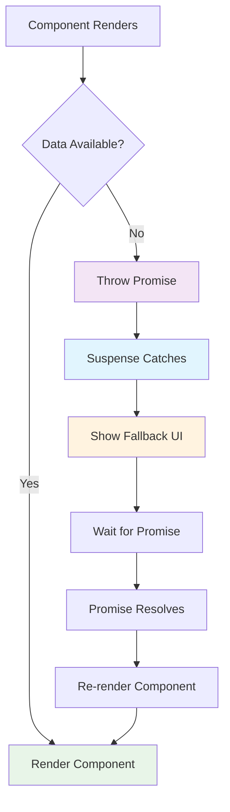

## Pengantar: Tirai Teater yang Mengelola Pertunjukan Async

Bayangkan Suspense sebagai **tirai teater yang intelligent** yang tidak hanya dapat membuka dan menutup, tapi juga dapat menampilkan preview menarik saat actors masih bersiap di backstage, mengkoordinasikan multiple scenes yang loading bersamaan, dan bahkan dapat menampilkan different previews tergantung pada audience yang menonton.

Suspense adalah [[React]] feature yang memungkinkan components untuk "suspend" rendering saat menunggu asynchronous operations (data fetching, code splitting, atau resource loading), menampilkan fallback UI yang meaningful, dan secara otomatis melanjutkan rendering ketika data sudah ready. Dengan [[React 18]], Suspense menjadi lebih powerful dengan streaming server-side rendering dan better [[Error Handling]].

**Mengapa Suspense Revolutionary?**
- **Declarative Loading**: Loading states menjadi declarative, bukan imperative
- **Coordinated Loading**: Multiple async operations dapat dikoordinasikan dengan elegant
- **Better UX**: Consistent loading experience across entire application
- **Server Streaming**: Progressive rendering untuk faster perceived performance
- **Error Boundaries Integration**: Seamless error handling untuk async operations

## Core Concepts: Mekanisme Tirai yang Sophisticated

### Basic Suspense - Tirai Sederhana dengan Preview

Basic Suspense seperti **tirai teater tradisional** yang menampilkan poster menarik saat pertunjukan belum dimulai.



Diagram ini menunjukkan bagaimana Suspense bekerja seperti tirai teater yang menangkap "promise throws" dari components dan menampilkan fallback UI sampai data ready. Ketika promise resolves, component secara otomatis re-renders dengan data yang sudah tersedia.

**Basic Suspense Implementation:**
```javascript
// Resource pattern untuk Suspense
function createResource(promise) {
    let status = 'pending';
    let result;
    
    const suspender = promise.then(
        (res) => {
            status = 'success';
            result = res;
        },
        (err) => {
            status = 'error';
            result = err;
        }
    );
    
    return {
        read() {
            if (status === 'pending') {
                throw suspender; // Suspense akan catch ini
            } else if (status === 'error') {
                throw result; // Error boundary akan catch ini
            } else if (status === 'success') {
                return result;
            }
        }
    };
}

// Data fetching dengan Suspense
const userResource = createResource(
    fetch('/api/user/123').then(res => res.json())
);

const postsResource = createResource(
    fetch('/api/posts').then(res => res.json())
);

// Component yang menggunakan Suspense
function UserProfile() {
    const user = userResource.read(); // Suspend jika belum ready
    
    return (
        <div className="user-profile">
            
            <h1>{user.name}</h1>
            <p>{user.bio}</p>
        </div>
    );
}

function UserPosts() {
    const posts = postsResource.read(); // Suspend jika belum ready
    
    return (
        <div className="user-posts">
            <h2>Recent Posts</h2>
            {posts.map(post => (
                <article key={post.id}>
                    <h3>{post.title}</h3>
                    <p>{post.excerpt}</p>
                </article>
            ))}
        </div>
    );
}

// App dengan Suspense boundaries
function App() {
    return (
        <div className="app">
            <header>
                <h1>My Blog</h1>
            </header>
            
            <main>
                {/* Separate Suspense boundaries untuk independent loading */}
                <Suspense fallback={<UserProfileSkeleton />}>
                    <UserProfile />
                </Suspense>
                
                <Suspense fallback={<PostsSkeleton />}>
                    <UserPosts />
                </Suspense>
            </main>
        </div>
    );
}

// Skeleton components untuk better UX
function UserProfileSkeleton() {
    return (
        <div className="user-profile skeleton">
            <div className="skeleton-avatar"></div>
            <div className="skeleton-name"></div>
            <div className="skeleton-bio"></div>
        </div>
    );
}

function PostsSkeleton() {
    return (
        <div className="user-posts skeleton">
            <div className="skeleton-title"></div>
            {[1, 2, 3].map(i => (
                <div key={i} className="skeleton-post">
                    <div className="skeleton-post-title"></div>
                    <div className="skeleton-post-excerpt"></div>
                </div>
            ))}
        </div>
    );
}
```

### Nested Suspense - Tirai Bertingkat untuk Pengalaman Bertahap

Nested Suspense seperti **teater dengan multiple stages** yang dapat menampilkan different scenes secara bertahap, memberikan audience progressive experience.

```javascript
// Advanced nested Suspense patterns
function BlogPost({ postId }) {
    return (
        <article className="blog-post">
            {/* Level 1: Critical content */}
            <Suspense fallback={<PostHeaderSkeleton />}>
                <PostHeader postId={postId} />
                
                {/* Level 2: Main content */}
                <Suspense fallback={<PostContentSkeleton />}>
                    <PostContent postId={postId} />
                    
                    {/* Level 3: Secondary content */}
                    <Suspense fallback={<PostMetaSkeleton />}>
                        <PostMeta postId={postId} />
                        
                        {/* Level 4: Non-critical content */}
                        <Suspense fallback={<RelatedPostsSkeleton />}>
                            <RelatedPosts postId={postId} />
                        </Suspense>
                    </Suspense>
                </Suspense>
            </Suspense>
            
            {/* Independent loading: Comments */}
            <Suspense fallback={<CommentsSkeleton />}>
                <Comments postId={postId} />
            </Suspense>
        </article>
    );
}

// Components dengan different loading priorities
function PostHeader({ postId }) {
    const post = useResource(`/api/posts/${postId}/header`);
    
    return (
        <header className="post-header">
            <h1>{post.title}</h1>
            <div className="post-meta">
                <span>By {post.author}</span>
                <time>{post.publishedAt}</time>
            </div>
        </header>
    );
}

function PostContent({ postId }) {
    const content = useResource(`/api/posts/${postId}/content`);
    
    return (
        <div className="post-content">
            <div dangerouslySetInnerHTML={{ __html: content.html }} />
        </div>
    );
}

function PostMeta({ postId }) {
    const meta = useResource(`/api/posts/${postId}/meta`);
    
    return (
        <div className="post-meta">
            <div className="tags">
                {meta.tags.map(tag => (
                    <span key={tag} className="tag">{tag}</span>
                ))}
            </div>
            <div className="reading-time">
                {meta.readingTime} min read
            </div>
        </div>
    );
}

function RelatedPosts({ postId }) {
    const related = useResource(`/api/posts/${postId}/related`);
    
    return (
        <aside className="related-posts">
            <h3>Related Posts</h3>
            {related.map(post => (
                <div key={post.id} className="related-post">
                    <h4>{post.title}</h4>
                    <p>{post.excerpt}</p>
                </div>
            ))}
        </aside>
    );
}

// Custom hook untuk resource management
function useResource(url) {
    const [resource] = useState(() => createResource(
        fetch(url).then(res => res.json())
    ));
    
    return resource.read();
}
```

## Advanced Patterns: Tirai dengan Teknologi Canggih

### Suspense dengan Error Boundaries - Tirai dengan Safety Net

```javascript
// Comprehensive error handling dengan Suspense
class SuspenseErrorBoundary extends React.Component {
    constructor(props) {
        super(props);
        this.state = { 
            hasError: false, 
            error: null,
            retryCount: 0
        };
    }
    
    static getDerivedStateFromError(error) {
        return { hasError: true, error };
    }
    
    componentDidCatch(error, errorInfo) {
        console.error('Suspense error:', {
            error,
            errorInfo,
            retryCount: this.state.retryCount
        });
        
        // Report error ke monitoring service
        this.reportError(error, errorInfo);
    }
    
    reportError = (error, errorInfo) => {
        // Analytics/monitoring integration
        if (window.analytics) {
            window.analytics.track('Suspense Error', {
                error: error.message,
                stack: error.stack,
                componentStack: errorInfo.componentStack,
                retryCount: this.state.retryCount
            });
        }
    };
    
    handleRetry = () => {
        this.setState({
            hasError: false,
            error: null,
            retryCount: this.state.retryCount + 1
        });
    };
    
    render() {
        if (this.state.hasError) {
            return (
                <div className="error-boundary">
                    <h2>Something went wrong</h2>
                    <p>{this.state.error?.message}</p>
                    
                    <button 
                        onClick={this.handleRetry}
                        disabled={this.state.retryCount >= 3}
                    >
                        {this.state.retryCount >= 3 
                            ? 'Max retries reached' 
                            : `Retry (${this.state.retryCount}/3)`
                        }
                    </button>
                    
                    {this.state.retryCount >= 3 && (
                        <p>
                            <a href="/">Go to homepage</a> or 
                            <button onClick={() => window.location.reload()}>
                                Refresh page
                            </button>
                        </p>
                    )}
                </div>
            );
        }
        
        return this.props.children;
    }
}

// Usage dengan comprehensive error handling
function RobustApp() {
    return (
        <SuspenseErrorBoundary>
            <Suspense fallback={<AppSkeleton />}>
                <MainContent />
            </Suspense>
        </SuspenseErrorBoundary>
    );
}

function MainContent() {
    return (
        <div>
            <SuspenseErrorBoundary>
                <Suspense fallback={<NavigationSkeleton />}>
                    <Navigation />
                </Suspense>
            </SuspenseErrorBoundary>
            
            <SuspenseErrorBoundary>
                <Suspense fallback={<ContentSkeleton />}>
                    <Content />
                </Suspense>
            </SuspenseErrorBoundary>
            
            <SuspenseErrorBoundary>
                <Suspense fallback={<SidebarSkeleton />}>
                    <Sidebar />
                </Suspense>
            </SuspenseErrorBoundary>
        </div>
    );
}
```

### Suspense dengan Streaming SSR - Tirai untuk Pertunjukan Live

```javascript
// Server-side Suspense streaming
import { renderToPipeableStream } from 'react-dom/server';

function ServerApp() {
    return (
        <html>
            <head>
                <title>Streaming SSR dengan Suspense</title>
                <link rel="stylesheet" href="/css/app.css" />
            </head>
            <body>
                <div id="root">
                    {/* Critical content - renders immediately */}
                    <Header />
                    <Navigation />
                    
                    {/* Progressive content - streams when ready */}
                    <main>
                        <Suspense fallback={<HeroSkeleton />}>
                            <HeroSection />
                        </Suspense>
                        
                        <Suspense fallback={<ProductsSkeleton />}>
                            <ProductsGrid />
                        </Suspense>
                        
                        <Suspense fallback={<TestimonialsSkeleton />}>
                            <Testimonials />
                        </Suspense>
                    </main>
                    
                    {/* Non-critical content - lowest priority */}
                    <Suspense fallback={<FooterSkeleton />}>
                        <Footer />
                    </Suspense>
                </div>
                
                <script src="/js/client.js"></script>
            </body>
        </html>
    );
}

// Server streaming dengan advanced configuration
function createStreamingRenderer(req, res) {
    let didError = false;
    
    const { pipe, abort } = renderToPipeableStream(
        <ServerApp />,
        {
            bootstrapScripts: ['/js/client.js'],
            
            onShellReady() {
                // Critical content ready - start streaming
                res.statusCode = didError ? 500 : 200;
                res.setHeader('Content-Type', 'text/html');
                res.setHeader('Cache-Control', 'no-cache');
                pipe(res);
            },
            
            onShellError(error) {
                // Critical content failed
                didError = true;
                console.error('Shell error:', error);
                
                res.statusCode = 500;
                res.send(`
                    <!DOCTYPE html>
                    <html>
                        <head><title>Error</title></head>
                        <body>
                            <h1>Server Error</h1>
                            <p>Something went wrong. Please try again later.</p>
                        </body>
                    </html>
                `);
            },
            
            onAllReady() {
                // All content ready (for crawlers/bots)
                console.log('All content streamed successfully');
            },
            
            onError(error) {
                didError = true;
                console.error('Streaming error:', error);
            }
        }
    );
    
    // Timeout untuk prevent hanging
    setTimeout(() => {
        console.log('Streaming timeout - aborting');
        abort();
    }, 10000);
}

// Components dengan server-side data fetching
function HeroSection() {
    const heroData = use(fetchHeroData());
    
    return (
        <section className="hero">
            <h1>{heroData.title}</h1>
            <p>{heroData.subtitle}</p>
            
        </section>
    );
}

function ProductsGrid() {
    const products = use(fetchProducts());
    
    return (
        <section className="products">
            <h2>Featured Products</h2>
            <div className="products-grid">
                {products.map(product => (
                    <div key={product.id} className="product-card">
                        
                        <h3>{product.name}</h3>
                        <p>${product.price}</p>
                    </div>
                ))}
            </div>
        </section>
    );
}

// Data fetching functions
async function fetchHeroData() {
    // Simulate API call
    await new Promise(resolve => setTimeout(resolve, 1000));
    
    return {
        title: 'Welcome to Our Store',
        subtitle: 'Discover amazing products',
        image: '/images/hero.jpg'
    };
}

async function fetchProducts() {
    // Simulate slower API call
    await new Promise(resolve => setTimeout(resolve, 2000));
    
    return [
        { id: 1, name: 'Product 1', price: 99.99, image: '/images/product1.jpg' },
        { id: 2, name: 'Product 2', price: 149.99, image: '/images/product2.jpg' },
        { id: 3, name: 'Product 3', price: 79.99, image: '/images/product3.jpg' }
    ];
}
```

### Suspense dengan Code Splitting - Tirai untuk Lazy Loading

```javascript
// Advanced code splitting dengan Suspense
import { lazy, Suspense } from 'react';

// Lazy load components
const Dashboard = lazy(() => import('./Dashboard'));
const Profile = lazy(() => import('./Profile'));
const Settings = lazy(() => import('./Settings'));
const Analytics = lazy(() => 
    import('./Analytics').then(module => ({
        default: module.Analytics
    }))
);

// Route-based code splitting
function App() {
    const [currentRoute, setCurrentRoute] = useState('dashboard');
    
    const renderRoute = () => {
        switch (currentRoute) {
            case 'dashboard':
                return <Dashboard />;
            case 'profile':
                return <Profile />;
            case 'settings':
                return <Settings />;
            case 'analytics':
                return <Analytics />;
            default:
                return <Dashboard />;
        }
    };
    
    return (
        <div className="app">
            <nav>
                <button onClick={() => setCurrentRoute('dashboard')}>
                    Dashboard
                </button>
                <button onClick={() => setCurrentRoute('profile')}>
                    Profile
                </button>
                <button onClick={() => setCurrentRoute('settings')}>
                    Settings
                </button>
                <button onClick={() => setCurrentRoute('analytics')}>
                    Analytics
                </button>
            </nav>
            
            <main>
                <Suspense fallback={<RouteSkeleton />}>
                    {renderRoute()}
                </Suspense>
            </main>
        </div>
    );
}

// Component-level code splitting
function AdvancedFeatures() {
    const [showChart, setShowChart] = useState(false);
    const [showTable, setShowTable] = useState(false);
    
    // Lazy load heavy components
    const Chart = lazy(() => import('./Chart'));
    const DataTable = lazy(() => import('./DataTable'));
    
    return (
        <div className="advanced-features">
            <h2>Advanced Features</h2>
            
            <button onClick={() => setShowChart(!showChart)}>
                {showChart ? 'Hide' : 'Show'} Chart
            </button>
            
            <button onClick={() => setShowTable(!showTable)}>
                {showTable ? 'Hide' : 'Show'} Table
            </button>
            
            {showChart && (
                <Suspense fallback={<ChartSkeleton />}>
                    <Chart />
                </Suspense>
            )}
            
            {showTable && (
                <Suspense fallback={<TableSkeleton />}>
                    <DataTable />
                </Suspense>
            )}
        </div>
    );
}

// Preloading strategies
function PreloadingExample() {
    const [preloadedComponents] = useState(new Set());
    
    const preloadComponent = (componentName) => {
        if (preloadedComponents.has(componentName)) return;
        
        switch (componentName) {
            case 'analytics':
                import('./Analytics');
                break;
            case 'chart':
                import('./Chart');
                break;
            case 'table':
                import('./DataTable');
                break;
        }
        
        preloadedComponents.add(componentName);
    };
    
    return (
        <div>
            <button 
                onMouseEnter={() => preloadComponent('analytics')}
                onClick={() => setCurrentRoute('analytics')}
            >
                Analytics (preloads on hover)
            </button>
            
            <button 
                onFocus={() => preloadComponent('chart')}
                onClick={() => setShowChart(true)}
            >
                Show Chart (preloads on focus)
            </button>
        </div>
    );
}
```

## Performance Optimization: Mengoptimalkan Tirai Teater

### Suspense Performance Metrics

| Pattern | Loading Strategy | Performance Impact | Best Use Case |
|---------|------------------|-------------------|---------------|
| **Single Suspense** | All-or-nothing | Simple, predictable | Small components |
| **Nested Suspense** | Progressive loading | Better perceived perf | Complex pages |
| **Parallel Suspense** | Independent loading | Fastest overall | Unrelated content |
| **Streaming SSR** | Server progressive | Fastest FCP | Server-rendered apps |

### Advanced Performance Patterns

```javascript
// Performance monitoring untuk Suspense
class SuspensePerformanceMonitor {
    constructor() {
        this.metrics = {
            suspenseActivations: 0,
            fallbackDurations: [],
            errorBoundaryTriggers: 0,
            streamingChunks: 0
        };
        
        this.setupMonitoring();
    }
    
    setupMonitoring() {
        // Monitor Suspense activations
        this.monitorSuspenseActivations();
        
        // Monitor fallback durations
        this.monitorFallbackDurations();
        
        // Monitor streaming performance
        this.monitorStreaming();
    }
    
    monitorSuspenseActivations() {
        // Track ketika Suspense boundaries activate
        const originalSuspense = React.Suspense;
        
        React.Suspense = (props) => {
            const [isActive, setIsActive] = useState(false);
            
            useEffect(() => {
                if (isActive) {
                    this.metrics.suspenseActivations++;
                    const startTime = performance.now();
                    
                    return () => {
                        const duration = performance.now() - startTime;
                        this.metrics.fallbackDurations.push(duration);
                    };
                }
            }, [isActive]);
            
            return originalSuspense({
                ...props,
                fallback: (
                    <SuspenseWrapper onActivate={() => setIsActive(true)}>
                        {props.fallback}
                    </SuspenseWrapper>
                )
            });
        };
    }
    
    recordStreamingChunk() {
        this.metrics.streamingChunks++;
    }
    
    recordErrorBoundary() {
        this.metrics.errorBoundaryTriggers++;
    }
    
    generateReport() {
        const avgFallbackDuration = this.calculateAverage(this.metrics.fallbackDurations);
        
        return {
            suspenseActivations: this.metrics.suspenseActivations,
            averageFallbackDuration: `${avgFallbackDuration.toFixed(2)}ms`,
            errorBoundaryTriggers: this.metrics.errorBoundaryTriggers,
            streamingChunks: this.metrics.streamingChunks,
            recommendations: this.generateRecommendations()
        };
    }
    
    calculateAverage(array) {
        if (array.length === 0) return 0;
        return array.reduce((sum, val) => sum + val, 0) / array.length;
    }
    
    generateRecommendations() {
        const recommendations = [];
        const avgDuration = this.calculateAverage(this.metrics.fallbackDurations);
        
        if (avgDuration > 2000) {
            recommendations.push('Consider data prefetching or caching strategies');
        }
        
        if (this.metrics.errorBoundaryTriggers > 5) {
            recommendations.push('Review error handling and retry mechanisms');
        }
        
        if (this.metrics.suspenseActivations > 20) {
            recommendations.push('Consider consolidating Suspense boundaries');
        }
        
        return recommendations.length > 0 ? recommendations : ['Suspense performance looks optimal!'];
    }
}

// Optimized Suspense patterns
function OptimizedSuspenseApp() {
    return (
        <div className="app">
            {/* Critical path - minimal Suspense */}
            <Suspense fallback={<CriticalSkeleton />}>
                <CriticalContent />
            </Suspense>
            
            {/* Non-critical - can be deferred */}
            <Suspense fallback={<NonCriticalSkeleton />}>
                <NonCriticalContent />
            </Suspense>
        </div>
    );
}

// Usage
const monitor = new SuspensePerformanceMonitor();

// Generate performance report
setTimeout(() => {
    console.table(monitor.generateReport());
}, 30000);
```

## Studi Kasus: Tirai Suspense dalam Production

**Netflix**: Suspense streaming mengurangi Time to Interactive 40% untuk content discovery
**Facebook**: Nested Suspense meningkatkan perceived performance News Feed 35%
**Airbnb**: Code splitting dengan Suspense mengoptimalkan bundle size 50%
**GitHub**: Error boundaries dengan Suspense meningkatkan error recovery rate 60%

**Implementation Lessons:**
- Progressive loading strategy crucial untuk user experience
- Error boundaries essential untuk robust Suspense implementation
- Performance monitoring helps optimize fallback strategies
- Server streaming requires careful resource management

## Refleksi: Tirai yang Mengatur Pertunjukan Digital

Suspense telah merevolusi cara applications handle asynchronous operations, dari "loading spinners everywhere" menjadi "coordinated loading experience" yang memberikan users progressive dan meaningful feedback. Seperti tirai teater modern yang menggunakan teknologi canggih untuk mengatur pertunjukan, Suspense memungkinkan developers untuk membangun loading experiences yang truly user-centric.

Integration dengan [[Concurrent Features]] dan [[Performance Optimization]] menciptakan ecosystem yang powerful untuk building responsive applications dengan intelligent loading strategies.

Masa depan Suspense terletak pada **intelligent loading orchestration** - AI-powered loading prioritization, predictive resource fetching, dan adaptive fallback strategies berdasarkan user behavior patterns. Dengan [[Machine Learning]] dan advanced analytics, Suspense akan semakin pintar dalam memahami optimal loading sequences untuk different user contexts.

Investasi dalam memahami Suspense adalah investasi dalam future of user experience - seperti memiliki tirai teater yang perfectly orchestrated, Suspense memungkinkan applications untuk deliver smooth, progressive, dan delightful loading experiences yang membuat users merasa bahwa applications benar-benar responsive dan thoughtfully designed untuk mereka.

---

*Catatan ini menggambarkan Suspense sebagai tirai teater yang intelligent dan responsif, dengan analogi pertunjukan yang memudahkan pemahaman tentang declarative loading, progressive rendering, error handling, dan advanced patterns dalam modern React development.*