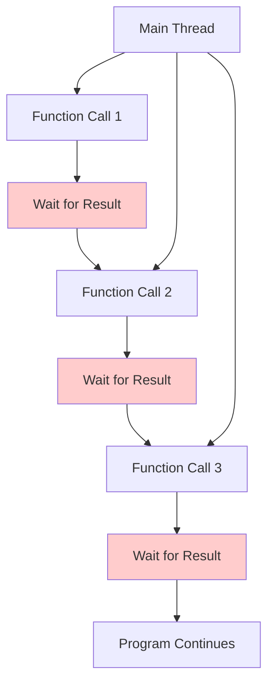

## Pengantar: Antrian Bank di Era Sebelum Internet Banking

Bayangkan Synchronous Programming sebagai **sistem antrian bank tradisional** di mana setiap nasabah harus menunggu giliran secara berurutan. Teller melayani satu nasabah sampai selesai sebelum memanggil nasabah berikutnya. Meskipun terlihat lambat, sistem ini memberikan kepastian urutan, predictability, dan simplicity yang mudah dipahami dan di-debug.

Synchronous Programming adalah paradigma di mana operations dieksekusi secara sequential - satu operation harus selesai sebelum operation berikutnya dimulai. Program "menunggu" (blocking) hingga setiap function call selesai dan mengembalikan result sebelum melanjutkan ke baris kode berikutnya.

**Mengapa Synchronous Programming Fundamental?**
- **Predictable Execution**: Urutan eksekusi yang jelas dan mudah diprediksi
- **Simple Mental Model**: Easier to reason about program flow dan state
- **Debugging Friendly**: Stack traces yang linear dan mudah diikuti
- **Deterministic Behavior**: Same input selalu menghasilkan same output dalam same order
## Execution Model: Sistem Antrian Berurutan

### Sequential Processing - Satu Nasabah Satu Waktu

Synchronous programming seperti **teller bank yang melayani satu nasabah sampai tuntas** sebelum memanggil nasabah berikutnya, memastikan setiap transaksi selesai dengan benar.



Diagram ini menunjukkan bagaimana synchronous execution memblok main thread pada setiap operation, seperti antrian bank yang harus menunggu setiap nasabah selesai dilayani. Meskipun terlihat tidak efisien, model ini memberikan predictability dan simplicity yang sangat valuable dalam banyak scenarios.

**Karakteristik Synchronous Execution:**
```javascript
// Synchronous function calls - blocking execution
function processCustomer(customer) {
    console.log(`Processing customer: ${customer.name}`);
    
    // Each step blocks until completion
    const validation = validateCustomer(customer);     // Blocks here
    const account = createAccount(validation);         // Then blocks here
    const card = issueCard(account);                   // Then blocks here
    
    console.log(`Customer ${customer.name} processed successfully`);
    return { account, card };
}

// Sequential processing
const customers = [
    { name: 'Alice', id: 1 },
    { name: 'Bob', id: 2 },
    { name: 'Charlie', id: 3 }
];

// Process one customer at a time
customers.forEach(customer => {
    const result = processCustomer(customer); // Blocks until complete
    console.log('Result:', result);
});

console.log('All customers processed'); // Only runs after all are done
```

### Call Stack - Sistem Tracking Antrian

Call stack dalam synchronous programming seperti **sistem nomor antrian** yang melacak urutan layanan dan memastikan setiap nasabah dilayani sesuai giliran.

```javascript
// Call stack demonstration
function bankTransaction() {
    console.log('1. Starting transaction');
    
    function validateAccount() {
        console.log('2. Validating account');
        
        function checkBalance() {
            console.log('3. Checking balance');
            return 1000; // Balance amount
        }
        
        const balance = checkBalance(); // Stack: bankTransaction -> validateAccount -> checkBalance
        console.log('4. Balance checked:', balance);
        return balance > 0;
    }
    
    const isValid = validateAccount(); // Stack: bankTransaction -> validateAccount
    console.log('5. Account validation:', isValid);
    
    if (isValid) {
        console.log('6. Transaction approved');
        return 'SUCCESS';
    } else {
        console.log('6. Transaction denied');
        return 'FAILED';
    }
}

const result = bankTransaction(); // Stack: bankTransaction
console.log('7. Final result:', result);

// Output shows clear sequential execution:
// 1. Starting transaction
// 2. Validating account  
// 3. Checking balance
// 4. Balance checked: 1000
// 5. Account validation: true
// 6. Transaction approved
// 7. Final result: SUCCESS
```

## Advantages: Keunggulan Sistem Tradisional

### Predictable Flow - Alur yang Dapat Diprediksi

Synchronous programming memberikan **alur eksekusi yang sangat predictable**, seperti jadwal bank yang pasti - buka jam 8, tutup jam 4, tidak ada kejutan.

```javascript
// Predictable execution order
class BankService {
    constructor() {
        this.transactionLog = [];
    }
    
    processTransaction(amount, accountId) {
        // Step 1: Always executed first
        this.logTransaction('START', accountId, amount);
        
        // Step 2: Always executed second
        const account = this.getAccount(accountId);
        
        // Step 3: Always executed third
        const isValid = this.validateTransaction(account, amount);
        
        // Step 4: Conditional but predictable
        if (isValid) {
            this.debitAccount(account, amount);
            this.logTransaction('SUCCESS', accountId, amount);
            return { status: 'SUCCESS', newBalance: account.balance };
        } else {
            this.logTransaction('FAILED', accountId, amount);
            return { status: 'FAILED', reason: 'Insufficient funds' };
        }
    }
    
    getAccount(accountId) {
        // Synchronous database lookup (simulated)
        return { id: accountId, balance: 1000 };
    }
    
    validateTransaction(account, amount) {
        return account.balance >= amount;
    }
    
    debitAccount(account, amount) {
        account.balance -= amount;
    }
    
    logTransaction(type, accountId, amount) {
        const timestamp = new Date().toISOString();
        this.transactionLog.push({ timestamp, type, accountId, amount });
        console.log(`[${timestamp}] ${type}: Account ${accountId}, Amount ${amount}`);
    }
}

// Usage - completely predictable behavior
const bank = new BankService();
const result1 = bank.processTransaction(500, 'ACC001'); // Always executes in same order
const result2 = bank.processTransaction(600, 'ACC001'); // Predictable failure
```

### Simple Debugging - Debugging yang Mudah

Synchronous code seperti **jejak kaki di salju** - mudah diikuti dan di-trace ketika ada masalah.

```javascript
// Easy debugging with synchronous code
function calculateLoanEligibility(customer) {
    try {
        console.log('Step 1: Starting loan calculation for', customer.name);
        
        // Each step can be easily debugged
        const creditScore = getCreditScore(customer.ssn);
        console.log('Step 2: Credit score retrieved:', creditScore);
        
        const income = calculateMonthlyIncome(customer.employment);
        console.log('Step 3: Monthly income calculated:', income);
        
        const expenses = calculateMonthlyExpenses(customer.expenses);
        console.log('Step 4: Monthly expenses calculated:', expenses);
        
        const debtToIncomeRatio = expenses / income;
        console.log('Step 5: Debt-to-income ratio:', debtToIncomeRatio);
        
        const eligibility = determineEligibility(creditScore, debtToIncomeRatio);
        console.log('Step 6: Eligibility determined:', eligibility);
        
        return eligibility;
        
    } catch (error) {
        // Clear error location in synchronous code
        console.error('Error at step:', error.message);
        console.error('Stack trace:', error.stack);
        throw error;
    }
}

function getCreditScore(ssn) {
    if (!ssn) {
        throw new Error('SSN required for credit check');
    }
    return 750; // Simulated credit score
}

function calculateMonthlyIncome(employment) {
    if (!employment || !employment.salary) {
        throw new Error('Employment information required');
    }
    return employment.salary / 12;
}

// Clear error handling and debugging
try {
    const customer = { name: 'John Doe', ssn: '123-45-6789' }; // Missing employment
    const eligibility = calculateLoanEligibility(customer);
} catch (error) {
    console.log('Caught error:', error.message);
    // Error location is immediately clear from stack trace
}
```

## Limitations: Keterbatasan Sistem Antrian

### Blocking Operations - Kemacetan Antrian

Synchronous operations dapat menyebabkan **kemacetan total** seperti antrian bank yang terhenti karena satu nasabah bermasalah.

```javascript
// Blocking operation example
function slowBankOperation() {
    console.log('Starting slow operation...');
    
    // Simulated slow operation (like network call or file I/O)
    const startTime = Date.now();
    while (Date.now() - startTime < 3000) {
        // Blocking for 3 seconds - nothing else can happen
    }
    
    console.log('Slow operation completed');
    return 'Operation result';
}

function urgentOperation() {
    console.log('Urgent operation executed');
    return 'Urgent result';
}

// Demonstration of blocking behavior
console.log('Program start');

const result1 = slowBankOperation();    // Blocks for 3 seconds
console.log('Result 1:', result1);

const result2 = urgentOperation();      // Only runs after slow operation
console.log('Result 2:', result2);

console.log('Program end');

// Timeline:
// 0ms: Program start
// 0ms: Starting slow operation...
// 3000ms: Slow operation completed
// 3000ms: Result 1: Operation result
// 3000ms: Urgent operation executed
// 3000ms: Result 2: Urgent result
// 3000ms: Program end
```

### Performance Impact - Efisiensi yang Terbatas

```javascript
// Performance comparison: Synchronous vs potential parallel
class PerformanceComparison {
    // Synchronous approach - one after another
    static synchronousProcessing(tasks) {
        console.time('Synchronous Processing');
        const results = [];
        
        for (const task of tasks) {
            const startTime = Date.now();
            const result = this.processTask(task); // Blocks for each task
            const endTime = Date.now();
            
            results.push({
                task: task.id,
                result,
                duration: endTime - startTime
            });
        }
        
        console.timeEnd('Synchronous Processing');
        return results;
    }
    
    static processTask(task) {
        // Simulate processing time
        const processingTime = Math.random() * 1000 + 500; // 500-1500ms
        const startTime = Date.now();
        
        while (Date.now() - startTime < processingTime) {
            // Blocking operation
        }
        
        return `Processed ${task.id}`;
    }
}

// Example usage
const tasks = [
    { id: 'TASK_1', data: 'Data 1' },
    { id: 'TASK_2', data: 'Data 2' },
    { id: 'TASK_3', data: 'Data 3' },
    { id: 'TASK_4', data: 'Data 4' }
];

// Synchronous processing - total time is sum of all individual times
const syncResults = PerformanceComparison.synchronousProcessing(tasks);
console.log('Synchronous results:', syncResults);

// If each task takes ~1000ms, total time ≈ 4000ms
```

## Use Cases: Kapan Menggunakan Antrian Tradisional

### Appropriate Scenarios - Situasi yang Tepat

| Scenario | Why Synchronous | Example |
|----------|----------------|---------|
| **Simple Scripts** | Linear logic, no concurrency needed | Data processing scripts |
| **Mathematical Calculations** | Sequential dependencies | Financial calculations |
| **Configuration Loading** | Must complete before app starts | App initialization |
| **Error-Critical Operations** | Need guaranteed completion order | Database transactions |
| **Learning/Prototyping** | Easier to understand and debug | Educational examples |

### Best Practices untuk Synchronous Code

```javascript
// 1. Clear function naming and documentation
/**
 * Processes customer loan application synchronously
 * @param {Object} application - Loan application data
 * @returns {Object} Processing result with approval status
 * @throws {Error} If required data is missing
 */
function processLoanApplication(application) {
    validateApplicationData(application);
    const creditCheck = performCreditCheck(application.ssn);
    const incomeVerification = verifyIncome(application.employment);
    const decision = makeApprovalDecision(creditCheck, incomeVerification);
    
    return {
        applicationId: application.id,
        decision: decision.approved,
        reason: decision.reason,
        processedAt: new Date().toISOString()
    };
}

// 2. Proper error handling
function robustSynchronousOperation(data) {
    try {
        // Validate input
        if (!data || typeof data !== 'object') {
            throw new Error('Invalid input data');
        }
        
        // Process step by step with validation
        const step1Result = processStep1(data);
        if (!step1Result.success) {
            throw new Error(`Step 1 failed: ${step1Result.error}`);
        }
        
        const step2Result = processStep2(step1Result.data);
        if (!step2Result.success) {
            throw new Error(`Step 2 failed: ${step2Result.error}`);
        }
        
        return {
            success: true,
            data: step2Result.data,
            processedSteps: ['step1', 'step2']
        };
        
    } catch (error) {
        console.error('Synchronous operation failed:', error.message);
        return {
            success: false,
            error: error.message,
            failedAt: new Date().toISOString()
        };
    }
}

// 3. Performance monitoring
class SynchronousPerformanceMonitor {
    static measureOperation(operationName, operation) {
        const startTime = performance.now();
        const startMemory = process.memoryUsage();
        
        try {
            const result = operation();
            const endTime = performance.now();
            const endMemory = process.memoryUsage();
            
            console.log(`Operation: ${operationName}`);
            console.log(`Duration: ${(endTime - startTime).toFixed(2)}ms`);
            console.log(`Memory delta: ${(endMemory.heapUsed - startMemory.heapUsed) / 1024 / 1024}MB`);
            
            return result;
        } catch (error) {
            const endTime = performance.now();
            console.error(`Operation ${operationName} failed after ${(endTime - startTime).toFixed(2)}ms`);
            throw error;
        }
    }
}

// Usage
const result = SynchronousPerformanceMonitor.measureOperation(
    'Customer Processing',
    () => processCustomerData(customerData)
);
```

## Trade-offs: Synchronous vs [[Asynchronous Programming]]

### Performance Comparison

| Aspect | Synchronous | [[Asynchronous Programming|Asynchronous]] |
|--------|-------------|-------------|
| **Execution Model** | Sequential, blocking | Concurrent, non-blocking |
| **Resource Usage** | Lower CPU, higher wait time | Higher CPU, lower wait time |
| **Complexity** | Simple, linear | Complex, callback/promise chains |
| **Debugging** | Easy, clear stack traces | Difficult, async stack traces |
| **Error Handling** | Straightforward try/catch | Complex error propagation |
| **Performance** | Poor for I/O operations | Excellent for I/O operations |

### Migration Strategies

```javascript
// Gradual migration from sync to async
class BankServiceMigration {
    // Original synchronous version
    processTransactionSync(accountId, amount) {
        const account = this.getAccountSync(accountId);
        const isValid = this.validateSync(account, amount);
        
        if (isValid) {
            this.updateBalanceSync(account, amount);
            return { success: true, newBalance: account.balance };
        }
        
        return { success: false, reason: 'Invalid transaction' };
    }
    
    // Hybrid approach - sync interface with async internals
    processTransactionHybrid(accountId, amount) {
        // Use synchronous-looking code with async operations
        const account = this.getAccountSync(accountId); // Keep sync for now
        const isValid = this.validateSync(account, amount); // Keep sync for now
        
        if (isValid) {
            // This could be made async later
            this.updateBalanceSync(account, amount);
            return { success: true, newBalance: account.balance };
        }
        
        return { success: false, reason: 'Invalid transaction' };
    }
    
    // Helper methods
    getAccountSync(accountId) {
        // Simulated synchronous database call
        return { id: accountId, balance: 1000 };
    }
    
    validateSync(account, amount) {
        return account.balance >= amount;
    }
    
    updateBalanceSync(account, amount) {
        account.balance -= amount;
    }
}
```

## Studi Kasus: Synchronous Programming dalam Production

**Banking Systems**: Core transaction processing menggunakan synchronous operations untuk data consistency
**Configuration Management**: Application startup sequences memerlukan synchronous loading
**Mathematical Libraries**: Scientific computing libraries menggunakan synchronous calculations
**CLI Tools**: Command-line utilities benefit dari synchronous, sequential processing

**Lessons Learned:**
- Synchronous programming excellent untuk predictable, sequential operations
- Performance trade-offs acceptable untuk CPU-bound tasks
- Debugging dan maintenance significantly easier dengan synchronous code
- Hybrid approaches dapat combine benefits dari both paradigms

## Refleksi: Tempat Synchronous Programming di Era Modern

Synchronous Programming seperti **bank tradisional** yang masih memiliki tempat penting meskipun era digital banking telah tiba. Seperti nasabah yang kadang memerlukan layanan personal di teller untuk transaksi kompleks, ada scenarios di mana synchronous approach memberikan clarity, predictability, dan reliability yang tidak dapat digantikan oleh [[Asynchronous Programming|asynchronous alternatives]].

Masa depan synchronous programming terletak pada **strategic usage** - memilih kapan menggunakan simplicity dan predictability synchronous operations versus kapan memerlukan performance dan scalability dari asynchronous approaches. Dengan [[JavaScript Interface]] dan modern development tools, developers dapat memilih paradigm yang tepat untuk setiap specific use case.

Investasi dalam memahami synchronous programming adalah investasi dalam fundamental programming concepts - seperti memahami prinsip dasar perbankan sebelum menggunakan fintech, menguasai synchronous programming memberikan foundation yang solid untuk memahami dan mengoptimalkan asynchronous systems yang lebih complex.

---

*Catatan ini menggambarkan Synchronous Programming sebagai sistem antrian bank tradisional yang memberikan predictability dan simplicity, dengan analogi perbankan yang memudahkan pemahaman tentang execution model, advantages, limitations, dan appropriate use cases dalam modern software development.*