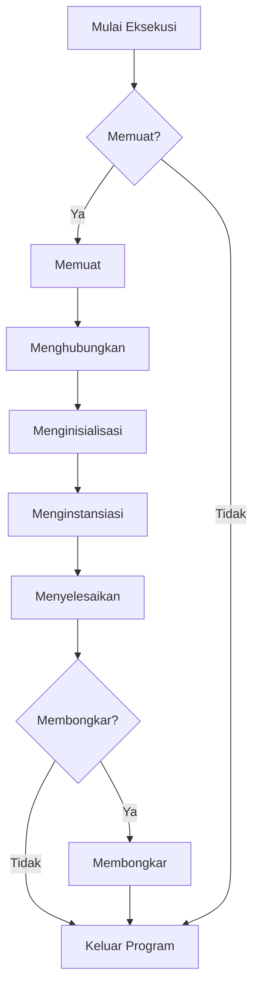

Jika Anda membaca postingan ini, kemungkinan besar Anda sudah tahu cara menulis kode [[Java]]. Itu sangat bagus, saya pikir setiap orang harus tahu cara membuat kode saat ini (sama seperti setiap orang harus tahu tentang operasi matematika dasar seperti +, -, \*, dan / meskipun kita semua memiliki kalkulator).

Dalam postingan sebelumnya, saya menulis tentang bagaimana kode Java pertama kali "dikompilasi" menjadi [[Bytecode]] dan kemudian diinterpretasikan serta **dieksekusi** oleh [[JVM]]. Namun, saya tidak menjelaskan bagaimana JVM sebenarnya melakukan eksekusi bytecode. Tujuan artikel ini adalah untuk mengisi kekosongan tersebut.

Saya akan menjawab pertanyaan: Apa yang terjadi ketika mengklik tombol "eksekusi" di [[IDE]] favorit Anda? Setelah membaca postingan ini, Anda akan memahami [[Siklus Hidup Eksekusi Aplikasi Java]] dan aktivitas yang dilakukan oleh JVM selama fase eksekusi.

© Pengetahuan mendalam seringkali menjadi persyaratan untuk eksekusi yang tepat. Foto diambil di stasiun metro Kungsträdgården.

[[Siklus Hidup Eksekusi Aplikasi Java]] secara luas dapat dibagi menjadi tiga fase:

1.  **[[Kompilasi]]**: Kode sumber aplikasi diubah menjadi [[Bytecode]] menggunakan kompiler "javac".
2.  **[[Pemuatan Kelas|Class Loading]]**: Bytecode dimuat ke dalam memori dan file kelas yang diperlukan disiapkan untuk eksekusi.
3.  **[[Eksekusi Bytecode]]**: JVM mengeksekusi bytecode dan program berjalan.

[[JVM]] bertanggung jawab untuk mengelola fase terakhir. Ini termasuk memuat bytecode, mengalokasikan memori, dan mengubah bytecode menjadi kode mesin asli. Dengan kata lain, JVM menangani tugas menerjemahkan bytecode ke dalam [[Kode Mesin]] yang spesifik untuk platform target dan mengeksekusinya. Ini adalah proses yang kompleks karena setiap arsitektur mikroprosesor "memahami" serangkaian instruksi yang berbeda (misalnya, x86, ARM, MIPS, PowerPC, dll.). JVM juga menyediakan layanan runtime seperti [[Manajemen Memori]], [[Sinkronisasi Thread]], dan [[Penanganan Pengecualian]].

Postingan ini berfokus pada **fase eksekusi bytecode**.

Diagram aktivitas berikut mengilustrasikan apa yang terjadi selama fase ini:



Bagian-bagian berikut memberikan detail lebih lanjut tentang setiap aktivitas yang terjadi selama fase eksekusi bytecode.

## Memuat (Loading)

[[Pemuatan Kelas|Loading]] mengacu pada proses menemukan bentuk biner dari sebuah kelas atau antarmuka (yaitu, format file `class`) dengan nama tertentu dan membangun objek `Class` dari bentuk biner tersebut. [[JVM]] menggunakan [[ClassLoader]] untuk menemukan representasi biner dari `Main`. Kelas `ClassLoader` dan subkelasnya mengimplementasikan proses pemuatan. Metode `defineClass` dipanggil untuk membangun objek `Class` dari representasi biner format file kelas.

JVM menyediakan dua jenis [[ClassLoader]]: [[Bootstrap Class Loader]] bawaan, yang memuat kelas inti Java dari file `rt.jar`; dan [[Extension Class Loader]], yang memuat kelas dari direktori `ext`. Selain itu, [[Application Class Loader]] dapat digunakan untuk memuat kelas dari lokasi lain, seperti classpath atau server jarak jauh. Yang terakhir adalah subkelas `ClassLoader` yang disesuaikan yang dapat memuat kelas melalui instance `java.lang.Class`.

```java
public class CustomClassLoader extends ClassLoader {
  public CustomClassLoader(ClassLoader parent) {
    super(parent);
  }
  // Method to load a class given its name
  public Class<?> loadClass(String name) throws ClassNotFoundException {
    if (!name.startsWith("com.example")) {
      // Delegate to the parent class loader
      return super.loadClass(name);
      }
    // The class name does start with "com.example", construct the file name
    String fileName = name.substring(name.lastIndexOf('.') + 1) + ".class";
    // Try to open an InputStream for the file
    InputStream inputStream = getClass().getResourceAsStream(fileName);
    // If the stream is null, throw a ClassNotFoundException
    if (inputStream == null) {
      throw new ClassNotFoundException();
    }
    try {
      // Create a byte array to hold the contents of the file
      byte[] bytes = new byte[inputStream.available()];
      // Read the bytes from the input stream
      inputStream.read(bytes);
      // Define the class using the class name, the byte array, and the number of bytes
      return defineClass(name, bytes, 0, bytes.length);
    } catch (IOException e) {
      throw new ClassNotFoundException();
    }
  }
}
```

Kelas ini memperluas kelas `ClassLoader` dan mengesampingkan metode `loadClass`-nya untuk menyediakan perilaku kustom untuk memuat kelas. Ini pertama-tama memeriksa apakah nama kelas dimulai dengan "com.example", dan jika tidak, ia mendelegasikan ke class loader induk. Jika nama kelas memang dimulai dengan "com.example", ia membangun nama file dan mencoba membuka `InputStream` untuk itu. Jika berhasil, ia membaca byte dari aliran input dan memanggil metode `defineClass` untuk mendefinisikan kelas. Jika gagal, ia melempar `ClassNotFoundException`.

Singkatnya, proses [[Pemuatan Kelas|class loading]] melakukan tiga fungsi ini:

-   Membuat aliran data biner dari file kelas
-   Mengurai data biner sesuai dengan struktur data internal
-   Membuat instance `java.lang.Class`

Setelah ini selesai, instance kelas siap untuk [[Penghubungan|linking]].

## Penghubungan (Linking)

[[Penghubungan|Linking]] mengacu pada proses mengambil bentuk biner dari sebuah kelas atau antarmuka dan menggabungkannya ke dalam status runtime [[JVM]], sehingga dapat dieksekusi. Linking melibatkan tiga langkah: verifikasi representasi biner, persiapan kelas antarmuka, dan (opsional) resolusi referensi simbolik.

1.  **Verifikasi**: memeriksa bahwa representasi kelas yang dimuat terbentuk dengan baik, dengan tabel simbol yang tepat. Ini juga memeriksa bahwa kode yang mengimplementasikan kelas mematuhi persyaratan semantik [[Bahasa Pemrograman Java]] dan JVM. Misalnya, ia memeriksa bahwa setiap instruksi memiliki kode operasi yang valid; bahwa setiap instruksi cabang bercabang ke awal instruksi lain, daripada ke tengah instruksi; bahwa setiap metode memiliki tanda tangan yang benar.
2.  **Persiapan**: melibatkan pembuatan bidang `static` (variabel kelas dan konstanta) untuk kelas atau antarmuka dan menginisialisasi bidang tersebut ke nilai default. Ini melibatkan alokasi penyimpanan statis dan struktur data apa pun yang digunakan secara internal oleh implementasi JVM, seperti tabel metode.
3.  **Resolusi**: adalah proses memeriksa [[Referensi Simbolik]] dari satu kelas ke kelas dan antarmuka lain, dengan memuat kelas dan antarmuka lain yang disebutkan, dan memeriksa bahwa referensi tersebut benar.

> "Selama [[Penghubungan Statis|static linkage]] dalam implementasi sederhana bahasa C, program yang dikompilasi berisi versi program yang sepenuhnya terhubung, termasuk tautan yang sepenuhnya diselesaikan ke rutinitas pustaka yang digunakan oleh program. Salinan rutinitas pustaka ini disertakan dalam file `a.out`. Di Java, sebaliknya, referensi simbolik diselesaikan hanya ketika secara aktif digunakan (yaitu, bentuk resolusi malas). Misalnya, jika sebuah kelas memiliki beberapa referensi simbolik ke kelas lain, maka referensi tersebut mungkin diselesaikan satu per satu, saat digunakan, atau mungkin tidak sama sekali, jika referensi ini tidak pernah digunakan selama eksekusi program."

Singkatnya, proses [[Penghubungan|linking]] melibatkan tiga fase:

-   Verifikasi
-   Persiapan
-   Resolusi (opsional)

Setelah ini selesai, kelas-kelas siap untuk [[Inisialisasi]].

## Inisialisasi (Initializing)

[[Inisialisasi]] sebuah kelas terdiri dari eksekusi inisialisasi statisnya dan inisialisasi untuk bidang `static` (variabel kelas) yang dideklarasikan dalam kelas. Inisialisasi statis dieksekusi dalam urutan kemunculannya dalam kode sumber.

Pertimbangkan contoh kode berikut, ketika [[JVM]] menginisialisasi kelas `Main`, ia pertama-tama menginisialisasi semua superkelasnya, dimulai dengan `Object`. Karena `Object` tidak memiliki superkelas, rekursi berhenti di sana. Kemudian, JVM menginisialisasi `Main` dengan mengeksekusi inisialisasi variabel kelas dan blok inisialisasi statis dalam urutan kemunculannya dalam kode sumber. Dalam contoh ini, inisialisasi variabel kelas untuk `x` dieksekusi terlebih dahulu, diikuti oleh blok inisialisasi `static`, dan terakhir inisialisasi variabel kelas untuk `z`. Setelah kelas sepenuhnya diinisialisasi, metode `main` dapat dieksekusi.

```java
class Main extends Object {
  // Class variable initializers and static initializers are executed in this order
  static int x = 1;  // Initializer for static field x
  static int y;  // No initializer for static field y
  // Static initializer
  static {
    y = x + 1;
  }
  static int z = x + y;  // Initializer for static field z
  public static void main(String[] args) {
    // Main method is executed after the class is initialized
  }
}
```

Secara umum, inisialisasi kelas atau antarmuka `T` terjadi ketika salah satu keadaan berikut terjadi:

-   Sebuah instance `T` dibuat
-   Metode statis dari `T` dipanggil
-   Bidang statis dari `T` diberi nilai
-   Bidang statis dari `T` digunakan dan bidang tersebut bukan bidang konstanta
-   Perhatikan juga bahwa pemanggilan metode dalam kelas melalui [[Refleksi]] menyebabkan inisialisasi kelas

Setelah semua kelas diinisialisasi, [[JVM]] melanjutkan untuk menginstansiasi kelas-kelas tersebut.

## Instansiasi (Instantiating)

Sebuah [[Instance Kelas|class instance]] baru secara eksplisit dibuat ketika evaluasi ekspresi pembuatan instance kelas dilakukan (misalnya, saat menggunakan operator `new`).

Sebuah instance kelas dapat secara implisit dibuat ketika:

-   Memuat kelas atau antarmuka yang berisi literal string atau blok teks dapat membuat objek `String` baru
-   Eksekusi operasi yang menyebabkan [[Konversi Boxing|boxing conversion]] dapat membuat objek baru dari kelas wrapper
-   Eksekusi operasi [[Konkatenasi String|string concatenation]] dapat membuat objek `String` baru
-   Evaluasi ekspresi [[Referensi Metode|method reference]] atau [[Ekspresi Lambda|lambda expression]] dapat membuat objek baru dari antarmuka fungsional

Berikut adalah contoh pembuatan instance baru dari kelas `Point`:

```java
Point magicPoint = new Point(42, 42);
```

Selama [[Instansiasi]], langkah-langkah berikut dilakukan:

-   Memori dialokasikan di [[Heap]] untuk menampung objek baru
-   [[Konstruktor]] kelas dipanggil untuk menginisialisasi objek baru
-   Referensi ke objek baru dikembalikan

## Finalisasi (Finalizing)

[[Finalisasi]] adalah proses membersihkan sumber daya yang dipegang oleh suatu objek dan mempersiapkannya untuk [[Pengumpulan Sampah|garbage collection]]. Kelas `Object` mendefinisikan metode `finalize` yang dipanggil oleh garbage collector ketika sebuah objek akan diklaim kembali.

[[JVM]] mendefinisikan metode `finalize` di kelas `Object`, yang dapat ditimpa oleh subkelas untuk melakukan tindakan pembersihan yang diperlukan sebelum objek dikumpulkan sampahnya. Berikut adalah contoh kelas yang mengesampingkan metode `finalize` untuk menghapus file ketika objek `TempFile` dikumpulkan sampahnya:

```java
public class TempFile {
  private File file;
  public TempFile(String filename) {
    file = new File(filename);
  }
  @Override
  protected void finalize() throws Throwable {
    // Delete the file when the TempFile object is garbage collected
    file.delete();
    super.finalize();
  }
}
```

Contoh sebelumnya dapat berguna jika Anda ingin memastikan bahwa file sementara selalu dihapus ketika tidak lagi diperlukan. Penting untuk dicatat bahwa metode `finalize` tidak dijamin akan dipanggil, dan tidak boleh diandalkan untuk tugas-tugas penting. Ini hanyalah sarana untuk melakukan tindakan pembersihan sebelum objek dikumpulkan sampahnya.

## Pembongkaran (Unloading)

[[Pembongkaran Kelas|Unloading]] mengacu pada proses menghapus kelas atau antarmuka dari status runtime [[JVM]] (misalnya, ketika class loader yang mendefinisikannya diklaim kembali oleh [[Pengumpul Sampah|garbage collector]]). Pembongkaran kelas mengurangi penggunaan memori. Akibatnya, optimasi ini hanya signifikan untuk aplikasi yang memuat sejumlah besar kelas dan antarmuka, dan yang berhenti menggunakannya setelah beberapa waktu.

Kode berikut menunjukkan contoh pengumpulan sampah yang ditentukan pengguna. Perhatikan bahwa kelas `LargeClass` memiliki array integer besar yang mengonsumsi banyak memori:

```java
import java.lang.ref.WeakReference;
public class LargeClass {
  // A large array of integers that consumes a lot of memory
  private int[] data = new int[Integer.MAX_VALUE]; // Corrected from Integer.MAX
  public static void main(String[] args) {
    // Create a LargeClass object and hold a weak reference to it
    LargeClass largeObject = new LargeClass();
    WeakReference<LargeClass> weakRef = new WeakReference<>(largeObject);
    largeObject = null;  // largeObject is no longer strongly reachable
    // Run the garbage collector
    System.gc();
    // Check if the LargeClass object has been collected
    if (weakRef.get() == null) {
      System.out.println("The LargeClass object has been collected");
    } else {
      System.out.println("The LargeClass object has not been collected");
    }
  }
}
```

Dalam contoh sebelumnya, jika objek `LargeClass` telah dikumpulkan sampahnya, outputnya adalah "The LargeClass object has been collected." Jika tidak, outputnya adalah "The LargeClass object has not been collected."

Kelas dan antarmuka yang dimuat oleh [[Bootstrap Class Loader]] tidak pernah dibongkar. Oleh karena itu, dalam aplikasi mandiri tipikal, pembongkaran kelas kurang umum karena [[System ClassLoader]] biasanya aktif selama masa pakai aplikasi, dan oleh karena itu kelas yang dimuatnya tidak dibongkar.

Berbeda dengan [[Pengumpulan Sampah|garbage collection]], [[Pembongkaran Kelas|class unloading]] mengacu pada penghapusan definisi kelas (objek `Class` yang mewakili `LargeClass`, dalam kasus ini) dan metadata terkait dari memori JVM. Ini biasanya terjadi ketika class loader yang memuat kelas menjadi memenuhi syarat untuk pengumpulan sampah, seperti yang dijelaskan sebelumnya. Pembongkaran kelas tergantung pada beberapa faktor, seperti perilaku garbage collector dan detail implementasi JVM.

Contoh berikut menunjukkan skenario di mana pembongkaran kelas kemungkinan besar akan terjadi:

```java
import java.lang.ref.WeakReference;
import java.net.URL;
import java.net.URLClassLoader;
public class ClassUnloadingExample {
  public static void main(String[] args) throws Exception {
    // Path to the .class file (make sure this is correctly set)
    URL classUrl = new URL("file:///path/to/LargeClass.class");
    // Creating a custom class loader to load "LargeClass"
    URLClassLoader customClassLoader = new URLClassLoader(new URL[]{classUrl});
    // Load "LargeClass" using the custom class loader
    Class<?> largeClass = Class.forName("LargeClass", true, customClassLoader);
    // Create a weak reference to the custom class loader
    WeakReference<ClassLoader> weakClassLoaderRef = new WeakReference<>(customClassLoader);
    // Clear all strong references to the custom class loader and the class
    customClassLoader = null;
    largeClass = null;
    // Suggesting garbage collection
    System.gc();
    // Wait a moment to increase the likelihood that GC has run
    Thread.sleep(1000);
    // Check if the custom class loader has been garbage collected
    if (weakClassLoaderRef.get() == null) {
      System.out.println("Custom class loader has been garbage collected, indicating that LargeClass might have been unloaded");
    } else {
      System.out.println("Custom class loader is still in memory");
    }
  }
}
```

Dalam contoh sebelumnya, [[Custom Class Loader]] digunakan untuk memuat `LargeClass.class` dan kemudian menghapus semua referensi ke class loader tersebut, membuatnya memenuhi syarat untuk [[Pengumpulan Sampah|garbage collection]]. Program kemudian memeriksa apakah custom class loader telah dikumpulkan sampahnya dengan memeriksa `WeakReference`. Jika `customClassLoader` telah dikumpulkan, kemungkinan besar kelas yang dimuatnya (`LargeClass`) telah dibongkar.

## Keluar Program (Program Exit)

[[Keluar Program|Program exit]] mengacu pada proses mengakhiri eksekusi program. Ini berarti semua thread yang bukan [[Daemon Thread]] diakhiri, atau beberapa thread memanggil metode `exit` dari kelas `Runtime`. Metode ini menghentikan [[JVM]] dan keluar dengan kode keluar yang ditentukan. Namun, penggunaan metode ini dibatasi oleh [[Security Manager]]. Jika security manager ada dan tidak mengizinkan program untuk keluar, metode `exit` akan melempar `SecurityException`.

## Kesimpulan

Dalam artikel ini, kita melihat lebih dalam [[Siklus Hidup Eksekusi Aplikasi Java]]. Seperti yang dibahas, ada banyak fase yang dilakukan sebelum metode `main` yang khas dieksekusi. Dari memuat kelas hingga membongkar, [[JVM]] melakukan serangkaian langkah kompleks untuk memastikan bahwa aplikasi dieksekusi dengan benar. Pengetahuan ini penting bagi pengembang, karena membantu memahami cara kerja JVM dan cara mengoptimalkan aplikasi Java. Saya harap Anda menikmati artikel ini dan mempelajari sesuatu yang baru.

## Referensi

-   [The Java Language Specification, Java SE 19 Edition](https://docs.oracle.com/javase/specs/jls/se19/jls19.pdf)
-   [Dynamic Class Loading in the Java Virtual Machine](https://dl.acm.org/doi/10.1145/286942.286945)
-   [The Execution Lifecycle of a Java Application](https://www.cesarsotovalero.net/blog/how-the-jvm-executes-java-code.html)