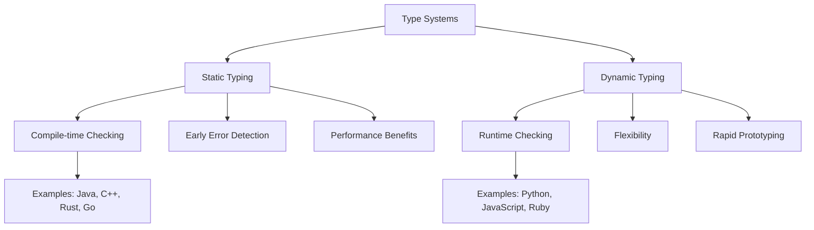
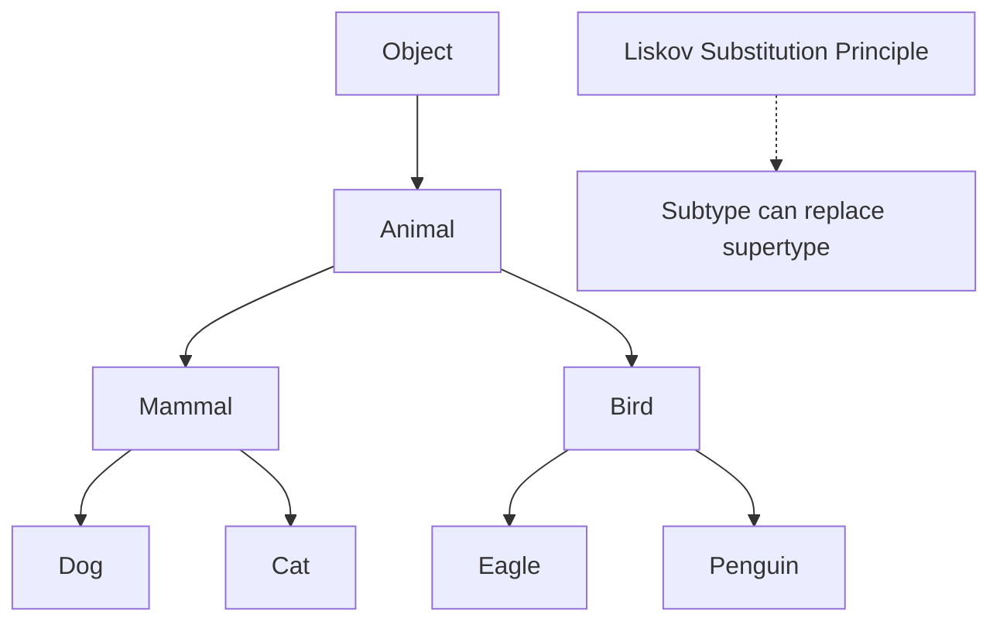
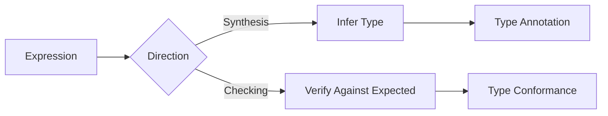
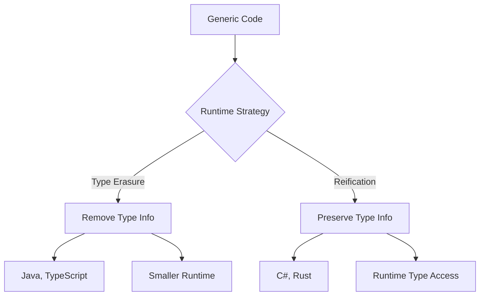

## Pengantar: Guardian Konsistensi

Type Checking adalah **penerjemah teliti** yang memastikan setiap "kata" dalam bahasa pemrograman dipahami dengan benar dan sesuai konteks. Seperti editor yang memeriksa naskah sebelum diterbitkan, type checker mencegah kesalahan yang dapat menyebabkan masalah di runtime.

## Filosofi Type Systems: Kontrak Keamanan

### Static vs Dynamic Typing
Type systems seperti **sistem kontrak dalam bisnis** - ada yang diperiksa di awal (static) dan ada yang diperiksa saat eksekusi (dynamic).



## Type Checking Process: Tahapan Verifikasi

### 1. Type Inference - Detektif Tipe
Type inference seperti **detektif yang mengumpulkan petunjuk** untuk menentukan tipe variabel tanpa deklarasi eksplisit.

| Language | Inference Style | Example |
|----------|----------------|---------|
| **Haskell** | Hindley-Milner | `let x = 42` → `x :: Int` |
| **TypeScript** | Structural | `let x = "hello"` → `x: string` |
| **Rust** | Local inference | `let x = vec![1, 2, 3]` → `x: Vec<i32>` |
| **Go** | Limited inference | `x := 42` → `x int` |

### 2. Type Unification - Mediator Konflik
- **Resolving type constraints** dari multiple sources
- Finding most general type yang satisfies all constraints
- Handling polymorphic functions dan generic types
- Error reporting untuk irreconcilable conflicts

### 3. Subtyping Relations - Hierarki Keluarga


## Advanced Type System Features

### Generics - Template Fleksibel
Generics seperti **template serbaguna** yang dapat bekerja dengan berbagai tipe data sambil mempertahankan type safety.

```typescript
// TypeScript Generic Example
type Parameters<T extends (...args: any[]) => any> = 
  T extends (...args: infer P) => any ? P : never;

function process<T>(data: T[]): T[] {
  return data.filter(item => item !== null);
}
```

### Dependent Types - Tipe yang Bergantung Nilai
- **Types yang depend pada values** untuk precise specification
- Compile-time guarantees tentang program properties
- Examples: array length, non-null assertions
- Advanced verification capabilities

### Linear Types - Resource Management
| Concept | Purpose | Benefit |
|---------|---------|---------|
| **Affine Types** | Use-once semantics | Memory safety |
| **Linear Types** | Exactly-once usage | Resource tracking |
| **Ownership** | Exclusive access | Concurrency safety |

## Type Checking Algorithms

### Hindley-Milner Algorithm
- **Principal type inference** untuk functional languages
- Unification-based approach
- Polymorphic type inference
- Foundation untuk languages like Haskell, ML

### Bidirectional Type Checking


### Constraint-Based Typing
- **Generate constraints** dari program structure
- Solve constraint system untuk type assignment
- Handle complex type relationships
- Support untuk advanced type features

## Error Handling dan Diagnostics

### Error Message Quality
Type errors seperti **GPS yang memberikan directions yang jelas** ketika kita tersesat:

- **Precise location** dari type mismatch
- Suggested fixes untuk common errors
- Context information untuk understanding
- Progressive disclosure untuk complex errors

### Common Type Errors
| Error Category | Example | Solution Strategy |
|----------------|---------|-------------------|
| **Type Mismatch** | `string` vs `number` | Explicit conversion |
| **Missing Property** | Object property access | Optional chaining |
| **Null Reference** | Accessing null value | Null checking |
| **Generic Constraint** | Type parameter violation | Constraint satisfaction |

## Performance Considerations

### Incremental Type Checking
- **Reuse previous results** untuk unchanged code
- Dependency tracking untuk minimal recomputation
- Cache type information across sessions
- Parallel type checking untuk large codebases

### Type Erasure vs Reification


## Modern Type System Innovations

### Gradual Typing
- **Smooth transition** antara dynamic dan static typing
- Optional type annotations
- Runtime type checking untuk untyped code
- Examples: TypeScript, Python type hints

### Effect Systems
- **Track side effects** dalam type system
- Purity guarantees untuk functional programming
- Exception tracking dan resource management
- Concurrency safety properties

### Refinement Types
- **Predicates dalam types** untuk precise specification
- Compile-time verification of program properties
- Integration dengan SMT solvers
- Advanced correctness guarantees

## Testing Type Systems

### Property-Based Testing
- **Generate random programs** untuk testing type checker
- Verify type safety properties
- Stress test dengan edge cases
- Regression testing untuk type system changes

### Type System Soundness
- **Progress**: Well-typed programs don't get stuck
- **Preservation**: Types preserved during evaluation
- **Decidability**: Type checking terminates
- **Completeness**: All valid programs type check

## Best Practices untuk Type System Design

### Usability Principles
- **Principle of least surprise** dalam type behavior
- Clear error messages dengan actionable advice
- Gradual learning curve untuk advanced features
- Good defaults dengan escape hatches

### Language Integration
- **Syntax harmony** dengan language design
- Performance considerations untuk type checking
- Tooling support untuk development experience
- Migration strategies untuk existing code

---

*Catatan ini mengeksplorasi Type Checking sebagai fundamental aspect dari programming language design, covering theory dan practical implementation considerations.*