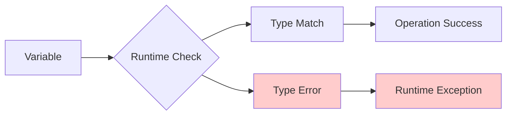

## Pengantar: Sistem Keamanan Digital Berlapis

Bayangkan type safety sebagai **sistem keamanan berlapis di bandara internasional** - serangkaian checkpoint yang memastikan hanya "penumpang yang valid" (data dengan type yang benar) yang bisa masuk ke "pesawat" (function atau operation). Seperti security screening yang mendeteksi barang berbahaya sebelum boarding, type system mendeteksi error potensial sebelum code dijalankan.

Type safety adalah properti sistem programming yang memastikan operasi hanya dilakukan pada data dengan type yang compatible. Ini bukan sekadar "aturan ketat" - type safety adalah **safety net** yang mencegah kategori error yang paling umum dan berbahaya dalam software development.

**Mengapa Type Safety Krusial?**
- **Error Prevention**: Mendeteksi 60-80% runtime errors di compile time
- **Code Documentation**: Type signatures sebagai living documentation
- **Refactoring Confidence**: Safe code changes dengan compiler verification
- **Developer Productivity**: Better IDE support dengan autocomplete dan error detection

## Spektrum Type Systems: Dari Permisif hingga Ketat

### Dynamic Typing - Keamanan Minimal dengan Fleksibilitas Maksimal

Dynamic typing seperti **sistem honor** - percaya bahwa developer akan melakukan hal yang benar, tapi tidak ada enforcement.



**Karakteristik Dynamic Typing:**
```javascript
// JavaScript - Dynamic Typing
let data = "hello";        // String
data = 42;                 // Now Number
data = { name: "John" };   // Now Object
data = [1, 2, 3];         // Now Array

// Runtime error - only discovered when executed
function divide(a, b) {
    return a / b;
}

divide("hello", "world"); // NaN - silent failure
divide(10, 0);            // Infinity - unexpected result
```

**Trade-offs Dynamic Typing:**
- ✅ **Rapid Prototyping**: Quick iteration tanpa type declarations
- ✅ **Flexibility**: Variable bisa berubah type sesuai kebutuhan
- ❌ **Runtime Errors**: Type errors baru ketahuan saat execution
- ❌ **Maintenance**: Sulit track type di large codebase

### Static Typing - Checkpoint Keamanan Berlapis

Static typing seperti **sistem keamanan bandara modern** - multiple layers of verification sebelum "takeoff".

```typescript
// TypeScript - Static Typing
interface User {
    id: number;
    name: string;
    email: string;
    isActive: boolean;
}

function processUser(user: User): string {
    if (user.isActive) {
        return `Processing ${user.name} (${user.email})`;
    }
    return `User ${user.name} is inactive`;
}

// Compile-time error prevention
const invalidUser = {
    id: "123",        // ❌ Should be number
    name: "John",
    email: "john@example.com"
    // ❌ Missing isActive property
};

// processUser(invalidUser); // Compile error!
```

### Gradual Typing - Sistem Keamanan Adaptif

Gradual typing seperti **sistem keamanan adaptif** yang bisa disesuaikan level strictness-nya sesuai kebutuhan.

```python
# Python with type hints
from typing import List, Optional, Union

def calculate_average(numbers: List[float]) -> float:
    if not numbers:
        raise ValueError("Cannot calculate average of empty list")
    return sum(numbers) / len(numbers)

def find_user(user_id: int) -> Optional[User]:
    # Returns User or None
    return database.get_user(user_id)

# Mixed typing - gradual adoption
def legacy_function(data):  # No type hints
    return data * 2

def modern_function(value: Union[int, float]) -> Union[int, float]:
    return legacy_function(value)  # Interop with untyped code
```

## Type System Features: Toolkit Keamanan Canggih

### Null Safety - Proteksi Terhadap "Billion Dollar Mistake"

Null safety seperti **sistem deteksi bom** yang mencegah "null pointer explosion" yang bisa menghancurkan aplikasi.

```kotlin
// Kotlin - Null Safety
fun processUserName(user: User?): String {
    // Safe call operator
    val name = user?.name ?: "Unknown"
    
    // Smart casting after null check
    if (user != null) {
        return user.name.uppercase() // user is smart cast to non-null
    }
    
    return "No user provided"
}

// Compile error prevention
fun unsafeOperation(user: User?) {
    // return user.name.length  // ❌ Compile error!
    return user?.name?.length ?: 0  // ✅ Safe
}
```

```rust
// Rust - Option Type for Null Safety
fn find_user_by_email(email: &str) -> Option<User> {
    // Returns Some(user) or None
    database.find_by_email(email)
}

fn process_user_email(email: &str) -> String {
    match find_user_by_email(email) {
        Some(user) => format!("Found user: {}", user.name),
        None => "User not found".to_string(),
    }
}

// Pattern matching forces handling of None case
```

### Generic Types - Sistem Template Keamanan

Generic types seperti **template keamanan** yang bisa disesuaikan untuk berbagai jenis "penumpang" sambil mempertahankan safety guarantees.

```typescript
// Generic Type Safety
interface ApiResponse<T> {
    data: T;
    status: 'success' | 'error';
    message?: string;
}

class ApiService {
    static async get<T>(url: string): Promise<ApiResponse<T>> {
        try {
            const response = await fetch(url);
            const data: T = await response.json();
            return { data, status: 'success' };
        } catch (error) {
            return { 
                data: {} as T, 
                status: 'error', 
                message: error.message 
            };
        }
    }
}

// Type-safe usage
const userResponse = await ApiService.get<User[]>('/users');
if (userResponse.status === 'success') {
    // userResponse.data is guaranteed to be User[]
    userResponse.data.forEach(user => console.log(user.name));
}
```

### Union Types - Sistem Multi-Pass Security

Union types seperti **sistem multi-pass** yang mengizinkan beberapa jenis "credential" yang valid.

```typescript
// Union Types for Flexible but Safe APIs
type PaymentMethod = 'credit_card' | 'paypal' | 'bank_transfer';
type Status = 'pending' | 'processing' | 'completed' | 'failed';

interface Payment {
    id: string;
    amount: number;
    method: PaymentMethod;
    status: Status;
}

function processPayment(payment: Payment): string {
    switch (payment.method) {
        case 'credit_card':
            return processCreditCard(payment);
        case 'paypal':
            return processPayPal(payment);
        case 'bank_transfer':
            return processBankTransfer(payment);
        // Exhaustiveness checking - compiler ensures all cases handled
    }
}

// Discriminated Unions for Complex State
type LoadingState = 
    | { status: 'idle' }
    | { status: 'loading' }
    | { status: 'success'; data: User[] }
    | { status: 'error'; error: string };

function renderUserList(state: LoadingState) {
    switch (state.status) {
        case 'idle':
            return <div>Click to load users</div>;
        case 'loading':
            return <div>Loading...</div>;
        case 'success':
            return <UserList users={state.data} />; // data guaranteed to exist
        case 'error':
            return <div>Error: {state.error}</div>; // error guaranteed to exist
    }
}
```

## Implementasi Praktis: Membangun Sistem Keamanan

### Type-Driven Development - Security by Design

```haskell
-- Haskell - Type-driven development
data User = User
    { userId :: UserId
    , userName :: UserName
    , userEmail :: Email
    , userAge :: Age
    }

-- Phantom types for compile-time safety
newtype UserId = UserId Int
newtype UserName = UserName String
newtype Email = Email String
newtype Age = Age Int

-- Smart constructors for validation
mkEmail :: String -> Maybe Email
mkEmail str
    | '@' `elem` str = Just (Email str)
    | otherwise = Nothing

mkAge :: Int -> Maybe Age
mkAge n
    | n >= 0 && n <= 150 = Just (Age n)
    | otherwise = Nothing

-- Impossible to create invalid User at compile time
createUser :: Int -> String -> String -> Int -> Maybe User
createUser id name emailStr ageInt = do
    email <- mkEmail emailStr
    age <- mkAge ageInt
    return $ User (UserId id) (UserName name) email age
```

### Runtime Type Checking - Backup Security System

```typescript
// Runtime validation with compile-time types
import { z } from 'zod';

// Schema definition
const UserSchema = z.object({
    id: z.number().positive(),
    name: z.string().min(1),
    email: z.string().email(),
    age: z.number().min(0).max(150),
    isActive: z.boolean()
});

// Infer TypeScript type from schema
type User = z.infer<typeof UserSchema>;

// Type-safe API endpoint
async function createUser(userData: unknown): Promise<User> {
    try {
        // Runtime validation
        const validatedUser = UserSchema.parse(userData);
        
        // Now we have compile-time AND runtime type safety
        const savedUser = await database.save(validatedUser);
        return savedUser;
    } catch (error) {
        if (error instanceof z.ZodError) {
            throw new ValidationError(error.errors);
        }
        throw error;
    }
}

// Usage
const result = await createUser({
    id: 1,
    name: "John Doe",
    email: "john@example.com",
    age: 30,
    isActive: true
});
// result is guaranteed to be valid User type
```

### Progressive Type Safety - Gradual Security Enhancement

```javascript
// JavaScript to TypeScript migration strategy

// Step 1: Add JSDoc types (no compilation changes)
/**
 * @param {User[]} users
 * @param {string} searchTerm
 * @returns {User[]}
 */
function searchUsers(users, searchTerm) {
    return users.filter(user => 
        user.name.toLowerCase().includes(searchTerm.toLowerCase())
    );
}

// Step 2: Convert to TypeScript with any types
function searchUsersTS(users: any[], searchTerm: string): any[] {
    return users.filter(user => 
        user.name.toLowerCase().includes(searchTerm.toLowerCase())
    );
}

// Step 3: Add proper types gradually
interface User {
    id: number;
    name: string;
    email: string;
}

function searchUsersTyped(users: User[], searchTerm: string): User[] {
    return users.filter(user => 
        user.name.toLowerCase().includes(searchTerm.toLowerCase())
    );
}

// Step 4: Add advanced type features
function searchUsersAdvanced<T extends { name: string }>(
    items: T[], 
    searchTerm: string
): T[] {
    return items.filter(item => 
        item.name.toLowerCase().includes(searchTerm.toLowerCase())
    );
}
```

## Trade-offs dan Best Practices: Balancing Security dan Productivity

### Perbandingan Type Systems

| Aspect | Dynamic | Static | Gradual |
|--------|---------|--------|---------|
| **Development Speed** | Fast | Slow | Medium |
| **Runtime Safety** | Low | High | Medium |
| **Refactoring** | Risky | Safe | Medium |
| **Learning Curve** | Easy | Steep | Medium |
| **IDE Support** | Basic | Excellent | Good |
| **Performance** | Runtime overhead | Compile-time | Mixed |

### Kapan Menggunakan Type Safety Level Tertentu?

**Strong Static Typing jika:**
- **Mission Critical**: Financial, healthcare, aerospace systems
- **Large Teams**: Multiple developers working on same codebase
- **Long-term Maintenance**: Code yang akan di-maintain bertahun-tahun
- **Complex Domain**: Business logic yang kompleks dengan banyak edge cases

**Dynamic Typing jika:**
- **Rapid Prototyping**: Quick experiments dan proof of concepts
- **Small Scripts**: Automation scripts dan one-off tools
- **Exploratory Programming**: Data analysis dan research
- **Simple Applications**: Straightforward CRUD applications

**Gradual Typing jika:**
- **Legacy Migration**: Existing codebase yang ingin ditingkatkan safety-nya
- **Mixed Teams**: Developer dengan berbagai level expertise
- **Incremental Adoption**: Gradual improvement tanpa big bang rewrite
- **External Integration**: Interfacing dengan untyped systems

### Best Practices untuk Type Safety

```typescript
// 1. Make Illegal States Unrepresentable
type LoadingState = 
    | { type: 'idle' }
    | { type: 'loading' }
    | { type: 'success'; data: User[] }
    | { type: 'error'; error: string };

// Instead of this error-prone approach:
interface BadLoadingState {
    isLoading: boolean;
    data?: User[];
    error?: string;
    // Can have invalid combinations like isLoading=false, data=undefined, error=undefined
}

// 2. Use Branded Types for Domain Safety
type UserId = string & { readonly brand: unique symbol };
type ProductId = string & { readonly brand: unique symbol };

function getUser(id: UserId): Promise<User> { /* ... */ }
function getProduct(id: ProductId): Promise<Product> { /* ... */ }

// Prevents mixing up IDs
const userId = "user123" as UserId;
const productId = "prod456" as ProductId;

// getUser(productId); // ❌ Compile error!

// 3. Leverage Type Guards for Runtime Safety
function isUser(obj: unknown): obj is User {
    return typeof obj === 'object' && 
           obj !== null && 
           'id' in obj && 
           'name' in obj && 
           'email' in obj;
}

function processUnknownData(data: unknown) {
    if (isUser(data)) {
        // TypeScript knows data is User here
        console.log(data.name); // ✅ Safe
    }
}

// 4. Use Const Assertions for Literal Types
const themes = ['light', 'dark', 'auto'] as const;
type Theme = typeof themes[number]; // 'light' | 'dark' | 'auto'

const config = {
    theme: 'light',
    version: '1.0.0'
} as const;
// config.theme is 'light', not string
```

## Studi Kasus: Type Safety dalam Production

**Airbnb**: Migrasi dari [[JavaScript]] ke TypeScript mengurangi production bugs 38%
**Slack**: Type safety membantu refactoring besar tanpa breaking changes
**Microsoft**: TypeScript adoption meningkatkan developer productivity 20%
**Facebook**: Flow type checker mencegah ribuan potential runtime errors

**Lessons Learned:**
- Gradual adoption lebih sustainable daripada big bang rewrite
- Type safety investment pays off dalam long-term maintenance
- Developer training crucial untuk effective type system usage
- Runtime validation tetap diperlukan untuk external data

## Refleksi: Masa Depan Keamanan Digital

Type safety telah berevolusi dari "academic curiosity" menjadi "industry standard" untuk software quality. Seperti sistem keamanan fisik yang terus berkembang menghadapi ancaman baru, type systems terus berinovasi untuk mengatasi kompleksitas software modern.

Masa depan type safety terletak pada **intelligent assistance** - AI-powered type inference, automatic migration tools, dan smart error recovery. Dengan [[Machine Learning]] dan [[Static Analysis]], type systems akan semakin pintar dalam memahami intent programmer dan memberikan suggestions yang actionable.

Investasi dalam memahami type safety adalah investasi dalam software craftsmanship - seperti belajar safety protocols dalam konstruksi bangunan, menguasai type systems memungkinkan kita membangun software yang robust, maintainable, dan reliable untuk jangka panjang.

---

*Catatan ini menggambarkan type safety sebagai sistem keamanan berlapis yang melindungi software dari kategori error yang paling umum, dengan analogi security screening yang memudahkan pemahaman tentang berbagai level protection dan trade-offs yang terlibat.*