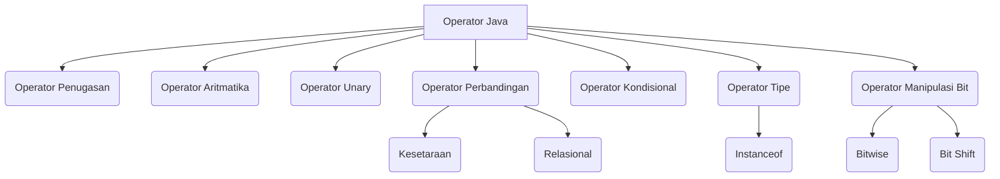

## Pengantar: Orkestra Komputasi

Bayangkan sebuah program sebagai sebuah [[Orkestra|orkestra]] yang megah, di mana setiap [[Variabel|variabel]] adalah not balok yang menunggu untuk dimainkan, dan setiap operator adalah konduktor atau musisi yang memberikan instruksi bagaimana not-not tersebut harus berinteraksi. Operator adalah jantung dari setiap melodi komputasi, mereka adalah perintah yang menggerakkan data, mengubah nilainya, dan menentukan alur simfoni logika program Anda. Tanpa operator, not-not (data) hanya akan diam membisu; dengan operator, mereka menjadi harmoni yang dinamis.

## Operator Penugasan: Konduktor Utama

Operator penugasan, yang dilambangkan dengan tanda sama dengan (`=`), adalah konduktor utama dalam orkestra ini. Tugasnya sederhana namun krusial: menugaskan nilai dari sisi kanan ke variabel di sisi kiri. Ini seperti konduktor yang menunjuk seorang musisi untuk memainkan not tertentu.

### Penugasan Dasar
```java
int cadence = 0;
int speed = 0;
int gear = 1;
```
Dalam contoh di atas, nilai `0` ditugaskan ke `cadence` dan `speed`, sementara `1` ditugaskan ke `gear`.

### Penugasan Objek
Ketika berhadapan dengan objek, operator penugasan tidak menyalin objek itu sendiri, melainkan menyalin referensinya. Ini seperti memberikan partitur yang sama kepada dua musisi; mereka berdua merujuk pada partitur yang sama.
```java
class Score {
    int notes;
    Score(int n) { notes = n; }
}

public class AssignmentDemo {
    public static void main(String[] args) {
        Score s1 = new Score(10);
        Score s2 = s1; // s2 sekarang merujuk ke objek yang sama dengan s1

        System.out.println("s1.notes: " + s1.notes); // Output: 10
        System.out.println("s2.notes: " + s2.notes); // Output: 10

        s2.notes = 20; // Mengubah melalui s2 juga mengubah s1
        System.out.println("s1.notes setelah perubahan s2: " + s1.notes); // Output: 20
    }
}
```

### Operator Penugasan Gabungan
Java juga menyediakan operator penugasan gabungan yang merupakan singkatan untuk operasi yang melibatkan operator aritmatika dan penugasan. Ini seperti seorang konduktor yang memberikan dua instruksi sekaligus.
- `+=` (tambah dan tugaskan)
- `-=` (kurang dan tugaskan)
- `*=` (kali dan tugaskan)
- `/=` (bagi dan tugaskan)
- `%=` (modulus dan tugaskan)
- `&=` (bitwise AND dan tugaskan)
- `|=` (bitwise OR dan tugaskan)
- `^=` (bitwise XOR dan tugaskan)
- `<<=` (left shift dan tugaskan)
- `>>=` (signed right shift dan tugaskan)
- `>>>=` (unsigned right shift dan tugaskan)

Contoh:
```java
int x = 10;
x += 5; // Sama dengan x = x + 5; x sekarang 15
System.out.println("x: " + x); // Output: 15
```

## Operator Aritmatika: Musisi yang Dinamis

Operator aritmatika adalah para musisi yang memainkan not-not dengan penuh semangat, mengubah nilai numerik melalui penambahan, pengurangan, perkalian, pembagian, dan modulus.

- `+` (penjumlahan)
- `-` (pengurangan)
- `*` (perkalian)
- `/` (pembagian)
- `%` (modulus - sisa pembagian)

Contoh:
```java
int result = 1 + 2; // result adalah 3
System.out.println("1 + 2 = " + result);

result = result - 1; // result adalah 2
System.out.println("result - 1 = " + result);

result = result * 2; // result adalah 4
System.out.println("result * 2 = " + result);

result = result / 2; // result adalah 2
System.out.println("result / 2 = " + result);

result = result + 8; // result adalah 10
result = result % 7; // result adalah 3 (sisa dari 10 dibagi 7)
System.out.println("result % 7 = " + result);
```

### Operator Unary: Sentuhan Solo

Operator unary adalah musisi solo yang bekerja pada satu "not" (operand) saja. Mereka bisa mengubah tanda, menambah, atau mengurangi nilai.

- `+` (Unary Plus): Menunjukkan nilai positif (jarang digunakan karena angka sudah positif secara default).
- `-` (Unary Minus): Membalik tanda ekspresi.
- `++` (Increment): Menambah nilai variabel sebesar 1.
- `--` (Decrement): Mengurangi nilai variabel sebesar 1.
- `!` (Logical Complement): Membalik nilai boolean.

Contoh Increment/Decrement:
```java
class PrePostDemo {
    public static void main(String[] args) {
        int i = 3;
        i++;
        System.out.println(i);    // Output: 4

        ++i;
        System.out.println(i);    // Output: 5

        System.out.println(++i);  // Output: 6 (pre-increment: increment then use)

        System.out.println(i++);  // Output: 6 (post-increment: use then increment)

        System.out.println(i);    // Output: 7
    }
}
```
Perhatikan perbedaan antara pre-increment (`++i`) dan post-increment (`i++`). Pre-increment akan menambah nilai variabel *sebelum* digunakan dalam ekspresi, sedangkan post-increment akan menggunakan nilai variabel *sebelum* ditambah.

## Operator Perbandingan: Kritikus Musik

Operator perbandingan adalah kritikus musik yang mengevaluasi hubungan antara dua not atau bagian melodi. Hasil dari perbandingan ini selalu berupa nilai [[Tipe Data Boolean|boolean]] (`true` atau `false`), yang menentukan apakah harmoni itu selaras atau tidak.

### Operator Kesetaraan
- `==` (Sama dengan): Menguji apakah dua operand memiliki nilai yang sama.
- `!=` (Tidak sama dengan): Menguji apakah dua operand memiliki nilai yang berbeda.

Contoh:
```java
int value1 = 1;
int value2 = 2;
System.out.println("value1 == value2: " + (value1 == value2)); // Output: false
System.out.println("value1 != value2: " + (value1 != value2)); // Output: true
```

### Operator Relasional
- `>` (Lebih besar dari)
- `>=` (Lebih besar dari atau sama dengan)
- `<` (Lebih kecil dari)
- `<=` (Lebih kecil dari atau sama dengan)

Contoh:
```java
int scoreA = 85;
int scoreB = 90;
System.out.println("scoreA > scoreB: " + (scoreA > scoreB));   // Output: false
System.out.println("scoreA <= scoreB: " + (scoreA <= scoreB)); // Output: true
```

### Operator Kondisional: Penentu Alur Melodi

Operator kondisional adalah penentu alur melodi, yang memungkinkan program untuk membuat keputusan berdasarkan kondisi tertentu.

- `&&` (Logical AND): Mengembalikan `true` jika *kedua* operand `true`.
- `||` (Logical OR): Mengembalikan `true` jika *salah satu* operand `true`.
- `? :` (Ternary Operator): Operator kondisional singkat yang mengevaluasi ekspresi boolean dan mengembalikan salah satu dari dua nilai berdasarkan hasilnya.

Contoh Logical AND dan OR:
```java
boolean isSunny = true;
boolean isWarm = false;

System.out.println("isSunny && isWarm: " + (isSunny && isWarm)); // Output: false
System.out.println("isSunny || isWarm: " + (isSunny || isWarm)); // Output: true
```

Contoh Ternary Operator:
```java
class ConditionalDemo2 {
    public static void main(String[] args) {
        int value1 = 1;
        int value2 = 2;
        int result;
        boolean someCondition = true;
        result = someCondition ? value1 : value2; // Jika someCondition true, result = value1, jika tidak, result = value2
        System.out.println(result); // Output: 1
    }
}
```

## Operator Tipe: Penilai Identitas Musisi

Operator tipe adalah penilai identitas dalam orkestra, memastikan bahwa setiap musisi (objek) adalah jenis yang tepat untuk memainkan bagiannya.

### `instanceof`
Operator `instanceof` digunakan untuk menguji apakah suatu objek merupakan instance dari kelas tertentu atau mengimplementasikan antarmuka tertentu. Ini sangat berguna dalam [[Polimorfisme|polimorfisme]] untuk memastikan keamanan tipe sebelum melakukan casting.

Contoh:
```java
class Parent {}
interface MyInterface {}
class Child extends Parent implements MyInterface {}

class InstanceofDemo {
    public static void main(String[] args) {
        Parent obj1 = new Parent();
        Parent obj2 = new Child(); // obj2 adalah Child, yang juga Parent

        System.out.println("obj1 instanceof Parent: " + (obj1 instanceof Parent));     // Output: true
        System.out.println("obj1 instanceof Child: " + (obj1 instanceof Child));       // Output: false
        System.out.println("obj1 instanceof MyInterface: " + (obj1 instanceof MyInterface)); // Output: false

        System.out.println("obj2 instanceof Parent: " + (obj2 instanceof Parent));     // Output: true
        System.out.println("obj2 instanceof Child: " + (obj2 instanceof Child));       // Output: true
        System.out.println("obj2 instanceof MyInterface: " + (obj2 instanceof MyInterface)); // Output: true
    }
}
```

## Operator Manipulasi Bit: Pengukir Not Mikro

Operator manipulasi bit adalah pengukir not mikro, bekerja langsung pada representasi biner dari angka. Mereka memungkinkan kontrol yang sangat halus atas data, sering digunakan dalam [[Pemrograman Tingkat Rendah|pemrograman tingkat rendah]], enkripsi, atau [[Optimasi Performa|optimasi performa]].

### Operator Bitwise
Operator bitwise melakukan operasi boolean pada setiap bit yang sesuai dari dua operand.

- `&` (Bitwise AND): Mengembalikan 1 jika kedua bit adalah 1.
- `|` (Bitwise OR): Mengembalikan 1 jika salah satu bit adalah 1.
- `^` (Bitwise XOR): Mengembalikan 1 jika bit berbeda.
- `~` (Bitwise Complement/NOT): Membalik semua bit (0 menjadi 1, 1 menjadi 0).

Contoh:
```java
class BitDemo {
    public static void main(String[] args) {
        int a = 9;  // binary 1001
        int b = 5;  // binary 0101

        // Bitwise AND
        int c = a & b; // binary 0001, which is 1
        System.out.println("a & b = " + c); // Output: a & b = 1

        // Bitwise OR
        int d = a | b; // binary 1101, which is 13
        System.out.println("a | b = " + d); // Output: a | b = 13

        // Bitwise XOR
        int e = a ^ b; // binary 1100, which is 12
        System.out.println("a ^ b = " + e); // Output: a ^ b = 12

        // Bitwise Complement (NOT)
        int f = ~a; // binary ...11110110 (tergantung ukuran int), yang merupakan -10
        System.out.println("~a = " + f); // Output: ~a = -10
    }
}
```

### Operator Bit Shift
Operator bit shift menggeser semua bit dari suatu operand ke kiri atau ke kanan.

- `<<` (Left Shift): Menggeser bit ke kiri. Mengisi bit kosong di kanan dengan 0. Efektif mengalikan dengan 2 untuk setiap pergeseran.
- `>>` (Signed Right Shift): Menggeser bit ke kanan. Mengisi bit kosong di kiri dengan bit tanda (mempertahankan tanda angka). Efektif membagi dengan 2 untuk setiap pergeseran.
- `>>>` (Unsigned Right Shift): Menggeser bit ke kanan. Mengisi bit kosong di kiri dengan 0 (tidak mempertahankan tanda angka).

Contoh:
```java
class ShiftDemo {
    public static void main(String[] args) {
        int a = 10; // binary 0000 1010

        // Left Shift
        int b = a << 2; // binary 0010 1000, which is 40 (10 * 2^2)
        System.out.println("a << 2 = " + b); // Output: a << 2 = 40

        // Signed Right Shift
        int c = a >> 1; // binary 0000 0101, which is 5 (10 / 2^1)
        System.out.println("a >> 1 = " + c); // Output: a >> 1 = 5

        int negA = -10; // binary ...1111 0110 (dalam 2's complement)
        int d = negA >> 1; // binary ...1111 1011, which is -5
        System.out.println("negA >> 1 = " + d); // Output: negA >> 1 = -5

        // Unsigned Right Shift
        int e = negA >>> 1; // binary 0111 1111 ... 1111 1011, yang merupakan angka positif besar
        System.out.println("negA >>> 1 = " + e); // Output: negA >>> 1 = 2147483643
    }
}
```

## Hierarki Operator: Struktur Orkestra

Setiap orkestra memiliki struktur dan hierarki, dan operator Java tidak terkecuali. Ada aturan preseden (urutan operasi) dan asosiatif (arah evaluasi) yang menentukan bagaimana ekspresi dievaluasi. Diagram berikut memvisualisasikan kategori utama operator.


Diagram di atas menunjukkan kategori utama operator dalam Java. Panah menunjukkan hubungan hierarkis, di mana "Operator Java" adalah kategori induk yang mencakup semua jenis operator lainnya. Setiap kotak mewakili jenis operator yang berbeda, yang telah kita bahas secara rinci. Ini membantu kita memahami struktur keseluruhan dari "orkestra" operator yang tersedia untuk kita.

## Refleksi: Simfoni Kode yang Harmonis

Seperti seorang konduktor yang mahir memimpin [[Orkestra|orkestra]] untuk menciptakan simfoni yang indah, pemahaman mendalam tentang operator Java memungkinkan kita untuk mengorkestrasi data dan logika program dengan presisi. Setiap operator, dari penugasan sederhana hingga manipulasi bit yang kompleks, adalah instrumen vital yang, ketika digunakan dengan benar, menghasilkan melodi kode yang harmonis dan fungsional.

Kita telah melihat bagaimana operator penugasan (`=`) bertindak sebagai konduktor utama, menugaskan peran kepada setiap [[Variabel|variabel]]. Operator aritmatika (`+`, `-`, `*`, `/`, `%`) adalah musisi yang dinamis, mengubah not-not numerik menjadi ritme yang berarti. Operator unary (`++`, `--`, `!`) memberikan sentuhan solo yang mengubah nilai dengan cepat.

Kritikus musik, yaitu operator perbandingan (`==`, `!=`, `>`, `<`, `>=`, `<=`), memastikan bahwa setiap bagian selaras, menghasilkan keputusan [[Tipe Data Boolean|boolean]] yang mengarahkan alur melodi. Operator kondisional (`&&`, `||`, `? :`) adalah penentu alur melodi, memungkinkan program untuk beradaptasi dan bereaksi terhadap berbagai kondisi.

Terakhir, operator tipe (`instanceof`) adalah penilai identitas musisi, memastikan setiap objek memainkan bagiannya dengan benar, sementara operator manipulasi bit (`&`, `|`, `^`, `~`, `<<`, `>>`, `>>>`) adalah pengukir not mikro, memberikan kontrol yang sangat halus pada tingkat [[Pemrograman Tingkat Rendah|bit]].

Dengan menguasai operator-operator ini, kita tidak hanya menulis kode; kita sedang menyusun sebuah simfoni digital. Setiap baris kode adalah not, setiap operator adalah instruksi, dan program kita adalah mahakarya yang dimainkan oleh orkestra komputasi. Mari terus berlatih dan menyempurnakan keahlian kita, karena dunia pemrograman adalah panggung tanpa batas untuk kreativitas dan logika.
