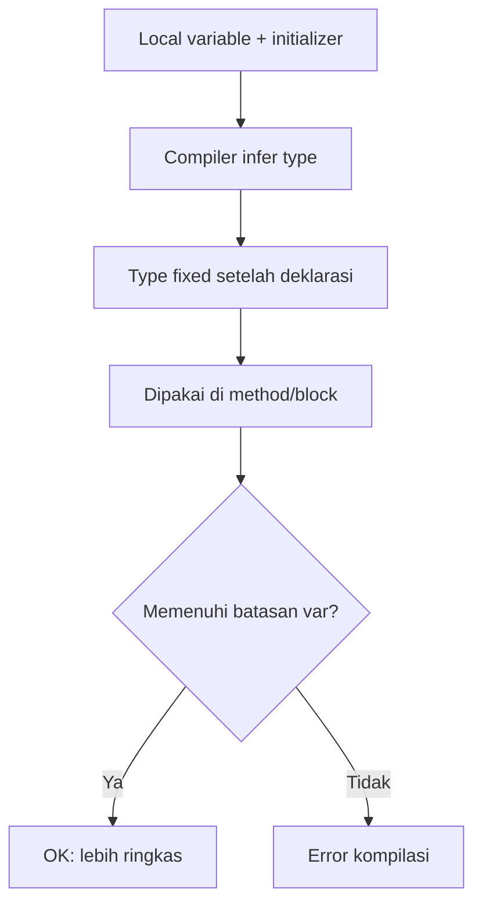

## Pengantar: Gudang Label Otomatis
Bayangkan kode Java seperti **gudang logistik**: setiap barang harus ditempeli label agar petugas tahu apa yang sedang dipindahkan. Sebelum ada `var`, kita sering menulis label secara lengkap di setiap paket—rapi, tetapi kadang repetitif. Mulai Java SE 10, `var` bertindak seperti **mesin label otomatis**: kita cukup menaruh barang (initializer), lalu kompilator mencetak label tipe yang tepat. Setelah label ditempel, isinya tidak bisa “berubah jadi jenis lain”.

## Peta Arsitektur: Dari Barang ke Label

Diagram ini memetakan alur “gudang”: variabel lokal harus datang bersama “barang” (initializer), kompilator menebak label tipe, lalu label itu menjadi permanen. Cabang keputusan menunjukkan bahwa `var` hanya boleh dipakai jika aturan-aturannya terpenuhi.

## Inti Konsep: Apa Itu `var`
### Definisi Label
- Mulai Java SE 10, `var` dapat dipakai untuk mendeklarasikan **local variable**.
- `var` membuat kompilator menentukan tipe sebenarnya saat deklarasi; setelah itu, tipe **tidak dapat berubah**.

### Kapan “Label Otomatis” Membantu
- Saat tipe eksplisit terasa redundan (misalnya `Path`, `InputStream`) tetapi nilai inisialisasinya sudah cukup menjelaskan.
- Saat ingin menambah keterbacaan blok, terutama di kode yang memanfaatkan API modern (contoh `Path.of(...)`, `List.of(...)`).

## Contoh: Label Manual vs Label Otomatis
### Versi “Label Manual” (tipe eksplisit)
```java
String message = "Hello world!";
Path path = Path.of("debug.log");
InputStream stream = Files.newInputStream(path);
```

### Versi “Label Otomatis” (`var`)
```java
var message = "Hello world!";
var path = Path.of("debug.log");
var stream = Files.newInputStream(path);
```

### Perbandingan Cepat
| Aspek | Tipe eksplisit | `var` |
|---|---|---|
| Panjang kode | Lebih panjang | Lebih ringkas |
| Kejelasan tipe di tempat | Langsung terlihat | Tergantung initializer |
| Perubahan tipe | Tidak bisa berubah | Tidak bisa berubah |
| Risiko “kabur” | Lebih kecil | Bisa meningkat jika initializer tidak informatif |

## Var di Struktur Kontrol: Label Saat Barang Bergerak
### `var` di `for` (for-each)
```java
var list = List.of("one", "two", "three", "four");
for (var element: list) {
    IO.println(element);
}
```
- Di analogi gudang: `list` adalah palet barang, `element` adalah tiap paket yang lewat di conveyor; mesin label otomatis memberi label yang konsisten untuk setiap paket yang diproses.
- Hubungkan konsep ini dengan [[Control Flow]] agar pola iterasi terasa seperti “alur forklift” yang rapi.

### `var` di try-with-resources
```java
var path = Path.of("debug.log");
try (var stream = Files.newInputStream(path)) {
    // process the file
}
```
- Di gudang: `stream` adalah alat yang “dipinjam” sementara; `try-with-resources` memastikan alat dikembalikan otomatis setelah selesai.
- Ini bertetangga dekat dengan [[Resource Management]] dan [[Exception Handling]] dalam cara berpikir.

## Batasan: Kapan Mesin Label Tidak Boleh Dipakai
### Aturan Resmi
- `var` hanya boleh untuk **local variables** di method, constructor, dan initializer block.
- `var` tidak boleh untuk **fields**, juga tidak boleh untuk parameter method/constructor.
- Kompilator harus bisa menentukan tipe saat deklarasi; karena `null` tidak punya tipe, variabel harus punya initializer yang valid.

### Contoh yang Tidak Kompilasi (field dan parameter)
```java
public class User  {
    private var name = "Sue"; // COMPILER ERROR

    public void setName(var name) {
        this.name = name;
    }
}
```

### Contoh yang Tidak Kompilasi (tanpa initializer)
```java
public String greetings(int message) {
    var greetings; // COMPILER ERROR
    if (message == 0) {
        greetings = "morning";
    } else {
        greetings = "afternoon";
    }
    return "Good " + greetings;
}
```

### Tabel “Checklist Gudang”
| Pertanyaan | Jika Ya | Jika Tidak |
|---|---|---|
| Apakah variabel ini lokal? | `var` boleh dipertimbangkan | `var` tidak boleh |
| Ada initializer yang informatif? | Kompilator bisa menginfer tipe | Kompilator gagal |
| Bukan `field` dan bukan parameter? | Aman dari larangan | Pasti error |

## Koneksi Pengetahuan: Menyambung Jalur Seri
### Titik Taut
- `var` sering muncul di materi setelah [[Creating Arrays in Your Programs]] karena keduanya menekankan “bentuk deklarasi” yang memengaruhi cara kita membaca kode.
- Setelah `var`, topik biasanya bergerak ke operator; lihat [[Using Operators in Your Programs]] untuk “aturan main” saat nilai diproses.
- Untuk fondasi tipe, tautkan kembali ke [[Tipe Data Primitif]] agar label yang dicetak mesin tidak terasa misterius.

## Refleksi: Label yang Baik Membuat Gudang Tenang
Mesin label otomatis tidak menggantikan disiplin gudang—ia hanya mempercepat pekerjaan yang berulang. Gunakan `var` ketika label otomatis tetap jelas dari bentuk barangnya (initializer), dan hindari saat label menjadi kabur. Tujuannya sama: alur kerja yang mudah dipahami oleh manusia, sambil tetap dipastikan benar oleh kompilator.

## Sumber
### Referensi Utama
- https://dev.java/learn/language-basics/using-var/
