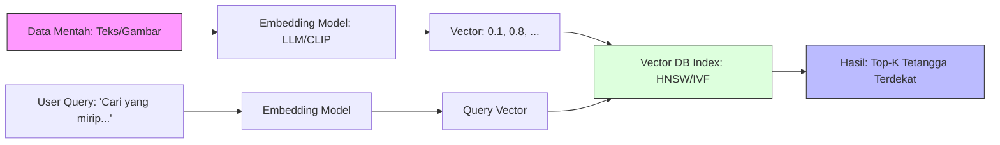

## Pengantar: Ruang Galaksi Makna

Bayangkan sebuah **Galaksi Tanpa Batas** di mana setiap bintang bukanlah bola gas panas, melainkan sebuah potongan informasi—bisa berupa kalimat, paragraf, gambar, atau suara.

Dalam database tradisional (seperti [[SQL]]), kita menemukan informasi dengan mencocokkan "label" atau koordinat yang pasti (misalnya, `WHERE id = 123` atau `LIKE '%keyword%'`). Ini seperti mencari buku di perpustakaan berdasarkan nomor panggilnya.

Namun, **Vector Database** bekerja secara berbeda. Ia tidak peduli dengan label kaku. Ia memetakan setiap informasi ke dalam **ruang multidimensi** berdasarkan *maknanya*.

### Filosofi: Simbol vs Makna
Mengapa "Makna"? Karena kata-kata (simbol) seringkali menipu.
- **Sintaksis (Bentuk)**: Database biasa melihat "Apel" dan "Apple" sebagai dua hal berbeda karena ejaannya beda.
- **Semantik (Makna)**: Vector Database "memahami" bahwa "Kucing" lebih dekat hubungannya dengan "Anjing" (sama-sama hewan peliharaan) daripada dengan "Kucing-kucingan" (tanaman), meskipun secara kata (sintaksis) "Kucing" dan "Kucing-kucingan" terlihat mirip.

Di "Galaksi Makna" ini:
- Bintang yang "mirip" (misalnya kata "Raja" dan "Ratu") akan mengorbit berdekatan.
- Bintang yang berbeda konteks (misalnya "Bisa" ular dan "Bisa" melakukan) akan berada di galaksi yang berbeda, meskipun tulisannya sama persis (homonim).

Vector Database adalah **peta navigasi** untuk galaksi ini, memungkinkan kita menemukan "bintang-bintang tetangga" yang paling relevan secara semantik, bukan hanya secara leksikal.

## Koordinat Semantik (Embeddings)

Agar komputer bisa memahami "makna", kita harus mengubah data abstrak (teks/gambar) menjadi angka. Proses ini disebut **Embedding**.

### Transformasi Materi ke Angka
Bayangkan kita punya mesin penerjemah canggih (seperti [[Large Language Model]]) yang bisa melihat sebuah kalimat dan memberinya serangkaian koordinat.

*   **Kalimat A**: "Kucing mengejar tikus" -> `[0.1, 0.5, 0.9]`
*   **Kalimat B**: "Hewan predator berburu mangsa" -> `[0.12, 0.55, 0.88]`
*   **Kalimat C**: "Saya suka makan nasi goreng" -> `[0.9, 0.1, 0.0]`

Di galaksi kita:
- Kalimat A dan B memiliki koordinat yang sangat dekat. Mereka adalah bintang tetangga.
- Kalimat C berada di sektor yang jauh berbeda.

Deretan angka ini (`[0.1, 0.5, ... n]`) disebut **Vector**. Semakin banyak dimensi (panjang array), semakin detail nuansa makna yang bisa ditangkap.

## Navigasi Antarbintang (Indexing & Search)

Mencari bintang terdekat di antara miliaran bintang lainnya adalah tugas berat jika kita harus mengukur jarak satu per satu (Brute Force). Kita butuh sistem navigasi cepat.

### Mengukur Jarak (Distance Metrics)
Bagaimana kita tahu dua bintang itu dekat?
1.  **Cosine Similarity (Sudut Pandang)**: Mengukur sudut antara dua vektor. Jika mereka menunjuk ke arah yang sama, mereka mirip. (Paling umum untuk teks).
2.  **Euclidean Distance (Penggaris)**: Mengukur jarak lurus antar titik.
3.  **Dot Product**: Mengukur besaran proyeksi satu vektor ke vektor lain.

### Terowongan Cacing (Indexing Algorithms)
Untuk mempercepat pencarian, Vector Database menggunakan struktur data khusus:
*   **HNSW (Hierarchical Navigable Small World)**: Bayangkan ini sebagai jaringan **terowongan cacing** (wormholes). Alih-alih melewati setiap bintang, kita melompat antar "hub" besar di lapisan atas galaksi, lalu turun ke lapisan yang lebih detail saat mendekati tujuan. Ini sangat cepat.
*   **IVF (Inverted File Index)**: Membagi galaksi menjadi beberapa **sektor**. Saat mencari, kita hanya memeriksa sektor yang relevan, mengabaikan sisanya.





*Diagram di atas menunjukkan perjalanan data dari bentuk mentah, diubah menjadi koordinat (vektor), disimpan dalam peta galaksi (index), hingga ditemukan kembali melalui pencarian kesamaan.*

## Misi Penjelajahan (Use Cases)

Mengapa kita butuh peta galaksi ini?

### 1. Memori Jangka Panjang AI (RAG)
[[RAG|Retrieval Augmented Generation]] adalah sahabat terbaik LLM. LLM kadang "lupa" atau berhalusinasi. Vector DB berfungsi sebagai perpustakaan referensi eksternal. Saat Anda bertanya pada AI, ia mencari "buku" yang relevan di Vector DB dulu, lalu menjawab berdasarkan fakta tersebut.

### 2. Rekomendasi (The "You Might Also Like")
Jika Anda menyukai film "Interstellar", Vector DB mencari film lain yang berada di koordinat yang sama (tema luar angkasa, emosional, sci-fi), bukan hanya film yang judulnya mengandung kata "Interstellar".

## Perbandingan: Tabel vs Ruang

| Fitur | Database Tradisional ([[SQL]]/NoSQL) | Vector Database |
| :--- | :--- | :--- |
| **Metode Pencarian** | Kata Kunci (Keyword Matching) | Kesamaan Makna (Semantic Similarity) |
| **Representasi Data** | Baris & Kolom / Dokumen JSON | Vektor (Array Angka) |
| **Hasil Pencarian** | Eksak (Cocok/Tidak Cocok) | Probabilistik (Skor Kemiripan) |
| **Analogi** | Kartu Katalog Perpustakaan | Peta Galaksi 3D |
| **Contoh Query** | `SELECT * FROM books WHERE title LIKE '%space%'` | `GetNearestNeighbors(vector_of('space adventure'), k=5)` |

## Refleksi: Teleskop Pengetahuan

**Vector Database** bukan sekadar tempat penyimpanan; ia adalah **teleskop** yang memungkinkan kita melihat hubungan tersembunyi antar informasi.

Di era [[Artificial Intelligence]], data tidak lagi duduk diam dalam baris-baris kaku. Data hidup, melayang, dan berinteraksi dalam ruang makna. Menguasai Vector Database berarti menguasai seni navigasi di lautan informasi yang tak terbatas ini, menemukan pola di mana orang lain hanya melihat kekacauan.
