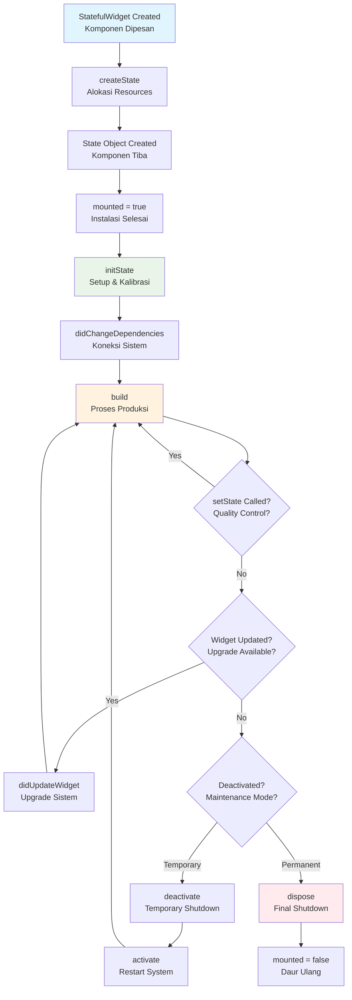

## Pengantar: Mengelola Komponen Pabrik dari Lahir hingga Daur Ulang

Bayangkan sebuah pabrik modern dengan ribuan komponen mesin yang beroperasi dalam siklus hidup yang terorganisir - dari instalasi dan kalibrasi awal, operasi produksi harian, maintenance berkala, hingga akhirnya shutdown dan daur ulang. Setiap komponen memiliki tahapan hidup yang jelas: setup awal, proses produksi, upgrade sistem, quality control, dan pembongkaran akhir. Manajemen siklus hidup yang tepat memastikan efisiensi operasional, mencegah pemborosan resources, dan menjaga performa optimal. Inilah Widget Lifecycle dalam [[Flutter]] - sistem manajemen siklus hidup komponen UI yang fundamental untuk membangun aplikasi yang robust dan performant.

Widget Lifecycle adalah serangkaian tahapan yang dilalui setiap widget [[Flutter]] dari saat dibuat hingga dihancurkan. Seperti komponen pabrik yang memiliki prosedur operasional standar, setiap widget mengikuti lifecycle methods yang terdefinisi dengan jelas. Pemahaman mendalam tentang lifecycle ini crucial untuk memory management yang efisien, performance optimization, dan debugging yang efektif. Framework [[Flutter]] menggunakan [[Dart]] untuk mengimplementasikan lifecycle yang predictable dan powerful.

Mengapa Widget Lifecycle penting? Dalam aplikasi mobile yang complex, widgets dibuat dan dihancurkan secara dinamis sesuai user interaction dan navigation flow. Tanpa pemahaman lifecycle yang proper, developer bisa mengalami memory leaks, performance issues, dan bugs yang sulit di-debug. Mastery widget lifecycle memungkinkan developer membangun aplikasi yang smooth, efficient, dan maintainable - seperti pabrik yang beroperasi dengan optimal karena setiap komponen dikelola dengan prosedur yang tepat.

## StatelessWidget: Komponen Sederhana dengan Operasi Minimal

StatelessWidget adalah komponen pabrik yang sederhana dan self-contained, seperti mesin stamping yang hanya melakukan satu operasi spesifik tanpa perlu maintenance kompleks. Lifecycle-nya straightforward namun memiliki performance implications yang penting untuk dipahami.

### Build Method: Proses Produksi Tunggal

StatelessWidget hanya memiliki satu method utama dalam lifecycle-nya: `build()`. Method ini dipanggil ketika widget perlu "memproduksi" UI-nya, seperti mesin yang menghasilkan output berdasarkan input yang diberikan:

```dart
class ProductCard extends StatelessWidget {
  final String productName;
  final double price;
  final String imageUrl;
  
  const ProductCard({
    Key? key,
    required this.productName,
    required this.price,
    required this.imageUrl,
  }) : super(key: key);
  
  @override
  Widget build(BuildContext context) {
    // Method ini dipanggil ketika:
    // 1. Widget pertama kali dimasukkan ke widget tree
    // 2. Parent widget berubah konfigurasi
    // 3. InheritedWidget yang di-depend berubah
    
    return Card(
      child: Column(
        children: [
          Image.network(imageUrl),
          Text(productName, style: Theme.of(context).textTheme.headline6),
          Text('\$${price.toStringAsFixed(2)}'),
        ],
      ),
    );
  }
}
```

### Performance Optimization: Efisiensi Operasional

StatelessWidget yang sering rebuild memerlukan optimasi khusus, seperti mesin pabrik yang perlu di-tune untuk efisiensi maksimal:

```dart
// ❌ Inefficient - creates new objects every rebuild
class BadCounter extends StatelessWidget {
  final int count;
  const BadCounter({Key? key, required this.count}) : super(key: key);
  
  @override
  Widget build(BuildContext context) {
    return Column(
      children: [
        Container(  // New Container every time
          padding: EdgeInsets.all(16.0),  // New EdgeInsets every time
          child: Text('Count: $count'),
        ),
        ElevatedButton(
          onPressed: () {},
          child: Text('Increment'),  // New Text every time
        ),
      ],
    );
  }
}

// ✅ Efficient - uses const widgets and caching
class GoodCounter extends StatelessWidget {
  final int count;
  const GoodCounter({Key? key, required this.count}) : super(key: key);
  
  // Cache static widgets
  static const _padding = EdgeInsets.all(16.0);
  static const _incrementButton = ElevatedButton(
    onPressed: null,  // Will be overridden
    child: Text('Increment'),
  );
  
  @override
  Widget build(BuildContext context) {
    return Column(
      children: [
        Container(
          padding: _padding,  // Reused constant
          child: Text('Count: $count'),  // Only this changes
        ),
        const ElevatedButton(  // Const constructor
          onPressed: null,
          child: Text('Increment'),
        ),
      ],
    );
  }
}
```

### Optimization Strategies: Teknik Efisiensi Lanjutan

| Teknik | Analogi Pabrik | Implementasi | Benefit |
|--------|----------------|--------------|---------|
| **Const Widgets** | Template standar | `const Text('Label')` | Zero rebuild cost |
| **Widget Extraction** | Modular components | Private widget classes | Isolated rebuilds |
| **Caching** | Pre-made parts | Static final variables | Reduced allocations |
| **Minimal Nodes** | Simplified assembly | Fewer nested widgets | Faster rendering |

## StatefulWidget: Komponen Kompleks dengan Siklus Hidup Lengkap

StatefulWidget adalah komponen pabrik yang sophisticated dengan siklus hidup lengkap, seperti mesin CNC yang memiliki tahapan setup, kalibrasi, operasi, maintenance, dan shutdown. Lifecycle-nya terdiri dari 10 fase yang terkoordinasi dengan presisi.

### Lifecycle Phases: Tahapan Operasional Komprehensif



Diagram ini menunjukkan alur lengkap lifecycle StatefulWidget, seperti flowchart operasional komponen pabrik. Setiap fase memiliki tanggung jawab spesifik dalam memastikan komponen beroperasi dengan optimal dari setup hingga shutdown.

### Phase-by-Phase Analysis: Detail Setiap Tahapan

**1. createState(): Alokasi Resources Awal**
```dart
class CounterWidget extends StatefulWidget {
  final String title;
  const CounterWidget({Key? key, required this.title}) : super(key: key);
  
  @override
  _CounterWidgetState createState() => _CounterWidgetState();
  // Framework memanggil method ini untuk membuat State object
  // Seperti memesan komponen baru untuk pabrik
}
```

**2. initState(): Setup dan Kalibrasi Komponen**
```dart
class _CounterWidgetState extends State<CounterWidget> 
    with SingleTickerProviderStateMixin {
  int _counter = 0;
  late AnimationController _animationController;
  late StreamSubscription _subscription;
  
  @override
  void initState() {
    super.initState(); // Wajib dipanggil pertama
    
    // Setup animation controller - seperti kalibrasi mesin
    _animationController = AnimationController(
      duration: Duration(milliseconds: 300),
      vsync: this,
    );
    
    // Subscribe to streams - seperti koneksi ke sistem monitoring
    _subscription = someDataStream.listen((data) {
      if (mounted) {  // Safety check
        setState(() {
          // Update state based on stream data
        });
      }
    });
    
    // One-time initialization
    _loadInitialData();
  }
  
  void _loadInitialData() async {
    // Async operations yang aman
    final data = await fetchData();
    if (mounted) {  // Pastikan widget masih aktif
      setState(() {
        _counter = data.initialValue;
      });
    }
  }
}
```

**3. didChangeDependencies(): Koneksi Sistem External**
```dart
@override
void didChangeDependencies() {
  super.didChangeDependencies();
  
  // Dipanggil ketika InheritedWidget berubah
  // Seperti update koneksi ke sistem pusat pabrik
  final theme = Theme.of(context);
  final mediaQuery = MediaQuery.of(context);
  
  // Respond to theme or screen size changes
  _updateUIBasedOnDependencies(theme, mediaQuery);
}
```

**4. build(): Proses Produksi Aktual**
```dart
@override
Widget build(BuildContext context) {
  // Method ini bisa dipanggil berkali-kali
  // Seperti mesin yang terus memproduksi output
  
  return Scaffold(
    appBar: AppBar(title: Text(widget.title)),
    body: Center(
      child: Column(
        mainAxisAlignment: MainAxisAlignment.center,
        children: [
          Text('Counter Value:'),
          AnimatedBuilder(
            animation: _animationController,
            builder: (context, child) {
              return Transform.scale(
                scale: 1.0 + (_animationController.value * 0.1),
                child: Text(
                  '$_counter',
                  style: Theme.of(context).textTheme.headline4,
                ),
              );
            },
          ),
        ],
      ),
    ),
    floatingActionButton: FloatingActionButton(
      onPressed: _incrementCounter,
      child: Icon(Icons.add),
    ),
  );
}
```

**5. setState(): Quality Control Trigger**
```dart
void _incrementCounter() {
  setState(() {
    // Synchronous state update
    _counter++;
  });
  
  // Trigger animation - seperti aktivasi quality control
  _animationController.forward().then((_) {
    _animationController.reverse();
  });
}

// ❌ Common mistake - async setState
void _badAsyncUpdate() async {
  setState(() async {  // WRONG! setState callback harus synchronous
    _counter = await fetchNewValue();
  });
}

// ✅ Correct async pattern
void _goodAsyncUpdate() async {
  final newValue = await fetchNewValue();
  if (mounted) {  // Safety check
    setState(() {
      _counter = newValue;  // Synchronous update
    });
  }
}
```

**6. didUpdateWidget(): Upgrade Sistem**
```dart
@override
void didUpdateWidget(CounterWidget oldWidget) {
  super.didUpdateWidget(oldWidget);
  
  // Dipanggil ketika parent rebuild dengan widget baru
  // Seperti upgrade komponen dengan spesifikasi baru
  
  if (oldWidget.title != widget.title) {
    // Respond to configuration changes
    _updateTitle();
  }
  
  // build() akan dipanggil setelah method ini
  // Tidak perlu setState() di sini
}
```

**7. dispose(): Final Shutdown dan Cleanup**
```dart
@override
void dispose() {
  // Cleanup resources - seperti shutdown komponen pabrik
  
  // Stop animations
  _animationController.dispose();
  
  // Cancel subscriptions
  _subscription.cancel();
  
  // Remove listeners
  _someNotifier.removeListener(_handleNotification);
  
  super.dispose(); // Wajib dipanggil terakhir
}
```

## Resource Management: Sistem Maintenance yang Efisien

Proper resource management dalam widget lifecycle seperti sistem maintenance pabrik yang mencegah kerusakan dan pemborosan. Setiap resource yang dialokasikan harus dikelola dengan hati-hati untuk mencegah memory leaks dan performance degradation.

### Animation Controllers: Manajemen Mesin Animasi

Animation controllers adalah "mesin animasi" yang memerlukan lifecycle management yang ketat:

```dart
class AnimatedCounterWidget extends StatefulWidget {
  @override
  _AnimatedCounterWidgetState createState() => _AnimatedCounterWidgetState();
}

class _AnimatedCounterWidgetState extends State<AnimatedCounterWidget>
    with TickerProviderStateMixin {  // Multiple animations
  
  late AnimationController _scaleController;
  late AnimationController _colorController;
  late Animation<double> _scaleAnimation;
  late Animation<Color?> _colorAnimation;
  
  @override
  void initState() {
    super.initState();
    
    // Setup multiple animation controllers
    _scaleController = AnimationController(
      duration: Duration(milliseconds: 200),
      vsync: this,
    );
    
    _colorController = AnimationController(
      duration: Duration(milliseconds: 500),
      vsync: this,
    );
    
    // Create animations
    _scaleAnimation = Tween<double>(
      begin: 1.0,
      end: 1.2,
    ).animate(CurvedAnimation(
      parent: _scaleController,
      curve: Curves.elasticOut,
    ));
    
    _colorAnimation = ColorTween(
      begin: Colors.blue,
      end: Colors.red,
    ).animate(_colorController);
  }
  
  @override
  void dispose() {
    // Critical: Dispose all animation controllers
    _scaleController.dispose();
    _colorController.dispose();
    
    super.dispose();
  }
  
  void _triggerAnimation() {
    // Coordinate multiple animations
    _scaleController.forward().then((_) {
      _scaleController.reverse();
    });
    
    _colorController.forward().then((_) {
      Future.delayed(Duration(milliseconds: 200), () {
        if (mounted) _colorController.reverse();
      });
    });
  }
  
  @override
  Widget build(BuildContext context) {
    return AnimatedBuilder(
      animation: Listenable.merge([_scaleController, _colorController]),
      builder: (context, child) {
        return Transform.scale(
          scale: _scaleAnimation.value,
          child: Container(
            color: _colorAnimation.value,
            child: child,
          ),
        );
      },
      child: Text('Animated Counter'),  // Static child for performance
    );
  }
}
```

### Stream Subscriptions: Koneksi Data Real-time

Stream subscriptions seperti koneksi real-time ke sistem monitoring pabrik yang harus dikelola dengan proper:

```dart
class DataStreamWidget extends StatefulWidget {
  final Stream<DataModel> dataStream;
  const DataStreamWidget({Key? key, required this.dataStream}) : super(key: key);
  
  @override
  _DataStreamWidgetState createState() => _DataStreamWidgetState();
}

class _DataStreamWidgetState extends State<DataStreamWidget> {
  StreamSubscription<DataModel>? _subscription;
  DataModel? _currentData;
  String _errorMessage = '';
  
  @override
  void initState() {
    super.initState();
    _subscribeToStream();
  }
  
  void _subscribeToStream() {
    _subscription = widget.dataStream.listen(
      (data) {
        if (mounted) {  // Safety check
          setState(() {
            _currentData = data;
            _errorMessage = '';
          });
        }
      },
      onError: (error) {
        if (mounted) {
          setState(() {
            _errorMessage = error.toString();
          });
        }
      },
    );
  }
  
  @override
  void didUpdateWidget(DataStreamWidget oldWidget) {
    super.didUpdateWidget(oldWidget);
    
    // Handle stream changes
    if (oldWidget.dataStream != widget.dataStream) {
      _subscription?.cancel();  // Cancel old subscription
      _subscribeToStream();     // Subscribe to new stream
    }
  }
  
  @override
  void dispose() {
    // Critical: Cancel stream subscription
    _subscription?.cancel();
    super.dispose();
  }
  
  @override
  Widget build(BuildContext context) {
    if (_errorMessage.isNotEmpty) {
      return Text('Error: $_errorMessage');
    }
    
    if (_currentData == null) {
      return CircularProgressIndicator();
    }
    
    return Text('Data: ${_currentData!.value}');
  }
}
```

### ChangeNotifier Listeners: Sistem Notifikasi

ChangeNotifier listeners seperti sistem notifikasi pabrik yang memberitahu perubahan status:

```dart
class NotifierWidget extends StatefulWidget {
  final ValueNotifier<int> counter;
  const NotifierWidget({Key? key, required this.counter}) : super(key: key);
  
  @override
  _NotifierWidgetState createState() => _NotifierWidgetState();
}

class _NotifierWidgetState extends State<NotifierWidget> {
  @override
  void initState() {
    super.initState();
    // Add listener to notifier
    widget.counter.addListener(_onCounterChanged);
  }
  
  @override
  void didUpdateWidget(NotifierWidget oldWidget) {
    super.didUpdateWidget(oldWidget);
    
    // Handle notifier changes
    if (oldWidget.counter != widget.counter) {
      oldWidget.counter.removeListener(_onCounterChanged);
      widget.counter.addListener(_onCounterChanged);
    }
  }
  
  void _onCounterChanged() {
    if (mounted) {  // Safety check
      setState(() {
        // Trigger rebuild when notifier changes
      });
    }
  }
  
  @override
  void dispose() {
    // Critical: Remove listener
    widget.counter.removeListener(_onCounterChanged);
    super.dispose();
  }
  
  @override
  Widget build(BuildContext context) {
    return Text('Counter: ${widget.counter.value}');
  }
}
```

## Performance Optimization: Efisiensi Maksimal Sistem

Performance optimization dalam widget lifecycle seperti fine-tuning mesin pabrik untuk efisiensi maksimal. Setiap rebuild harus diminimalkan dan setiap resource harus digunakan secara optimal.

### Rebuild Minimization: Mengurangi Operasi Berulang

```dart
class OptimizedListWidget extends StatefulWidget {
  final List<ItemModel> items;
  const OptimizedListWidget({Key? key, required this.items}) : super(key: key);
  
  @override
  _OptimizedListWidgetState createState() => _OptimizedListWidgetState();
}

class _OptimizedListWidgetState extends State<OptimizedListWidget> {
  final Set<int> _selectedItems = {};
  
  // ❌ Bad: Rebuilds entire list on selection change
  Widget _buildBadList() {
    return ListView.builder(
      itemCount: widget.items.length,
      itemBuilder: (context, index) {
        final item = widget.items[index];
        final isSelected = _selectedItems.contains(index);
        
        return ListTile(
          title: Text(item.name),
          subtitle: Text(item.description),
          selected: isSelected,
          onTap: () {
            setState(() {
              if (isSelected) {
                _selectedItems.remove(index);
              } else {
                _selectedItems.add(index);
              }
            });
          },
        );
      },
    );
  }
  
  // ✅ Good: Only rebuilds affected items
  Widget _buildGoodList() {
    return ListView.builder(
      itemCount: widget.items.length,
      itemBuilder: (context, index) {
        return _OptimizedListItem(
          key: ValueKey(widget.items[index].id),
          item: widget.items[index],
          isSelected: _selectedItems.contains(index),
          onSelectionChanged: (selected) {
            setState(() {
              if (selected) {
                _selectedItems.add(index);
              } else {
                _selectedItems.remove(index);
              }
            });
          },
        );
      },
    );
  }
  
  @override
  Widget build(BuildContext context) {
    return _buildGoodList();
  }
}

// Separate widget for individual items
class _OptimizedListItem extends StatelessWidget {
  final ItemModel item;
  final bool isSelected;
  final ValueChanged<bool> onSelectionChanged;
  
  const _OptimizedListItem({
    Key? key,
    required this.item,
    required this.isSelected,
    required this.onSelectionChanged,
  }) : super(key: key);
  
  @override
  Widget build(BuildContext context) {
    return ListTile(
      title: Text(item.name),
      subtitle: Text(item.description),
      selected: isSelected,
      onTap: () => onSelectionChanged(!isSelected),
    );
  }
}
```

### Caching Strategies: Sistem Penyimpanan Efisien

```dart
class CachedExpensiveWidget extends StatefulWidget {
  final ComplexData data;
  const CachedExpensiveWidget({Key? key, required this.data}) : super(key: key);
  
  @override
  _CachedExpensiveWidgetState createState() => _CachedExpensiveWidgetState();
}

class _CachedExpensiveWidgetState extends State<CachedExpensiveWidget> {
  Widget? _cachedExpensiveChild;
  ComplexData? _lastProcessedData;
  
  Widget _buildExpensiveChild() {
    // Expensive computation - cache the result
    if (_cachedExpensiveChild == null || _lastProcessedData != widget.data) {
      _cachedExpensiveChild = _computeExpensiveWidget(widget.data);
      _lastProcessedData = widget.data;
    }
    return _cachedExpensiveChild!;
  }
  
  Widget _computeExpensiveWidget(ComplexData data) {
    // Simulate expensive computation
    return Column(
      children: data.items.map((item) {
        return ExpensiveItemWidget(item: item);
      }).toList(),
    );
  }
  
  @override
  Widget build(BuildContext context) {
    return Column(
      children: [
        Text('Header - rebuilds every time'),
        _buildExpensiveChild(),  // Cached expensive part
        Text('Footer - rebuilds every time'),
      ],
    );
  }
}
```

### Performance Monitoring: Sistem Monitoring Real-time

| Metric | Target | Monitoring Tool | Action |
|--------|--------|-----------------|---------|
| **Frame Rate** | 60 FPS | Flutter Inspector | Optimize build methods |
| **Memory Usage** | < 100MB | Observatory | Fix memory leaks |
| **Widget Rebuilds** | Minimal | Widget Inspector | Cache expensive widgets |
| **Animation Jank** | 0 dropped frames | Performance Overlay | Optimize animations |

## Common Pitfalls: Menghindari Kesalahan Fatal

Seperti pabrik yang memiliki protokol safety untuk mencegah kecelakaan, widget lifecycle memiliki common pitfalls yang harus dihindari untuk mencegah crashes dan performance issues.

### Memory Leaks: Kebocoran Resources

```dart
// ❌ Memory leak example
class LeakyWidget extends StatefulWidget {
  @override
  _LeakyWidgetState createState() => _LeakyWidgetState();
}

class _LeakyWidgetState extends State<LeakyWidget> {
  Timer? _timer;
  StreamController<String> _controller = StreamController<String>();
  
  @override
  void initState() {
    super.initState();
    
    // ❌ Timer not cancelled in dispose
    _timer = Timer.periodic(Duration(seconds: 1), (timer) {
      _controller.add('Data: ${DateTime.now()}');
    });
  }
  
  // ❌ Missing dispose method - MEMORY LEAK!
  // Resources are never cleaned up
  
  @override
  Widget build(BuildContext context) {
    return StreamBuilder<String>(
      stream: _controller.stream,
      builder: (context, snapshot) {
        return Text(snapshot.data ?? 'Loading...');
      },
    );
  }
}

// ✅ Proper resource management
class ProperWidget extends StatefulWidget {
  @override
  _ProperWidgetState createState() => _ProperWidgetState();
}

class _ProperWidgetState extends State<ProperWidget> {
  Timer? _timer;
  late StreamController<String> _controller;
  
  @override
  void initState() {
    super.initState();
    _controller = StreamController<String>();
    
    _timer = Timer.periodic(Duration(seconds: 1), (timer) {
      if (mounted && !_controller.isClosed) {
        _controller.add('Data: ${DateTime.now()}');
      }
    });
  }
  
  @override
  void dispose() {
    // ✅ Proper cleanup
    _timer?.cancel();
    _controller.close();
    super.dispose();
  }
  
  @override
  Widget build(BuildContext context) {
    return StreamBuilder<String>(
      stream: _controller.stream,
      builder: (context, snapshot) {
        return Text(snapshot.data ?? 'Loading...');
      },
    );
  }
}
```

### setState After Dispose: Operasi Setelah Shutdown

```dart
class AsyncWidget extends StatefulWidget {
  @override
  _AsyncWidgetState createState() => _AsyncWidgetState();
}

class _AsyncWidgetState extends State<AsyncWidget> {
  String _data = 'Loading...';
  
  @override
  void initState() {
    super.initState();
    _loadData();
  }
  
  // ❌ Dangerous async operation
  void _badLoadData() async {
    final data = await fetchDataFromServer();
    setState(() {  // ❌ Might be called after dispose!
      _data = data;
    });
  }
  
  // ✅ Safe async operation
  void _loadData() async {
    try {
      final data = await fetchDataFromServer();
      if (mounted) {  // ✅ Check if widget is still active
        setState(() {
          _data = data;
        });
      }
    } catch (error) {
      if (mounted) {
        setState(() {
          _data = 'Error: $error';
        });
      }
    }
  }
  
  @override
  Widget build(BuildContext context) {
    return Text(_data);
  }
}
```

### Debugging Tools: Sistem Diagnostik

```dart
class DebuggableWidget extends StatefulWidget {
  @override
  _DebuggableWidgetState createState() => _DebuggableWidgetState();
}

class _DebuggableWidgetState extends State<DebuggableWidget> {
  int _buildCount = 0;
  
  @override
  void initState() {
    super.initState();
    debugPrint('${widget.runtimeType}: initState called');
  }
  
  @override
  void didChangeDependencies() {
    super.didChangeDependencies();
    debugPrint('${widget.runtimeType}: didChangeDependencies called');
  }
  
  @override
  void didUpdateWidget(DebuggableWidget oldWidget) {
    super.didUpdateWidget(oldWidget);
    debugPrint('${widget.runtimeType}: didUpdateWidget called');
  }
  
  @override
  void dispose() {
    debugPrint('${widget.runtimeType}: dispose called');
    super.dispose();
  }
  
  @override
  Widget build(BuildContext context) {
    _buildCount++;
    debugPrint('${widget.runtimeType}: build called (count: $_buildCount)');
    
    return Column(
      children: [
        Text('Build count: $_buildCount'),
        ElevatedButton(
          onPressed: () => setState(() {}),
          child: Text('Trigger Rebuild'),
        ),
      ],
    );
  }
}
```

## Refleksi: Mastery Lifecycle untuk Aplikasi yang Robust

Widget Lifecycle dalam [[Flutter]] adalah fondasi yang menentukan kualitas dan performa aplikasi, seperti sistem manajemen komponen pabrik yang menentukan efisiensi operasional keseluruhan. Pemahaman mendalam tentang setiap fase lifecycle - dari initState hingga dispose - memungkinkan developer membangun aplikasi yang tidak hanya functional, tetapi juga efficient, maintainable, dan scalable.

Kunci utama dalam mastery widget lifecycle terletak pada balance antara functionality dan resource management. Setiap resource yang dialokasikan dalam initState harus dikelola dengan hati-hati dan dibersihkan dalam dispose. Animation controllers, stream subscriptions, dan listeners harus ditangani dengan protokol yang ketat untuk mencegah memory leaks yang bisa merusak user experience dalam jangka panjang.

Performance optimization melalui proper lifecycle management bukan hanya tentang kecepatan, tetapi juga tentang sustainability aplikasi. Teknik-teknik seperti widget caching, rebuild minimization, dan resource pooling memungkinkan aplikasi tetap smooth bahkan dengan kompleksitas yang tinggi. Seperti pabrik yang beroperasi dengan efisiensi maksimal melalui maintenance yang proper, aplikasi [[Flutter]] yang menerapkan lifecycle best practices akan memberikan user experience yang consistent dan reliable.

Debugging dan monitoring lifecycle events adalah skill yang crucial untuk development yang productive. Tools seperti Flutter Inspector dan Observatory memberikan visibility ke dalam widget rebuilds dan memory usage, memungkinkan developer mengidentifikasi bottlenecks dan memory leaks sebelum menjadi masalah production. Investasi waktu dalam memahami lifecycle debugging akan terbayar dengan development velocity yang lebih tinggi dan bug count yang lebih rendah.

Masa depan aplikasi mobile menuntut performance yang semakin tinggi dengan resource constraints yang ketat. Mastery widget lifecycle memberikan foundation yang solid untuk menghadapi tantangan ini, memungkinkan developer membangun aplikasi yang tidak hanya memenuhi user expectations saat ini, tetapi juga adaptable untuk requirements yang akan datang. Seperti engineer pabrik yang memahami setiap komponen sistem, Flutter developer yang menguasai widget lifecycle akan mampu membangun aplikasi yang truly professional dan production-ready.

---

*Catatan ini disusun berdasarkan dokumentasi resmi Flutter repository dan analisis mendalam menggunakan Sequential Thinking methodology untuk memberikan pemahaman komprehensif tentang widget lifecycle management yang fundamental untuk pengembangan aplikasi Flutter yang robust dan performant.*