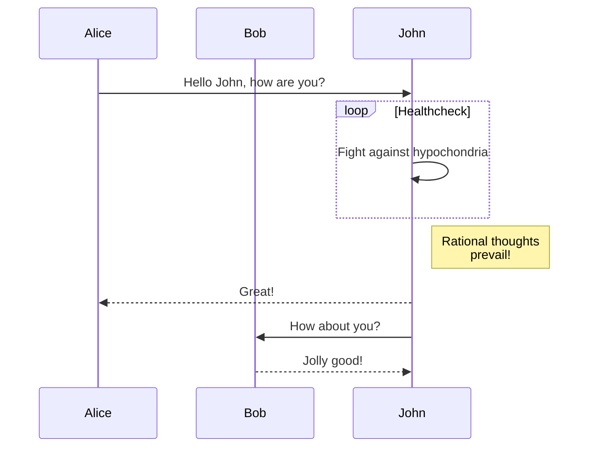
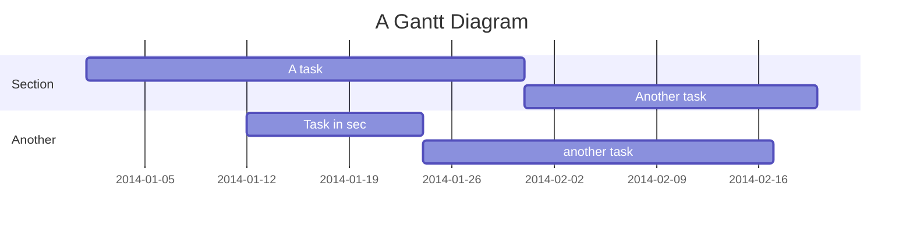

# Testing Mermaid Diagrams

This is a test page to verify that Mermaid.js is working correctly with our Jekyll site.

## Simple Flowchart

## Sequence Diagram

## Gantt Chart

If these diagrams render correctly, then Mermaid.js has been successfully integrated into your Jekyll site!